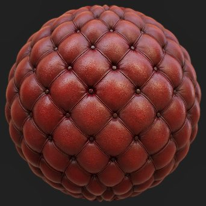
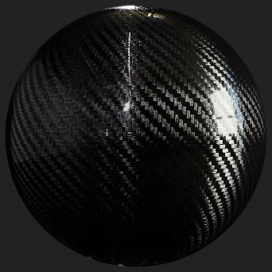

# PBR render

<table>
<tr style="border: 0;">
<td width="41.60%" style="border: 0;" valign="top">

{width="250px"}

**Ingresso:** *Filtri materiale/Utility PBR*

**Complesso**

</td>
<td width="58.30%" style="border: 0;" valign="top">

## Descrizione

Esegue il rendering di un materiale PBR su una sfera, un piano o un cilindro utilizzando l&#39;illuminazione basata su immagine (IBL). Si tratta di un motore di rendering all&#39;interno di un nodo che può essere molto utile per generare miniature, anteprime o risorse 2D. Non è un rendering come la vista 3D, ma una texture effettiva generata nel grafico.

Questo nodo richiede almeno un materiale PBR completo da collegare. Idealmente si utilizza la modalità di creazione del collegamento per collegare il materiale al PBR render. Inoltre, per il rendering è necessario un ambiente HDRI con bordi sferici da cui calcolare l’illuminazione. I materiali per i test sono disponibili in Materiali PBR, le mappe dell&#39;ambiente sono disponibili in [Vista 3D nella libreria.](../../../../../../compositing-graphs/nodes-reference-for-com/node-library/3d-view-library/3d-view-library.md)

</td>
</tr>
</table>

>[!WARNING]
>
> **Motore CPU (SSE2)**
> 
> Il PBR render Node è molto pesante e non funziona bene con il motore CPU SSE2. Passare a un altro motore premendo F9, se il nodo non funziona correttamente.

## Input

* **Canale materiale** **input**\
  Per eseguire il rendering del materiale sulla geometria vengono utilizzati più input di materiale:
  * Colore di base
  * Normale
  * Con emissioni
  * Ruvidità
  * Metallizzato
  * Livello specularità
  * Altezza
  * Occlusione ambientale
  * Maschera di opacità
  * Livello anisotropia
  * Angolo anisotropia
  * Traslucidità
  * Scala distanza di dispersione
* **Mappa Dirt obiettivo**: *Input scala di grigi* Mappa personalizzata per il dirt sull&#39;obiettivo, che viene visualizzata quando sono visibili i riflessi dell&#39;obiettivo.
* **Mappa apertura obiettivo**: *Input scala di grigi* Può essere utilizzato per ignorare la forma Bokeh, fuori fuoco. Più è contrastato, più è visibile. Tenete presente che viene campionato solo un cerchio all’interno della texture, quindi qualsiasi forma deve adattarsi all’interno di un cerchio.
* **Input in background**: *Input a colori*\
  Mapping personalizzato utilizzato come sfondo quando il parametro **Modalità sfondo** è impostato su *Input sfondo*
* **Mappa ambiente**: *Input colore* Mappa ambiente utilizzata per calcolare l&#39;illuminazione. Deve essere mappato a livello sferico e in HDR.

Output

* **Bellezza**\
  Rendering finale
* **Irradianza raw**\
  I dati di irradianza del rendering finale\
  *Alpha:* mappa di opacità
* **Specular non elaborato**\
  I dati di specular del rendering finale\
  *Alpha:* mappa ombreggiatura Specular
* **Spazio mondo normale**\
  I dati delle normali dello spazio mondo del rendering finale\
  *Alpha:* mappa height spaziale mondiale
* **Spazio tangente normale**\
  I dati delle normali dello spazio tangente del rendering finale\
  *Alpha:* mappa height spazio tangente
* **UV**\
  Dati UV del rendering finale\
  *Alpha:* mappa di opacità

## Parametri

* **Forma**: *Sfera, Piano, Cilindro*\
  Imposta la forma utilizzata per il rendering. Le forme personalizzate non sono possibili.
* **Intensità Spostamento**: *0.0 - 0.5* Impostare l&#39;intensità dello spostamento dal height.
* **Rotazione ambiente**: *0.0 - 1.0*\
  Ruota l’ambiente di illuminazione. Pre-ruota rispetto allo spostamento della videocamera.
* **Modalità Sfondo**: *Colore, Ambiente, Ambiente, Input Sfondo*\
  Impostate gli elementi visualizzati sullo sfondo. Il colore è una tinta unita, l&#39;ambiente è la mappa a cui è stata collegata una sfocatura opzionale. Ambient è una versione molto sfocata dell&#39;ambiente.
* **Colore di sfondo**: *(valore colore)*\
  Disponibile solo quando la modalità Sfondo è impostata su Colore.
* **Sfocatura sfondo ambiente**: *0.0 - 1.0*\
  Disponibile solo quando la modalità Sfondo è impostata su Ambiente.
* **Forma**
  * **Scala**: *0,0 - 2,0*\
    Impostate la scala per la sfera.
  * **Dimensione piano**: *0,0 - 1,0*\
    Impostate la scala per il piano.
  * **Raggio cilindro**: *0,0 - 1,0*\
    Impostate il raggio per il cilindro.
  * **Lunghezza cilindro**: *0,0 - 1,0*\
    Impostate la lunghezza del cilindro.
  * **Rotazione**: *0,0 - 1,0*\
    Ruota la forma senza l’illuminazione rotante.
  * **Direzione rotazione**: *0.0 - 1.0*\
    Imposta l&#39;asse di rotazione in 2D.
  * **Rotazione Attorno Alla Direzione**: *0,0 - 1,0*\
    Ruota la forma sull&#39;asse di rotazione.
  * **Posizione forma**: *-1.0 - 1.0*\
    Sposta le forme.
  * **Inclinazione UV**: *1.0 - 6.0*\
    Imposta la quantità di porzioni UV.
  * **Scala UV Sfera**: *0.0 - 4.0*\
    Imposta la scala degli UV sulla sfera.
  * **Scala UV piano**: *1.0 - 4.0*\
    Imposta la scala degli UV sul piano.
  * **Scala UV cilindro**: *1.0 - 6.0*\
    Imposta la scala degli UV sul cilindro.
  * **Offset UV**: *0.0 - 1.0*\
    Scostamento UV
  * **UV inclinazione**: *False/True*\
    Inclina gli UV di 45 gradi per la Sfera.
* **Fotocamera**
  * **Esposizione**: *-4.0 - 4.0*\
    Impostate l&#39;esposizione della fotocamera.
  * **Mappatura toni**: *Lineare, ACES, Hejl cinematografico*\
    Impostate la soluzione di mappatura dei toni da usare per l’immagine finale.
  * **Modalità fotocamera**: *Prospettiva, ortogonale*\
    Passa tra due modalità di proiezione.
  * **Campo di visualizzazione**: *0.01 - 100.0*\
    Impostare l&#39;angolo FOV della fotocamera.
  * **Distanza**: *0,0 - 4,0*\
    Impostate la distanza della videocamera dal centro dell’oggetto.
  * **Intensità vignettatura**: *0,0 - 1,0*\
    Impostate l’intensità dell’effetto vignettatura.
  * **Raggio vignettatura**: *0,0 - 1,0*\
    Impostate il raggio dell’effetto vignettatura.
  * **Posizione schermo**:\
    Sposta la videocamera intorno all’oggetto; può essere modificata anche con un gizmo nella vista 2D.
* **Profondità di campo**
  * **Raggio apertura**: *0.0 - 0.1* Imposta il raggio dell&#39;apertura. Valori più elevati rendono le aree sfocate più sfocate (bokeh).
  * **Blade apertura**: *3 - 9*\
    Imposta la forma della sfocatura bokeh.
  * **Anello apertura**: *0,0 - 1,0*\
    Aggiunge una sfumatura interna alla forma bokeh.
  * **Difrazione dell&#39;apertura**: *0,0 - 2,0*\
    Aggiunge aberrazione cromatica al bokeh.
  * **Bokeh in modalità inversa**: *0,0 - 1,0*\
    Aggiunge un effetto vorticoso o che gira nelle aree di sfocatura bokeh sfocate.
  * **Modalità Focus**: *Automatico, Punto*\
    Impostata se lo stato attivo è predeterminato o impostato dall&#39;utente. Il Punto di interesse consente di spostare un punto nella vista 2D per determinare la distanza focale.
  * **Punto di interesse**:\
    Se lo stato attivo è impostato su Punto, questo consente di spostare quel punto. ha un gizmo per la visualizzazione 2D.
  * **Scostamento Focus**: *-0,5 - 0,5*\
    Se lo stato attivo è impostato su Automatico, consente di spostarlo avanti e indietro.
  * **Usa mappa apertura personalizzata**: *False/True*\
    Ignora le impostazioni di apertura precedenti e utilizza l&#39;input della mappa di apertura per determinare la forma bokeh. Richiede un input.
* **Effetti post**
  * **Abilita effetti post**: *False/True*\
    Attiva/disattiva *tutti* i post-effetti nel rendering finale.
  * **Intensità fioritura**: *0.0 - 2.0* Imposta l&#39;intensità dell&#39;effetto fioritura.
  * **Soglia di fioritura**: *0.0 - 2.0* Imposta una soglia bassa per la comparsa della fioritura.
  * **Spostamento crominanza fiorita**: *0.0 - 1.0*
  * **Intensità alone obiettivo**: *0.0 - 1.0* Imposta l&#39;intensità dell&#39;effetto alone obiettivo.
  * **Intensità riflessi obiettivo**: *0.0 - 1.0* Imposta l&#39;intensità del riflesso dell&#39;obiettivo. Assicurati che la luce proveniente dallo sfondo dell’ambiente sia in grado di vedere correttamente questo effetto.
  * **Intensità Dirt obiettivo**: *0.0 - 1.0* Imposta l&#39;effetto della mappa del dirt obiettivo sui riflessi dell&#39;obiettivo.
* **Impostazioni rendering**
  * **Qualità Diffusa**: *16 Campioni, 32 Campioni, 64 Campioni, 128 Campioni*\
    Consente di passare da un livello di qualità all&#39;altro per la mappa di diffusione.
  * **Moltiplicatore Emissivo Diffuso**: *0.0 - 1.0*\
    Controlla l&#39;entità del contributo delle parti di emissione all&#39;irradianza.
  * **Intensità ombreggiatura diffusa**: *0,0 - 1,0*\
    Controlla l’intensità delle ombre diffuse.
  * **Dithering Specular**: *0,0 - 1,0*\
    Impostate la quantità di dithering dello specular.
  * **Moltiplicatore ombra Specular**: *0,0 - 1,0*\
    Controlla l’intensità delle ombre nei riflessi degli specular.
  * **Modalità opacità** *Test Alpha con dithering, fusione Alpha semplice*\
    Controlla il metodo di applicazione della trasparenza. La modalità *Fusione Alpha semplice* è più visibile su sfondi uniformi.
  * **Intensità Occlusione ambiente**: *0,0 - 1,0*\
    Consente di impostare l’intensità delle ombre di occlusione ambiente.
* **Regolazioni materiale**
  * **Ricalcola normali**: *False/True*\
    I valori normali verranno ricalcolati dalla mappa del height in base all&#39;intensità dello spostamento.
  * **Formato normale**: *DirectX, OpenGL*\
    Passare da un Formato mappa normale a un altro (inverte il canale verde)
  * **Input F0 dielettrico**: *Valore costante, input Specular level*\
    Impostate le unità con i valori F0. L&#39;input di Specular level indica che sarà guidato da una mappa di input.
  * **Dielettrico F0**: *0.0 - 0.08*\
    Se per l’input Dielettrico F0 viene selezionato Valore costante, questo cursore consente di impostare il valore globale.
* **Cancella pelo**
  * **Attiva Clear Coat**: *False/True*\
    Consente di applicare uno strato di rivestimento trasparente aggiuntivo e semplice sopra il materiale di input.
  * **Cancella peso pelo**: *0,0 - 1,0*\
    Imposta l’intensità o l’intensità del livello del rivestimento trasparente.
  * **Cancella Specular level**: *0.0 - 1.0*\
    Consente di impostare la ruvidità del livello del rivestimento trasparente.
  * **Eredita normale dal livello di base**: *False/True* Imposta se clearcoat ignora o usa le normali del materiale di base.
* **Emissivo**
  * **Attiva illuminazione emettente** *Vero/Falso* Attiva/disattiva il contributo diffuso dell&#39;illuminazione emissiva.
  * **Intensità di emissione**: *0,0 - 10,0*\
    Imposta il moltiplicatore globale per la mappa di emissione.
* **Dispersione sottosuperficie**
  * **Attiva dispersione sottosuperficie** *Vero/Falso*\
    Attiva/disattiva la dispersione del sottosuolo nel rendering finale.\
    *Nota:* per la dispersione del sottosuolo è necessario che il valore di input **Translucency** sia *superiore a 0,0*
  * **Distanza di diffusione** *0.0 - 1.0*\
    Regola la distanza massima dell’effetto di dispersione.\
    *Nota:* questo valore viene moltiplicato rispetto al valore di input *per canale di colore* della **scala della distanza di diffusione**.
  * **Spostamento Rosso** *0.0 - 1.0*\
    Regola l’intensità dell’effetto Spostamento rosso nella dispersione.
  * **Rayleigh** *0.0 - 1.0*\
    Regola l’intensità dell’effetto Rayleigh nella dispersione.

## Immagini di esempio

Tutte le immagini sono state generate direttamente all&#39;interno di Designer, nella finestra della vista 2D, utilizzando materiali dalla libreria [Risorse Substance 3D](https://helpx.adobe.com/substance-3d/unlisted/assets.html).

| 

 | 

 | 

 | 

 |
| --- | --- | --- | --- |
|  |  |  |  |
| 

 | 

 | 

 | 

 |
|  |  |  |  |
