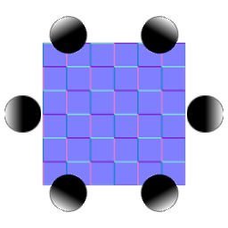

# Da multi-angolo a normale

<table>
<tr style="border: 0;">
<td style="border: 0;" valign="top">

{width="128px"}

## Da multi-angolo a normale

**Ingresso:** *Filtri materiale/Elaborazione analisi*

**Intermedio**

</td>
<td style="border: 0;" valign="top">

## Descrizione

Questo nodo costruisce una Normalmap a partire da una serie di fotografie/scansioni realizzate in diverse condizioni di illuminazione. Consente una conversione Normalmap molto più accurata rispetto all’estrazione di Normali da una singola immagine di albedo.

È più complicato di [Multi-Angolo per l&#39;Albedo](../../../../../../compositing-graphs/nodes-reference-for-com/node-library/material-filters/scan-processing/multi-angle-to-albedo/multi-angle-to-albedo.md), in quanto richiede l&#39;utilizzo di angoli di illuminazione impostati e precisi per i vostri input. L’angolo di illuminazione di ogni campione deve essere distribuito uniformemente e i campioni devono essere inseriti in sequenza. Quindi, per tre campioni, gli angoli di illuminazione devono essere presi a: 0, 120, 240 - o qualsiasi offset uniforme di quello (come 90, 210, 330).

>[!NOTE]
>
> Per informazioni sulla versione di Albedo di questo nodo, vedere [Multi-Angolo a albedo](../../../../../../compositing-graphs/nodes-reference-for-com/node-library/material-filters/scan-processing/multi-angle-to-albedo/multi-angle-to-albedo.md). Se desideri pre-elaborare i tuoi input, [Multi Color Equalizer](../../../../../../compositing-graphs/nodes-reference-for-com/node-library/material-filters/scan-processing/multi-color-equalizer/multi-color-equalizer.md), [Multi Crop](../../../../../../compositing-graphs/nodes-reference-for-com/node-library/material-filters/scan-processing/multi-crop/multi-crop.md) e [Multi Clone Patch](../../../../../../compositing-graphs/nodes-reference-for-com/node-library/material-filters/scan-processing/multi-clone-patch/multi-clone-patch.md) possono essere utili, poiché sono destinati a essere combinati con questi nodi.

## Parametri

### Input

* **Input 1-8**: *Input colore*

### Parametri

* **Formato normale**: *DirectX, OpenGL*\
  Passa da un formato Normalmap a un altro (inverte il canale verde).
* **Quantità campioni**: *2 - 8* Imposta la quantità di campioni (input) da elaborare.
* **Intensità**: *0.0 - 1.0* Imposta l&#39;intensità della mappa normale.
* **Angolo luce primo campione**: *0.0 - 360.0* Imposta la direzione dell&#39;angolo di illuminazione del primo input.
* **Angolo luce campione successivo**: *In senso antiorario e orario* Imposta la direzione verso cui si sposta l’illuminazione nel campione successivo.

## Immagini di esempio

|  |
| --- |
| Nessuna immagine allegata alla pagina. |

</td>
</tr>
</table>
