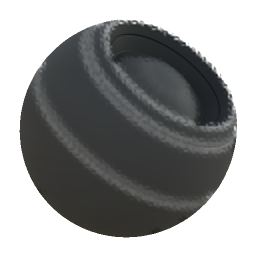

# Usura stoffa

<table>
<tr style="border: 0;">
<td style="border: 0;" valign="top">

{width="128px"}

## Usura stoffa

**Ingresso:** *Generatori Basati Su Trama**/Generatori Maschera*

**Semplice**

</td>
<td style="border: 0;" valign="top">

## Descrizione

Genera una maschera in bianco e nero in base alle mappe con baking e alle impostazioni dell’utente. Simile a [Maschere avanzate](https://support.allegorithmic.com/documentation/display/SPDOC/Smart+Materials+and+Masks) in [Painter](https://support.allegorithmic.com/documentation/display/SPDOC/Substance+Painter).

La maschera rappresenta i bordi sfalsati sui materiali in tessuto. Usa una mappa di altezza dei dettagli del tessuto che determina la maggior parte dell&#39;aspetto; senza una mappa appropriata, l&#39;effetto sembra molto semplice.

## Parametri

### Input

* **Height tessuto**: *Input scala di grigi*\
  Height solo per il motivo tessuto. Questo non è il height del vostro oggetto (cotto), ma piuttosto un pattern di dettaglio di piastrelle.
* **Maschera (facoltativo)**: *Input scala di grigi*\
  Slot maschera utilizzato per mascherare gli effetti del nodo.
* **Curvatura**: *Input scala di grigi*\
  Curvatura generata/al forno per determinare i bordi in rilievo.

### Parametri

* **Quantità bordi netti**: *0,0 - 1,0*
* **Morbidezza usura**: *0.0 - 5.0* Determina la sfocatura o la morbidezza dei bordi usurati.

## Immagini di esempio

</td>
</tr>
</table>
