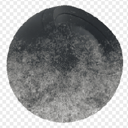

# Dirt terreno

<table>
<tr style="border: 0;">
<td style="border: 0;" valign="top">

{width="128px"}

## Dirt terreno

**Ingresso:** *Generatori Basati Su Trama**/Generatori Maschera*

**Semplice**

</td>
<td style="border: 0;" valign="top">

## Descrizione

Genera una maschera in bianco e nero in base alle mappe con baking e alle impostazioni dell’utente. Simile a [Maschere avanzate](https://support.allegorithmic.com/documentation/display/SPDOC/Smart+Materials+and+Masks) in [Painter](https://support.allegorithmic.com/documentation/display/SPDOC/Substance+Painter).

Questa maschera rappresenta un dirt accumulato da terra verso l&#39;alto, l&#39;opposto di [Dal basso in alto](../../../../../../compositing-graphs/nodes-reference-for-com/node-library/mesh-based-generators/mask-generators/bottom-to-top/bottom-to-top.md) o [Dust](../../../../../../compositing-graphs/nodes-reference-for-com/node-library/mesh-based-generators/mask-generators/dust/dust.md). Non ha una sostituzione personalizzata della mappa.

## Input

* **Posizione**: *Input scala di grigi*\
  Mappa posizione al forno su cui basare l’effetto. Obbligatorio!
* **Maschera (facoltativo)**: *Input scala di grigi*\
  Slot maschera utilizzato per mascherare gli effetti del nodo.

## Parametri

* **Livello**: *0,0 - 1,0*\
  Imposta il livello di aspetto totale del dirt.
* **Contrasto**: *0.0 - 1.0*\
  Regola il contrasto del risultato.
* **Height di Dirt**: *0.0 - 1.0* Imposta il height (proporzionalmente) in cui deve apparire il dirt.

## Immagini di esempio

</td>
</tr>
</table>
