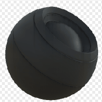

# Perdite

<table>
<tr style="border: 0;">
<td style="border: 0;" valign="top">

{width="128px"}

## Perdite

**Ingresso:** *Generatori Basati Su Trama**/Generatori Maschera*

**Intermedio**

</td>
<td style="border: 0;" valign="top">

## Descrizione

Genera una maschera in bianco e nero in base alle mappe con baking e alle impostazioni dell’utente. Simile a [Maschere avanzate](https://support.allegorithmic.com/documentation/display/SPDOC/Smart+Materials+and+Masks) in [Painter](https://support.allegorithmic.com/documentation/display/SPDOC/Substance+Painter).

Questo nodo rappresenta le striature di dirt e sporcizia che fuoriescono dagli spigoli vivi. Poiché le striature vengono generate con Posizione al forno, scorrono sempre verso il basso.

Provate a cambiare la maschera di variazione: poiché guida il posizionamento delle striature, può avere un’influenza molto maggiore rispetto ad altri generatori di maschere.

## Parametri

### Input

* **Posizione**: *Input scala di grigi*\
  Mappa di posizione al forno, utilizzata per le direzioni di striscia. Obbligatorio!
* **Curvatura**: *Input scala di grigi*\
  Mappa con baking utilizzata per il posizionamento della striscia. Obbligatorio!
* **Occlusione ambiente**: *Input scala di grigi*\
  Mappa con baking utilizzata per effetti interni e mascheratura. Consigliato, ma potrebbe usare bianco piatto.
* **Spazio mondo normale**: *Input colore*\
  Baked World Space Normalmap, usato per la direzione della striscia. Obbligatorio!
* **Maschera variazione**: *Input scala di grigi*\
  Maschera di variazione facoltativa, attivare impostando l&#39;override su True.
* **Maschera (facoltativo)**: *Input scala di grigi*\
  Slot maschera utilizzato per mascherare gli effetti del nodo.

### Parametri

* **Livello**: *0,0 - 1,0*\
  Livello totale del risultato. Progressivamente rivela l&#39;effetto, influisce anche sulla lunghezza. Dovrebbe essere abbastanza alto per ottenere gocce lunghe.
* **Contrasto**: *0.0 - 1.0*\
  Regola il contrasto del risultato.
* **Variazione**: *0.0 - 1.0* Imposta la quantità di variazione su larga scala utilizzata per mascherare le striature. Impostando questo valore su 0 si ottengono striature uniformi complete, quindi evitate che ciò si verifichi.
* **Durata**: *0.0 - 8.0* Lunghezza della striscia. Se si imposta questo valore su una scala ridotta, i passaggi risulteranno visibili. Gioca anche con Level.
* **Occlude**: *X, Y, Z, Nessuno* Imposta la direzione che l&#39;AO deve modificare.
* **Ignora maschera di variante**: *False/True* Consente l&#39;override della maschera di variante con uno slot di input personalizzato. L&#39;uso di maschere più sparse o più dense può essere interessante ed è un buon modo per controllare le gocce.

## Immagini di esempio

</td>
</tr>
</table>
