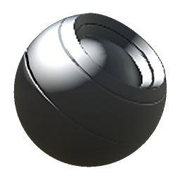

# Luce

<table>
<tr style="border: 0;">
<td width="33.33%" style="border: 0;" valign="top">

{width="128px"}

<b>In:</b> Generatori Basati Su Trama > Generatori di maschere

</td>
<td width="100.00%" style="border: 0;" valign="top">

## Descrizione

Genera una maschera in bianco e nero in base alle mappe con baking e alle impostazioni dell’utente. Simile a [Maschere avanzate](https://support.allegorithmic.com/documentation/display/SPDOC/Smart+Materials+and+Masks) in [Painter](https://support.allegorithmic.com/documentation/display/SPDOC/Substance+Painter).

Questa maschera è un po&#39; diversa dagli altri Generatori: semplicemente fa una falsa illuminazione, basata sulla mappa normale dello spazio mondiale, restituendo una maschera &quot;lightmap&quot; in bianco e nero.

</td>
</tr>
</table>

## Parametri

|  |  |
|:---|:---|
| <b>Angolo orizzontale</b> <i>0.0 - 1.0</i> | Imposta l’angolo orizzontale della luce falsa. |
| <b>Angolo verticale</b> <i>0.0 - 1.0</i> | Imposta l’angolo verticale della luce falsa. |
| <b>Lucentezza evidenziazione</b> <i>0.0 - 0.999</i> | Imposta la distanza di decadimento dell’area evidenziata. |
| <b>Livello evidenziazione</b> <i>0.0 - 1.0</i> | Consente di impostare il livello di luminosità dell’area evidenziata. |

## Esempi

<table style="margin-top: 32px; margin-bottom: 32px">
    <tr style="border: 0">
        <td style="border: 0; background: transparent">
            
        </td>
    </tr>
</table>
