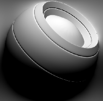

# Luce

<table>
<tr style="border: 0;">
<td style="border: 0;" valign="top">

{width="128px"}

## Luce

**Ingresso:** *Generatori Basati Su Trama**/Generatori Maschera*

**Semplice**

</td>
<td style="border: 0;" valign="top">

## Descrizione

Genera una maschera in bianco e nero in base alle mappe con baking e alle impostazioni dell’utente. Simile a [Maschere avanzate](https://support.allegorithmic.com/documentation/display/SPDOC/Smart+Materials+and+Masks) in [Painter](https://support.allegorithmic.com/documentation/display/SPDOC/Substance+Painter).

Questa maschera è un po&#39; diversa dagli altri Generatori: semplicemente fa una falsa illuminazione, basata sulla mappa normale dello spazio mondiale, restituendo una maschera &quot;lightmap&quot; in bianco e nero.

## Parametri

* **Angolo orizzontale**: *0.0 - 1.0* Imposta l&#39;angolo orizzontale della luce falsa.
* **Angolo verticale**: *0.0 - 1.0* Imposta l&#39;angolo verticale della luce falsa.
* **Luce lucidità**: *0.0 - 0.999* Imposta la diffusione di decadimento dell&#39;area evidenziata.
* **Livello di evidenziazione**: *0.0 - 1.0* Imposta il livello di luminosità dell&#39;area evidenziata.

## Immagini di esempio

</td>
</tr>
</table>
