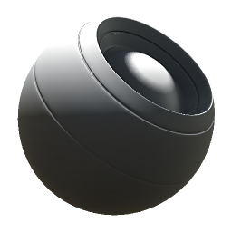

# Sun Bleach

<table>
<tr style="border: 0;">
<td width="33.33%" style="border: 0;" valign="top">

{width="128px"}

<b>In:</b> Generatori Basati Su Trama > Generatori di maschere

</td>
<td width="100.00%" style="border: 0;" valign="top">

## Descrizione

Genera una maschera in bianco e nero in base alle mappe con baking e alle impostazioni dell’utente. Simile a [Maschere avanzate](https://support.allegorithmic.com/documentation/display/SPDOC/Smart+Materials+and+Masks) in [Painter](https://support.allegorithmic.com/documentation/display/SPDOC/Substance+Painter).

Questa maschera è simile a [Luce](../../../../../../compositing-graphs/nodes-reference-for-com/node-library/mesh-based-generators/mask-generators/light/light.md), ma supporta anche AO, il che porta a una maschera che rappresenta lo sbiancamento della luce e la dissolvenza sopra un effetto.

</td>
</tr>
</table>

## Input

|  |  |
|:---|:---|
| <b>Spazio mondo normale</b> <i>Input colore</i> |  |
| <b>Occlusione ambiente</b> <i>Input scala di grigi</i> | Mappa con baking utilizzata per effetti interni e mascheratura. |
| <b>Maschera (facoltativo)</b> <i>Input scala di grigi</i> | Slot maschera utilizzato per mascherare gli effetti del nodo. |

## Parametri

|  |  |
|:---|:---|
| <b>Livello</b> <i>0.0 - 1.0</i> | Consente di impostare la quantità totale di sbiancamento e di spostare l’effetto verso il basso. |
| <b>Contrasto</b> <i>0.0 - 1.0</i> | Regola il contrasto del risultato. |
| <b>Occlusione</b> <i>0.0 - 1.0</i> | Imposta l’influenza dell’AO sul risultato finale. |

## Esempi

<table style="margin-top: 32px; margin-bottom: 32px">
    <tr style="border: 0">
        <td style="border: 0; background: transparent">
            
        </td>
    </tr>
</table>
