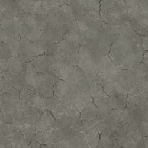

# Crepe meteorologiche

<table>
<tr style="border: 0;">
<td style="border: 0;" valign="top">

{width="128px"}

## Crepe meteorologiche

**Ingresso:** *Generatori Basati Su Trama**/Meteorizzazione*

**Complesso**

</td>
<td style="border: 0;" valign="top">

## Descrizione

Si tratta di un effetto di materiale completo che funziona su più canali contemporaneamente. Aggiunge un pattern di crepe casuale, con controllo sulle pagine affiancate e sulla profondità.

Assicurati di aver compreso correttamente le [modalità di creazione del collegamento](../../../../../../interface/the-graph-view/link-creation-modes/link-creation-modes.md) quando lavori con i materiali completi.

## Parametri

### Input

* **Curvatura**: *Input scala di grigi*\
  Mappe infornate o generate utilizzate per effetti interni e mascheratura.
* **Height**: *Input scala di grigi*\
  Mappe infornate o generate utilizzate per effetti interni e mascheratura.
* **Maschera** : *Input scala di grigi*\
  Slot maschera utilizzato per mascherare gli effetti del nodo. Può essere attivato/disattivato con il parametro &quot;Maschera&quot;.

### Parametri

* **Canali**
  * Attivate e disattivate i canali del materiale in questo gruppo, ad esempio quando utilizzate mappe Specular/lucidità invece di Metallico/Rugosità.
* **Avanzate**
  * **Formato normale**: *DirectX, OpenGL*\
    Passa da un formato Normalmap a un altro (inverte il canale verde).
  * **Maschera**: *False/True*\
    Attiva o disattiva l’uso della mappa maschera.
* **Effetto**
  * **Propagazione Crepe**: *0.0 - 1.0* Distanza di diffusione delle crepe. Questo è il controllo principale di questo effetto.
  * **Profondità Crepe**: *0.0 - 1.0* Profondità dell&#39;effetto di crepa. Questo influisce principalmente sul height e leggermente sul thickness visivo.
* **Fusione**
  * Consente di controllare l’entità della fusione dell’effetto in ciascun canale risultante.

## Immagini di esempio

</td>
</tr>
</table>
