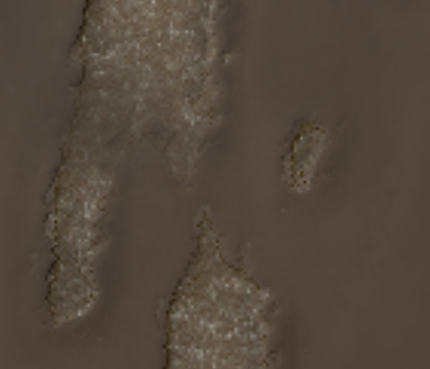

# Agenti meteorologici in pelle

<table>
<tr style="border: 0;">
<td width="33.33%" style="border: 0;" valign="top">

{width="128px"}

<b>In:</b> Generatori Basati Su Trama > Meteo

</td>
<td width="100.00%" style="border: 0;" valign="top">

## Descrizione

Si tratta di un effetto di materiale completo che funziona su più canali contemporaneamente. Aggiunge un effetto casuale di usura della pelle, con controllo per l&#39;età e la sporcizia. È simile a [Weathering tessuto](../../../../../../compositing-graphs/nodes-reference-for-com/node-library/mesh-based-generators/weathering/fabric-weathering/fabric-weathering.md), ma ottimizzato specificamente per il cuoio. Questo effetto non funziona molto bene a meno che non si disponga di mappe AO e World Space Normalmap eseguite i baking correttamente collegate, in quanto richiede queste mappe per calcolare e generare tutto in modo adeguato.

Assicurati di aver compreso appieno le [modalità di creazione dei collegamenti](https://support.allegorithmic.com/documentation/display/SD5/Link+Creation+Modes) quando lavori con i materiali completi.

</td>
</tr>
</table>

## Input

|  |  |
|:---|:---|
| <b>Occlusione ambiente</b> <i>Input scala di grigi</i> | Mappa con baking utilizzata per effetti interni e mascheratura. |
| <b>Spazio Normale Del Mondo</b> <i>Input colore</i> |  |
| <b>Maschera</b> <i>Input scala di grigi</i> | Slot maschera utilizzato per mascherare gli effetti del nodo. Può essere attivato/disattivato con il parametro &quot;Maschera&quot;. |

## Parametri

|  |  |
|:---|:---|
| <b>Canali</b> | Attivate e disattivate i canali del materiale in questo gruppo, ad esempio quando utilizzate mappe Specular/lucidità invece di Metallico/Rugosità. |
| <b>Avanzate</b> |  |
| <b>Formato Normale</b> <i>DirectX, OpenGL</i> | Passa da un formato Normalmap a un altro (inverte il canale verde). |
| <b>Maschera</b> <i>Falso/Vero</i> | Attiva o disattiva l’uso della mappa maschera. |
| <b>Effetto</b> |  |
| <b>Dust</b> <i>0.0 - 1.0</i> | Fusione un effetto dust più scuro, basato sulle aree rivolte verso l’alto nella mappa normale di World Space. |
| <b>Irritazione</b> <i>0.0 - 1.0</i> | Fusioni di un effetto dirt/sfumino globale, basato principalmente sulle aree occluse (scure) nell’oggetto principale. |
| <b>Indossamento bordi</b> <i>0.0 - 1.0</i> | Aggiunge ai bordi un effetto di nitidezza/intensificazione basato su Materiale normale. |
| <b>Utilizzato</b> <i>0.0 - 1.0</i> | Fusioni in un aspetto in pelle usurato globale. |
| <b>Età</b> <i>0.0 - 1.0</i> | Fusioni in un look in pelle usurato in pieghe basate su AO. Il posizionamento è influenzato molto da Age Treshold. |
| <b>Soglia di validità</b> <i>0.0 - 1.0</i> | Imposta la soglia di aspetto per l’effetto Età. |
| <b>Scala Crepe</b> <i>1.0 - 16.0</i> | Imposta la profondità del cuoio usurato dall’effetto Usato ed Età. |
| <b>Intensità alterazione Crepe</b> <i>0.0 - 1.0</i> | Imposta l’intensità del cuoio usurato dall’effetto Usato ed Età. |
| <b>Scala Scratches bordi netti</b> <i>1.0 - 32.0</i> |  |
| <b>Intensità alterazione Scratches bordi netti</b> <i>0.0 - 1.0</i> |  |
| <b>Desaturazione Della Pelle Usata</b> <i>0.0 - 1.0</i> | Consente di impostare la saturazione dell’effetto pelle usurata dagli effetti Età e Usato. |
| <b>Luminosità pelle usata</b> <i>0.0 - 1.0</i> | Consente di impostare la luminosità dell’aspetto in pelle usurato dagli effetti Età e Usato. |
| <b>Fusione</b> |  |
| <b>Intensità Diffusa</b> <i>0.0 - 1.0</i> | Intensità di fusione della Diffusione. |
| <b>Intensità Colore di base</b> <i>0.0 - 1.0</i> | Intensità di fusione del colore di base. |
| <b>Intensità normale</b> <i>0.0 - 1.0</i> | Intensità di fusione del normale. |
| <b>Intensità Specular</b> <i>0.0 - 1.0</i> | Forza di fusione dello Specular. |
| <b>Intensità Lucentezza</b> <i>0.0 - 1.0</i> | Forza di fusione della lucidità. |
| <b>Intensità rugosità</b> <i>0.0 - 1.0</i> | Forza di fusione della rugosità. |
| <b>Intensità Occlusione ambientale</b> <i>0.0 - 1.0</i> | Intensità di fusione dell’Occlusione ambiente. |
| <b>Intensità Height</b> <i>0.0 - 1.0</i> | Forza di fusione del Height. |

## Esempi

<table style="margin-top: 32px; margin-bottom: 32px">
    <tr style="border: 0">
        <td style="border: 0; background: transparent">
            
        </td>
        <td style="border: 0; background: transparent">
            
        </td>
    </tr>
</table>
