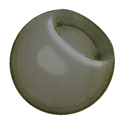

# Moss Weathering

<table>
<tr style="border: 0;">
<td width="33.33%" style="border: 0;" valign="top">

{width="128px"}

<b>In:</b> Generatori Basati Su Trama > Meteo

</td>
<td width="100.00%" style="border: 0;" valign="top">

## Descrizione

Si tratta di un effetto di materiale completo che funziona su più canali contemporaneamente. Genera un effetto muschio ingrandito, con un singolo controllo per Propagazione.

Questo effetto funziona meglio con una mappa eseguita i baking Posizione spazio mondo e una mappa di altezza aggiuntiva. Anche se questo non è un requisito esatto, conferisce all&#39;effetto un posizionamento più credibile.

Assicurati di aver compreso correttamente le [modalità di creazione del collegamento](https://support.allegorithmic.com/documentation/display/SD5/Link+Creation+Modes) quando lavori con i materiali completi.

</td>
</tr>
</table>

## Input

|  |  |
|:---|:---|
| <b>Posizione</b> <i>Input colore</i> | Posizione spaziale mondiale eseguita i baking. |
| <b>Height</b> <i>Input scala di grigi</i> | Input aggiuntivo Heightmap. |
| <b>Maschera</b> <i>Input scala di grigi</i> | Slot maschera utilizzato per mascherare gli effetti del nodo. Può essere attivato/disattivato con il parametro &quot;Maschera&quot;. |

## Parametri

|  |  |
|:---|:---|
| <b>Canali</b> | Attivate e disattivate i canali del materiale in questo gruppo, ad esempio quando utilizzate mappe Specular/Lucentezza invece di Metallo/Rugosità. |
| <b>Avanzate</b> |  |
| <b>Formato Normale</b> <i>DirectX, OpenGL</i> | Passa da un formato Normalmap a un altro (inverte il canale verde). |
| <b>Maschera</b> <i>Falso/Vero</i> | Attiva o disattiva l’uso della mappa maschera. |
| <b>Effetto</b> |  |
| <b>Propagazione Moss</b> <i>0.0 - 1.0</i> | Consente di impostare la diffusione del muschio. Cresce a intervalli che vanno da una leggera copertura a muschio spesso e scuro. |
| <b>Fusione</b> |  |
| <b>Intensità Diffusa</b> <i>0.0 - 1.0</i> | Intensità di fusione della Diffusione. |
| <b>Intensità Colore di base</b> <i>0.0 - 1.0</i> | Intensità di fusione del colore di base. |
| <b>Intensità normale</b> <i>0.0 - 1.0</i> | Intensità di fusione del normale. |
| <b>Intensità Specular</b> <i>0.0 - 1.0</i> | Forza di fusione dello Specular. |
| <b>Intensità Lucentezza</b> <i>0.0 - 1.0</i> | Forza di fusione della lucidità. |
| <b>Intensità rugosità</b> <i>0.0 - 1.0</i> | Forza di fusione della rugosità. |
| <b>Intensità Occlusione ambientale</b> <i>0.0 - 1.0</i> | Intensità di fusione dell’Occlusione ambiente. |
| <b>Intensità Height</b> <i>0.0 - 1.0</i> | Forza di fusione del Height. |

## Esempi

<table style="margin-top: 32px; margin-bottom: 32px">
    <tr style="border: 0">
        <td style="border: 0; background: transparent">
            
        </td>
    </tr>
</table>
