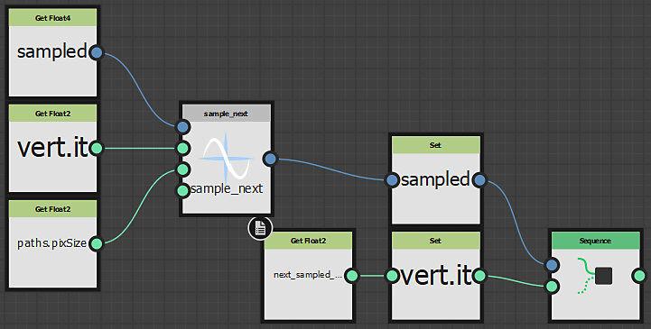

# Specifiche formato tracciati

Questa pagina descrive il formato Tracciati e fornisce indicazioni per la modifica dei dati in tale formato utilizzando le funzioni incluse negli strumenti Tracciati.

## Specifiche del formato

<table>
<tr style="border: 0;">
<td width="100.00%" style="border: 0;" valign="top">

Questa sezione spiega come viene codificato un documento (o immagine) di <b>tracciati</b>:

Un documento Percorsi è un elenco di percorsi, ognuno dei quali descrive un elenco di segmenti, codificato in una texture di colore a virgola mobile a <b>32 bit</b>.

La texture viene divisa in parti &#39;top&#39; (*$pos.y &lt; 0.5*) e &#39;bottom&#39; (*$pos.y > 0.5*).

Tutti i dati di un pixel nella parte &quot;superiore&quot; sono semanticamente correlati al pixel corrispondente nella parte &quot;inferiore&quot; e viceversa.

</td>
<td width="33.33%" style="border: 0;" valign="top">

</td>
</tr>
</table>

>[!NOTE]
>
> I dati dei percorsi richiedono una precisione di 32 bit e l&#39;utilizzo di una profondità di bit inferiore produrrà risultati errati.
> 
> Pertanto, assicurati di impostare il parametro &#39;Formato output&#39; dei nodi che generano i dati dei percorsi su &#39;HDR High Precision (32F)&#39;.

Sia `*uv\_pos*` un indirizzo 2D (ad esempio *$pos*) di un pixel della parte &#39;superiore&#39;.

Nel resto del documento:

* <b>top[uv\_pos].XYZW</b> farà riferimento ai 4 float memorizzati nel pixel della parte superiore.\
  top[uv\_pos] == esempio\_color(percorsi, uv\_pos)
* <b>bottom[uv\_pos].XYZW</b> farà riferimento ai 4 float memorizzati nel pixel corrispondente della parte inferiore.\
  bottom[uv\_pos] == esempio\_color(paths, uv\_pos + Virgola mobile 2(0, 0.5))

top[uv\_pos] e bottom[uv\_pos] insieme formano un&#39;unità semantica U[uv\_pos] del documento, composta da 8 float.

### Intestazione documento

Ogni documento Tracciati inizia con un&#39;intestazione di documento. Si tratta della prima unità semantica U[(0,0)]:

+++In alto
<b>X</b>

Numero di percorsi (deve essere un numero intero positivo in [0; 16777216]).

Se alcuni tracciati sono vuoti, vengono comunque contati qui. Quindi puoi immaginarlo come un &quot;numero di intestazioni di tracciati da decodificare&quot;.

<b>YZ</b>

Dimensione in pixel per il documento (ovvero, esattamente `Float2(1,1) / $size`).

Ciò è utile quando si leggono i percorsi da un [processore pixel](../../../../../../compositing-graphs/nodes-reference-for-com/atomic-nodes/pixel-processor/pixel-processor.md) o da una [mappa-FX](../../../../../../compositing-graphs/nodes-reference-for-com/atomic-nodes/fx-map/fx-map.md), ad esempio, le cui dimensioni di output sono diverse.

<b>L</b>

1/16 = 0,0625 (flag di intestazione)

+++

+++In basso
<b>XY</b>

L&#39;indirizzo dell&#39;ultimo vertice definito in questo documento. Questo è utile per aggiungere nuovi dati.

Può quindi essere qualsiasi indirizzo maggiore (in ordine di scansione) dell&#39;indirizzo dell&#39;ultimo vertice. Deve trovarsi nell&#39;intervallo ]0, 1[×]0,.5[

<b>ZW</b>

Non utilizzato, deve essere Float2(0, 1)

+++

### Intestazioni tracciato

L&#39;intestazione del documento è immediatamente seguita da number-of-paths = top[(0,0)].X path-headers, uno per unità semantica.\
E.g. se il documento contiene 3 tracciati, questi verranno memorizzati nei formati U[(0,1)\*pixel\_size], U[(0,2)\*pixel\_size] e U[(0,3)\*pixel\_size] (con pixel\_size = top[(0,0)].YZ).

Se sono presenti più tracciati di quanto possa contenere una riga di pixel, le intestazioni rimanenti del tracciato vengono scritte una sulla riga o sulle righe successive, in ordine di scansione.\
È consentito avere intestazioni di percorso null (`top[...].XYZW = Float4(0,0,0,0)`). Tale percorso potrebbe comunque essere un percorso vuoto.

L&#39;intestazione del percorso Nth verrà definita all&#39;indirizzo `path\_addr` come segue:

+++In alto
<b>X</b>

Numero di vertici in questo percorso. Deve essere compreso nell&#39;intervallo [0, 16777216].

Se i vertici iniziale e finale di un tracciato chiuso si trovano nella stessa posizione, contano comunque per 2 vertici.\
Un percorso con 0 vertici è comunque un percorso valido.

<b>A</b>

*Flag\_closed*: 1 se il percorso è chiuso (ad esempio un cerchio), 0 in caso contrario (ad esempio una linea retta).

<b>Z</b>

L&#39;indice del percorso *N.* Deve assolutamente corrispondere a *percorso\_addr* (vedi nota sotto).

<b>L</b>

Flag di intestazione: 1/16 = 0,0625.

+++

+++In basso
<b>XY</b>

Indirizzo di vertice iniziale (o primo).

<b>ZW</b>

Indirizzo di fine (o ultimo) vertice.

+++

>[!NOTE]
>
> È possibile calcolare `path\_addr` da N utilizzando la funzione `Utils/pixel\_index\_to\_position` in paths\_tools.sbs: `path\_addr = pixel\_index\_to\_position(N+1)`

### Informazioni sui vertici

I vertici si trovano ovunque nell’immagine dopo le intestazioni (intestazioni di documenti o tracciati). I vertici possono essere di vari &quot;tipi&quot; (Inizio, Metà o Fine) e sono collegati in modo esplicito mediante 2 puntatori di indirizzo (&quot;collegamenti&quot;).

I vertici <b>Inizio</b> e <b>Fine</b> sono speciali a questo proposito: per consentire la rappresentazione di tracciati chiusi o di una rete arbitraria di tracciati collegati tra loro, uno dei collegamenti viene in realtà utilizzato per formare un elenco circolare collegato in avanti di tutti gli altri vertici Inizio o Fine che rappresentano lo stesso vertice. Tali vertici che corrispondono tra loro sono chiamati &quot;fratelli&quot;. [Illustrazione accolta]

Formalmente, ogni vertice all&#39;indirizzo `*vert\_addr*` è definito nel modo seguente:

+++In alto
<b>XY</b>

Posizione del vertice. Le coordinate possono essere qualsiasi valore float diverso da NaN o ±inf. Non c&#39;è alcun concetto di affiancamento a questo livello (può essere maneggiato o meno dall&#39;implementazione di ogni filtro), quindi i percorsi dovrebbero essere definiti sul piano euclideo.

<b>Z</b>

Indice del percorso dei vertici. Un vertice può appartenere a un solo tracciato. (Come accennato in precedenza, i vertici Inizio e Fine possono tuttavia avere pari livello.) L’indice dei percorsi può essere utilizzato per recuperare l’intestazione dei percorsi (vedi Sezione Intestazioni percorso sopra), quindi assicurati di mantenerla sincronizzata.

<b>L</b>

Tipo di vertice. Viene divisa tra il segno del valore e il suo valore assoluto:

Nella parte segno, un valore pari a 0 significa che in realtà non esiste alcun vertice in questo punto (anche tutti gli altri componenti dovrebbero essere 0). Un valore negativo indica che il vertice è contrassegnato come un &quot;angolo&quot;, un valore positivo indica che il vertice è &quot;arrotondato&quot;. Il vertice Angolo o Arrotondato è un attributo puro e isolato e non ha alcun impatto o significato sul resto della codifica Tracciati.

Nella parte relativa al valore assoluto, sono codificati il tipo di pixel (Inizio, Metà o Fine) e un altro flag (banale\_link):

* *0.125*: vertice finale (ultimo vertice della forma; collegamenti sempre non banali, vedere di seguito)

* *0.25*: vertice iniziale (il primo vertice della forma; collegamenti sempre non banali, vedere di seguito)

* *0.5*: vertice centrale con collegamenti non banali

* *1*: vertice centrale con collegamenti banali

&quot;Collegamenti banali&quot; si riferisce al fatto che i vertici precedente e successivo (nell&#39;elenco dei vertici del percorso corrente) sono memorizzati rispettivamente nel pixel a sinistra (vert\_addr-(0,pixel\_size)) e a destra (vert\_addr+(0,pixel\_size)), mentre &quot;collegamenti non banali&quot; significa che almeno uno di questi è memorizzato altrove.

+++

+++In basso
Indipendentemente dai collegamenti &quot;banalità&quot;, i valori affidabili dei collegamenti vengono memorizzati nella parte inferiore:

<b>XY</b>

L&#39;indirizzo del vertice precedente di questo percorso. Per i vertici iniziali, questo punta al vertice di pari livello successivo.\
se |top[vert\_addr].W| = 1, quindi bottom[vert\_addr].XY = vert\_addr - (0,pixel\_size)

<b>ZW</b>

L&#39;indirizzo del vertice successivo di questo percorso. Per i vertici finali, punta al vertice di pari livello successivo.\
se |top[vert\_addr].W| = 1, quindi bottom[vert\_addr].ZW = vert\_addr + (0,pixel\_size)

+++

## Lettura e scrittura delle informazioni sui percorsi

Se desiderate creare nodi di elaborazione tracciati personalizzati, avete a disposizione diversi strumenti.

Le nozioni di base sono fornite dai nodi [Paths Vertex Processor](../../../../../../compositing-graphs/nodes-reference-for-com/node-library/spline-paths-tools/path-tools/paths-vertex-processor/paths-vertex-processor.md) e [Paths Vertex Processor Simple](../../../../../../compositing-graphs/nodes-reference-for-com/node-library/spline-paths-tools/path-tools/paths-vertex-processor-1/paths-vertex-processor-simple.md), che possono essere utilizzati nello stesso modo di un [Pixel Processor](../../../../../../compositing-graphs/nodes-reference-for-com/atomic-nodes/pixel-processor/pixel-processor.md).

Se sono necessarie funzionalità che vanno oltre a quelle offerte dai nodi del processore del vertice dei percorsi (più texture di input o più vertici precedenti o successivi), copiare l&#39;implementazione di questo grafico potrebbe essere un buon punto di partenza (supponendo di sostituire il nodo <b>Get(&quot;%perVertex&quot;)</b> con l&#39;elaborazione personalizzata).

Ma se volete fare qualcosa di più alieno che applicare una funzione per vertice, ecco una spiegazione dettagliata degli strumenti che potete usare. Si tratta in genere di piccole funzioni di supporto che si trovano nello stesso pacchetto degli altri nodi Percorsi (*percorsi\_tools.sbs)*. Queste funzioni non sono disponibili nel menu [<b>Libreria</b>](../../../../../../interface/the-library/the-library.md) e <b>Nodo</b>.

### Funzioni &#39;Read&#39;

Nella cartella `Read`, puoi trovare alcuni di questi elementi, utili per raccogliere informazioni sui percorsi:

Alcuni possono fornire informazioni su un determinato pixel. Tutti accettano il valore Float4 campionato nella parte \*top\* come input. Se guardate alla loro implementazione, sono molto semplici. Il loro scopo è quello di trasmettere più significato dei semplici nodi atomici:

+++is_header
Verificate che il valore campionato corrente sia un’intestazione tracciato o un’intestazione documento.

+++

+++path_is_closed
Selezionate il flag Is\_Closed (.Y) in un&#39;intestazione di percorso. Si presuppone che tu abbia già controllato che si tratta di un percorso\* con `is\_header` e che `current\_pixel\_is\_document\_header` abbia restituito false.

+++

+++is_vertex
Verificate che il valore attualmente campionato sia un vertice, cioè non un’intestazione né un pixel vuoto.

+++

+++is_start_vertex
Verificare se un valore \*top-part sample\* è un vertice iniziale (non è necessario controllare prima `is\_vertex`).

+++

+++is_mid_vertex
Controllare se un valore \*top-part sample\* è un vertice che non è un vertice iniziale né finale (non è necessario controllare prima `is\_vertex`).

+++

+++is_end_vertex
Verificare se un valore \*top-part sample\* è un vertice finale (non è necessario controllare prima `is\_vertex`).

+++

+++is_segment_start
Mano corta per `is\_start\_vertex || is\_mid\_vertex`. Più utile per l&#39;elaborazione basata su [Fx-Map](../../../../../../compositing-graphs/nodes-reference-for-com/atomic-nodes/fx-map/fx-map.md), per elaborare ogni segmento al massimo una volta.

+++

+++is_corner
Controllare il flag d&#39;angolo del vertice (non è necessario controllare prima `is\_vertex`: se la risposta è vera, si è sicuramente su un vertice). Ricorda che questo flag non è ancora supportato dai nodi ufficiali.

+++

+++has_trivial_links
Se si tratta di un vertice, indica se è possibile dedurre facilmente la posizione dei vertici precedente e successivo senza campionare la parte inferiore. (Nota: un non vertice restituirà sempre false).

È probabile che non si desideri utilizzare questa funzionalità direttamente, ma utilizzare una delle funzioni `sample\_next\*` o `sample\_prev\*` che si occupano automaticamente di questo aspetto.

+++

+++sample_next, sample_prev
Dato il valore campionato della parte superiore `*sampled*` e la sua posizione `*sampled\_position*`, restituisce il valore campionato della parte superiore del vertice successivo (rispettivamente precedente) e Imposta una variabile Float2 `*next\_sampled\_pos*` sulla posizione (nella parte superiore) di questo vicino (ovvero &lt;valore restituito> = SampleColor(next\_samples\_pos, image0)). `*input0PixSize*`deve essere uguale alla dimensione in pixel del tracciato (top[(0,0)].YZ).

Se il pixel corrente (`*sampled*`) è un vertice <b>Inizio</b>, *esempio\_prev* restituirà il fratello successivo di questo vertice; allo stesso modo, se è un vertice <b>Fine</b>, *campione\_successivo* restituirà il fratello successivo di questo vertice (ovvero, potrebbe non essere quello desiderato). Per risolvere il problema, vedere `*sample\_next\_advanced*` e `*sample\_prev\_advanced*` di seguito.

Si noti che per semplicità, si presume che <b>Le informazioni sui percorsi vengano memorizzate in input0!</b> Inoltre, a differenza degli stati del documento della funzione, non è necessario pre-dichiarare `*next\_sampled\_pos*`. `*[out]next\_sampled\_pos*` è un parametro fittizio per ricordare che questo secondo &quot;valore restituito&quot; esiste.

È possibile controllare `*paths\_trace*` [Fx-Map](../../../../../../compositing-graphs/nodes-reference-for-com/atomic-nodes/fx-map/fx-map.md), nel parametro Iterazioni del terzo nodo iterato, per un esempio di come utilizzarlo.

")

+++

+++sample_next_advanced, sample_prev_advanced
Questo è destinato a funzionare su tracciati chiusi. Per i tracciati aperti, il vertice Inizio o Fine non ha un pari livello e in questo caso entrambe le funzioni restituiscono lo stesso e unico adiacente. Per i vertici Inizio o Fine con più di un elemento di pari livello (Percorsi connessi come rete), che restituiscono il vertice adiacente del successivo elemento di pari livello nell&#39;elenco collegato.

+++

### Funzioni &#39;Write&#39;

Nella cartella `Write`, troverai piccoli helper che creano un Float4 pronto per essere scritto <b>da un [Fx-Map](../../../../../../compositing-graphs/nodes-reference-for-com/atomic-nodes/fx-map/fx-map.md)</b>.

In effetti, [Fx-Map](../../../../../../compositing-graphs/nodes-reference-for-com/atomic-nodes/fx-map/fx-map.md) moltiplica RGB per Alpha prima di disegnare, quindi i valori effettivi non vengono premoltiplicati per compensare. Se si desidera utilizzare queste funzioni, ad esempio in un [processore pixel](../../../../../../compositing-graphs/nodes-reference-for-com/atomic-nodes/pixel-processor/pixel-processor.md), si consiglia di applicare nuovamente la premoltiplicazione o di scrivere una versione personalizzata (più ottimizzata per il caso d&#39;uso e più facile da usare).

+++document_header
Crea la parte superiore dell’intestazione del documento, dichiarando il numero di percorsi forniti.

+++

+++document_last_vertex_spec
Crea la parte \*bottom\* dell&#39;intestazione del documento che specifica l&#39;indirizzo dell&#39;ultimo vertice (vedere A.1).

+++

+++path_header
Crea la parte superiore di un&#39;intestazione di percorso in base al numero di vertici nel percorso `*nbVertices*`, al flag `*isClosed*` e al `*pathIndex*`.

+++

+++inizio_vertice, metà_vertice, fine_vertice
Crea la parte superiore di un vertice, impostando la posizione, il tipo e le altre opzioni di conseguenza.

Informazioni sul parametro *mid\_vertex* e *hasTrivialLinks*: se preferisci impostare il valore appropriato, ma se alla fine non riesci a stabilire se i collegamenti sono banali o meno, puoi impostarlo su false (a scapito di un&#39;elaborazione più lenta del percorso generato).

+++

Non esiste un generatore di parti inferiori per le intestazioni di percorso e i vertici: entrambi codificano due collegamenti alla parte superiore, quindi questa funzione sarebbe essenzialmente un costruttore Vector Float4 da due Float2. Non dimenticare di dividere XYZ per W se scrivi utilizzando una [Mappa Fx](../../../../../../compositing-graphs/nodes-reference-for-com/atomic-nodes/fx-map/fx-map.md) (dove W è la Y di un indirizzo e non deve mai essere null).

Troverai un esempio pertinente di come utilizzare queste funzioni nel pacchetto <b>*paths\_polygon.sbs* </b>che ospita il nodo [Paths Polygon](../../../../../../compositing-graphs/nodes-reference-for-com/node-library/spline-paths-tools/path-tools/paths-polygon/paths-polygon.md).

### Metodi per l’elaborazione dei tracciati

Per implementare l’elaborazione personalizzata, probabilmente utilizzerai un processore pixel o una mappa Fx, ognuno dei quali ha i suoi punti di forza e di debolezza:

+++FX-Map
La soluzione basata su [Fx-Map](../../../../../../compositing-graphs/nodes-reference-for-com/atomic-nodes/fx-map/fx-map.md) sarà in genere preferita quando si eseguono operazioni di alto livello che richiedono una conoscenza globale dell&#39;intero percorso (o percorsi) o una conoscenza cumulativa (ad esempio, se si esegue il reinserimento dei vertici dopo la decimazione o la tassellatura). È anche il metodo più semplice da utilizzare, quindi se si esegue un&#39;elaborazione personalizzata per la prima volta, è possibile utilizzare una mappa Fx, nonostante *potrebbe* essere più lenta.

Per prima cosa devi acquisire familiarità con Fx-Map. In caso contrario, consulta la [documentazione specifica](../../../../../../compositing-graphs/nodes-reference-for-com/atomic-nodes/fx-map/fx-map.md).

Si consiglia di esaminare l&#39;implementazione di [Anteprima tracciati](../../../../../../compositing-graphs/nodes-reference-for-com/node-library/spline-paths-tools/path-tools/preview-paths/preview-paths.md) in <b>*tracciati\_trace.sbs*</b> e [Tracciati poligono](../../../../../../compositing-graphs/nodes-reference-for-com/node-library/spline-paths-tools/path-tools/paths-polygon/paths-polygon.md) in <b>*tracciati\_poligono.sbs*</b> per ottenere un&#39;idea su come leggere e scrivere (rispettivamente) un tracciato utilizzando una mappa Fx.

+++

+++Elaborazione pixel
La soluzione [Pixel Processor](../../../../../../compositing-graphs/nodes-reference-for-com/atomic-nodes/pixel-processor/pixel-processor.md) sarà adatta se sono necessarie solo informazioni &quot;locali&quot;. Qui intendiamo &quot;locale&quot; non spazialmente (la distanza tra gli elementi) ma piuttosto topologicamente (vertici collegati tra loro). Questo è il modo in cui viene implementato il Processore Vertice. Il processore pixel è in genere più veloce rispetto alla mappa Fx per questo tipo di operazioni, poiché la funzione di ciascun pixel viene valutata in parallelo, mentre si accede solo a una quantità limitata di dati. Lo sforzo di implementazione potrebbe tuttavia essere molto più importante, in quanto è possibile modificare solo il pixel corrente.

Non entreremo nei dettagli, poiché c&#39;è così tanto da dire a seconda del tuo caso d&#39;uso specifico, ma la prima cosa da fare è verificare dove sei:

Sei nella parte superiore ($pos.y &lt; 0.5) o inferiore ($pos.y > 0.5)? Si consiglia di tenere presente che in una variabile dedicata (ad esempio `*isTop*`) e di creare un `*vert.addr*` Float2 tale valore è `*$pos*` per la parte superiore e `$pos - (0,0.5)` per la parte inferiore.

Che cos&#39;è *vert.addr*? Campionarlo e controllare se c&#39;è qualcosa (W != 0) poi, se c&#39;è, cosa esattamente. Intestazione (W = 0,0625) (controllo con `*Read/is\_header*`) o vertice (controllo con `Read/is\_vertex`)? E se è un&#39;intestazione, è l&#39;intestazione del documento o un&#39;intestazione Percorso? Puoi utilizzare `*Read/current\_pixel\_is\_document\_header*` per verificarlo. Utilizzare una o più delle funzioni di supporto per trovare la soluzione più appropriata.

+++
