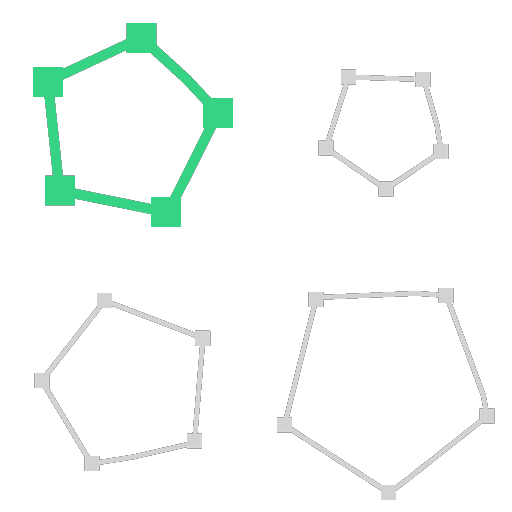

# Selezione tracciati

<table>
<tr style="border: 0;">
<td width="33.33%" style="border: 0;" valign="top">

<b>In:</b> Strumenti spline e tracciati > Strumenti tracciato

</td>
<td width="100.00%" style="border: 0;" valign="top">

## Descrizione

Isolate un tracciato tra più tracciati contenuti in Tracciati.

</td>
</tr>
</table>

## Input

|  |  |
|:---|:---|
| <b>Etichetta</b> <i>Tipo</i> | Un elenco di percorsi dei segmenti codificati. Collegare questo input al risultato di una [maschera ai percorsi](../../../../../../compositing-graphs/nodes-reference-for-com/node-library/spline-paths-tools/path-tools/mask-to-paths/mask-to-paths.md) o a un altro nodo di elaborazione dei percorsi. |

## Output

|  |  |
|:---|:---|
| <b>Tracciati</b> <i>Colore</i> | L’input Tracciati contiene un solo tracciato. Potete utilizzare [Anteprima tracciati](../../../../../../compositing-graphs/nodes-reference-for-com/node-library/spline-paths-tools/path-tools/preview-paths/preview-paths.md) per avere un&#39;idea di ciò che rappresenta il risultato, utilizzare un altro nodo di elaborazione tracciati o inserirlo in un [Tracciati da spline](../../../../../../compositing-graphs/nodes-reference-for-com/node-library/spline-paths-tools/path-tools/paths-to-spline/paths-to-spline.md) per elaborarlo ulteriormente come spline. |

## Parametri

|  |  |
|:---|:---|
| <b>Modalità di selezione</b> <i>Numero intero</i> | Il metodo utilizzato per selezionare i percorsi: *- Per ID:* Seleziona il percorso dall&#39;elenco il cui indice corrisponde a quello specificato in <b>ID percorso</b>; *- Per lunghezza:* Seleziona i percorsi la cui lunghezza è superiore o inferiore alla soglia specificata in <b>Lunghezza di destinazione</b>. |
| <b>ID percorso</b> <i>Intero</i> (disponibile quando <b>Modalità di selezione</b> è impostata su *Per ID*) | L&#39;indice del percorso selezionato. Un valore maggiore del numero di percorsi in <b>Percorsi *genera*</b> un output vuoto. |
| <b>Lunghezza maggiore o minore?</b> <i>Booleano</i> (disponibile quando <b>Modalità di selezione</b> è impostata su *Per lunghezza*) | Determina se la selezione deve includere una lunghezza maggiore o minore di <b>Lunghezza di destinazione</b>. |
| <b>Lunghezza destinazione</b> <i>Virgola mobile</i> (disponibile quando <b>Modalità di selezione</b> è impostata su *Per lunghezza*) | Soglia di lunghezza utilizzata per selezionare le spline. |

## Esempi

<table>
<tr style="border: 0;">
<td style="border: 0;" valign="top">

<table>
  <tr>
    <td>
      
       <i>Prima</i>
    </td>
    <td>
      
       <i>Dopo</i>
    </td>
  </tr>
</table>

</td>
<td style="border: 0;" valign="top">

<table>
  <tr>
    <td>
      
       <i>Prima</i>
    </td>
    <td>
      
       <i>Dopo</i>
    </td>
  </tr>
</table>

</td>
</tr>
</table>
