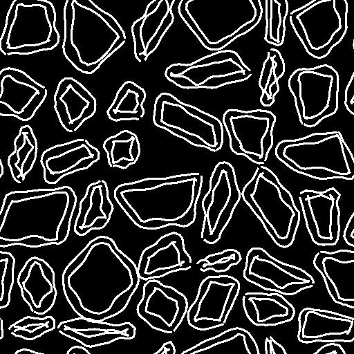

# Tracciati da spline

<table>
<tr style="border: 0;">
<td width="33.33%" style="border: 0;" valign="top">

<b>In:</b> Strumenti spline e tracciati > Strumenti tracciato

</td>
<td width="100.00%" style="border: 0;" valign="top">

## Descrizione

Converte i tracciati in spline che possono essere visualizzate utilizzando un nodo [Rendering spline](../../../../../../compositing-graphs/nodes-reference-for-com/node-library/spline-paths-tools/spline-tools/spline-render/spline-render.md) ed elaborate utilizzando [nodi spline](../../../../../../compositing-graphs/nodes-reference-for-com/node-library/spline-paths-tools/spline-tools/spline-tools.md).

</td>
</tr>
</table>

>[!NOTE]
>
> Le spline sono curve e quindi non possono mantenere la nitidezza dei tracciati. Quando si convertono i tracciati in spline, ci si aspetta una certa attenuazione delle forme.

>[!TIP]
>
> Questo nodo può essere utilizzato dopo il nodo [Maschera in tracciati](../../../../../../compositing-graphs/nodes-reference-for-com/node-library/spline-paths-tools/path-tools/mask-to-paths/mask-to-paths.md) per formare una catena che converte una maschera in spline.

## Input

|  |  |
|:---|:---|
| <b>Tracciati</b> <i>Colore</i> | Un elenco di percorsi dei segmenti codificati. Collegare questo input al risultato di una [maschera ai percorsi](../../../../../../compositing-graphs/nodes-reference-for-com/node-library/spline-paths-tools/path-tools/mask-to-paths/mask-to-paths.md) o a un altro nodo di elaborazione dei percorsi. |

## Output

|  |  |
|:---|:---|
| <b>Spline Coords</b> <i>Colore</i> | Coordinate dei punti delle spline di input codificate nei canali RGBA di un&#39;immagine a colori: <b>R</b> - Posizione X <b>G</b> - Posizione Y <b>B</b> - Height <b>A</b> - Dati compressi:  * Segno: la spline è chiusa (negativa) o aperta (positiva);  * Valore assoluto: Thickness + 1. |
| <b>Dati spline</b> <i>Colore</i> | Dati aggiuntivi delle spline di input codificate nei canali RGBA di un&#39;immagine <b>color</b>: <b>R</b> - Tangenti X <b>G</b> - Tangenti Y <b>B</b> - Non utilizzati <b>A</b> - Non utilizzati |
| <b>Quantità spline</b> <i>Numero intero</i> | Numero di spline di input. |

## Parametri

|  |  |
|:---|:---|
| <b>Spline Precision</b> <i>Numero intero</i> | Il logaritmo in base 2 (log2) del numero di vertici campionati in ogni percorso dell&#39;input Paths per creare la spline corrispondente. |

## Esempi

<table>
<tr style="border: 0;">
<td style="border: 0;" valign="top">

<table>
  <tr>
    <td>
      
       <i>Prima</i>
    </td>
    <td>
      
       <i>Dopo</i>
    </td>
  </tr>
</table>

</td>
<td style="border: 0;" valign="top">

<table>
  <tr>
    <td>
      
       <i>Prima</i>
    </td>
    <td>
      
       <i>Dopo</i>
    </td>
  </tr>
</table>

</td>
</tr>
</table>
