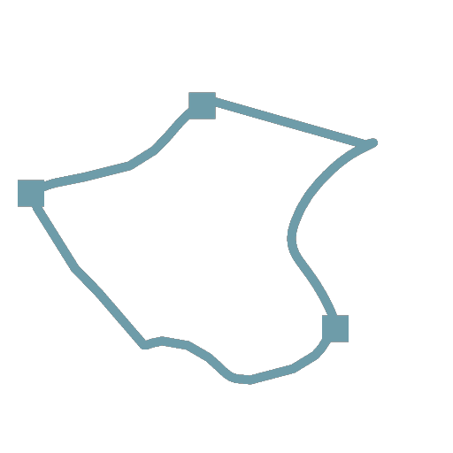

# Alterazione tracciati

<table>
<tr style="border: 0;">
<td width="33.33%" style="border: 0;" valign="top">

<b>In:</b> Strumenti spline e tracciati > Strumenti tracciato

</td>
<td width="100.00%" style="border: 0;" valign="top">

## Descrizione

Deforma i percorsi di input in base all&#39;<b>input sfumatura</b>. Stesso effetto del nodo [Altera](../../../../../../compositing-graphs/nodes-reference-for-com/atomic-nodes/warp/warp.md).

</td>
</tr>
</table>

## Input

|  |  |
|:---|:---|
| <b>Tracciati</b> <i>Colore</i> | Un elenco di percorsi dei segmenti codificati. Collegare questo input al risultato di una [maschera ai percorsi](../../../../../../compositing-graphs/nodes-reference-for-com/node-library/spline-paths-tools/path-tools/mask-to-paths/mask-to-paths.md) o a un altro nodo di elaborazione dei percorsi. |
| <b>Input sfumatura</b> <i>Scala di grigi</i> | L’input di tipo height che controlla sia l’entità che la direzione dell’alterazione. Stesso effetto del nodo [Altera](../../../../../../compositing-graphs/nodes-reference-for-com/atomic-nodes/warp/warp.md). |

## Output

|  |  |
|:---|:---|
| <b>Tracciati</b> <i>Colore</i> | I tracciati trasformati. Potete utilizzare [Anteprima tracciati](../../../../../../compositing-graphs/nodes-reference-for-com/node-library/spline-paths-tools/path-tools/preview-paths/preview-paths.md) per avere un&#39;idea di ciò che rappresenta il risultato, utilizzare un altro nodo di elaborazione tracciati o inserirlo in un [Tracciati da spline](../../../../../../compositing-graphs/nodes-reference-for-com/node-library/spline-paths-tools/path-tools/paths-to-spline/paths-to-spline.md) per elaborarlo ulteriormente come spline. |

## Parametri

|  |  |
|:---|:---|
| <b>Intensità</b> <i>Mobile</i> | Il parametro <b>Intensità</b> imposta l&#39;intensità dell&#39;alterazione. |
| <b>Numero di passaggi</b> <i>Numero intero</i> | Usate un valore più alto per alterare i tracciati di input di più piccoli incrementi. Questo può impedire al percorso di intersecarsi, soprattutto quando si utilizzano valori di <b>intensità</b> elevati. |

## Esempi

<table>
<tr style="border: 0;">
<td style="border: 0;" valign="top">

<table>
  <tr>
    <td>
      
       <i>Prima</i>
    </td>
    <td>
      
       <i>Dopo</i>
    </td>
  </tr>
</table>

</td>
<td style="border: 0;" valign="top">

<table>
  <tr>
    <td>
      
       <i>Prima</i>
    </td>
    <td>
      
       <i>Dopo</i>
    </td>
  </tr>
</table>

</td>
</tr>
</table>

<table>
<tr style="border: 0;">
<td style="border: 0;" valign="top">

</td>
<td style="border: 0;" valign="top">

</td>
</tr>
</table>
