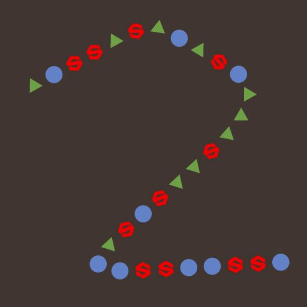

# Dispersione su colore spline

<table>
<tr style="border: 0;">
<td width="33.33%" style="border: 0;" valign="top">

In: Strumenti spline e tracciato > Strumenti spline

</td>
<td width="100.00%" style="border: 0;" valign="top">

## Descrizione

Disegna i pattern specificati lungo le spline di input sullo sfondo di input.

</td>
</tr>
</table>

Il nodo offre opzioni di personalizzazione avanzate per controllare la modalità di dispersione dei pattern

Alcuni aspetti della dispersione possono essere controllati utilizzando immagini provenienti da altri nodi nel grafico per migliorare l’aspetto dinamico del risultato.

>[!NOTE]
>
> Vedere anche [Dispersione su scala di grigi spline](../../../../../../compositing-graphs/nodes-reference-for-com/node-library/spline-paths-tools/spline-tools/scatter-spline-grayscale/scatter-on-spline-grayscale.md).

## Input

|  |  |
|:---|:---|
| <b>Sfondo</b> <i>Scala di grigi</i> (primaria) | Immagine in scala di grigio su cui devono essere disegnate spline. |
| <b>Spline Coords</b> <i>Colore</i> | Coordinate dei punti delle spline di input codificate nei canali RGBA di un&#39;immagine a colori: <b>R</b> - Posizione X <b>G</b> - Posizione Y <b>B</b> - Height <b>A</b> - Dati compressi:  * Segno: la spline è chiusa (negativa) o aperta (positiva);  * Valore assoluto: Thickness + 1. |
| <b>Dati spline</b> <i>Colore</i> | Dati aggiuntivi delle spline di input codificate nei canali RGBA di un&#39;immagine a colori. <b>R</b> - Tangenti X <b>G</b> - Tangenti Y <b>B</b> - Non utilizzati <b>A</b> - Non utilizzati |
| <b>Quantità spline</b> <i>Numero intero</i> | Numero di spline di input. |
| <b>Input pattern n. </b> <i>Scala di grigi</i> | Motivi che devono essere distribuiti lungo le spline. |
| <b>Mappa scala</b> <i>Scala di grigi</i> | La mappa che controlla la scala dei pattern sparsi. L’effetto di questa mappa è controllato dal parametro &quot;Moltiplicatore input mappa scala&quot; ed è combinato con gli altri parametri del gruppo &quot;Dimensione&quot;. |
| <b>Mappa altezza</b> <i>Scala di grigi</i> | La mappa che controlla il height dei pattern sparsi. L’effetto di questa mappa è controllato dal parametro &quot;Moltiplicatore di input di Height&quot; ed è combinato con gli altri parametri &quot;Colore&quot; del gruppo &quot;Colore&quot;. |
| <b>Mappa maschera</b> <i>Scala di grigi</i> | La mappa che controlla la mascheratura dei pattern sparsi. L’effetto di questa mappa è controllato dal parametro &quot;Soglia mappa maschera&quot; ed è combinato con gli altri parametri &quot;Maschera&quot; nel gruppo &quot;Colore&quot;. |

## Output

|  |  |
|:---|:---|
| <b>Output</b> <i>Scala di grigi</i> | Immagine che rappresenta i pattern distribuiti lungo la spline di input sullo sfondo dell&#39;input. |

## Parametri

|  |  |
|:---|:---|
| <b>Input spline</b> <i>Numero intero</i> | Metodo di selezione delle spline da utilizzare per i motivi di dispersione: ** Tutte le spline *: utilizzare tutte le spline nell&#39;elenco di input; * *Spline singola*: utilizzare solo la spline specificata dall&#39;elenco di input; * *Intervallo spline*: utilizzare solo le spline nell&#39;intervallo specificato dall&#39;elenco di input. |
| <b>Indice spline</b> <i>Intero</i> (disponibile quando ‘Spline Input’ è impostato su ‘Single Spline’) | Indice di elenco della spline da utilizzare per i pattern di dispersione. |
| <b>Intervallo spline</b> <i>Intero2</i> (disponibile quando &quot;Input spline&quot; è impostato su &quot;Intervallo spline&quot;) | Intervallo di indici di elenco, incluse le spline, che devono essere utilizzate per i pattern di dispersione. |
| <b>Modalità Dispersione</b> <i>Numero intero</i> | Metodo di dispersione dei pattern lungo le spline, che influisce sulla quantità di pattern su ciascuna spline: * Quantità forma: la quantità specificata di pattern uniformemente distanziati è dispersa; * Spaziatura forma: il numero di pattern viene regolato automaticamente per adattarsi alla spaziatura uniforme specificata. In entrambi i casi, il primo e l&#39;ultimo motivo si trovano esattamente all&#39;inizio e alla fine di ogni spline. |
| <b>Quantità forma</b> <i>Intero</i> (disponibile quando &quot;Modalità Dispersione&quot; è impostato su &quot;Quantità forma&quot;) | Quantità di pattern uniformemente distribuiti lungo ciascuna spline. |
| <b>Distribuzione della forma lungo la spline</b> <i>Intero</i> (disponibile quando &quot;Modalità Dispersione&quot; è impostato su &quot;Quantità forma&quot;) | Metodo di distribuzione dei pattern lungo una spline: ** Dall&#39;origine *: la spaziatura dei pattern è influenzata dalle tangenti del punto della spline, in cui le forme sono più distanti vicino a punti con tangenti lunghe; * *Uniforme*: i pattern sono distribuiti uniformemente lungo la spline indipendentemente dalle tangenti e dalla traiettoria. |
| <b>Spaziatura tra forme</b> <i>Virgola mobile</i> (disponibile quando &quot;Modalità Dispersione&quot; è impostato su &quot;Spaziatura forme&quot;) | Distanza minima lungo una spline in base alla quale i pattern devono essere distanziati, mentre il primo e l&#39;ultimo pattern devono ancora atterrare rispettivamente all&#39;inizio e alla fine di ogni spline. |
| <b>Inizio</b> <i>Mobile</i> | Sposta il punto dall&#39;inizio di una spline nel punto in cui inizia la dispersione. Il valore è la lunghezza normalizzata di ogni spline. |
| <b>Fine</b> <i>Mobile</i> | Sposta il punto dall&#39;inizio di una spline nel punto in cui termina la dispersione. Il valore è la lunghezza normalizzata di ogni spline. |
| <b>Pivot forma</b> <i>Float2</i> | Sposta il perno della serie X e Y nello spazio tangente della spline. Considerando che il perno è ciò che viene posizionato sulla spline, questo sposta efficacemente i pattern lungo o perpendicolarmente alla spline. Nota: le posizioni dei perni influiscono sull&#39;effetto dei parametri &quot;Scala&quot; e &quot;Rotazione (pivot)&quot;. |
| <b>Pattern</b> |  |
| <b>Pattern</b> <i>Numero intero</i> | Motivo che deve essere diffuso lungo le spline: *- Input motivo*: utilizzare i motivi forniti agli input &quot;N. input motivo&quot;; *- Quadrato; * Disco; * Paraboloide; * Campana; * Gaussiana; * Spina; * Piramide; * Mattone; * Gradazione; * Onde; * Mezza campana; * Campana scanalata; * Crescente; * Capsula; * Cono; * Gradazione w. offset; * Emisfero.* |
| <b>Numero di input del modello</b> <i>Intero</i> (disponibile quando &quot;Pattern&quot; è impostato su &quot;Pattern Input&quot;) | Seleziona l&#39;indice del pattern di input che deve essere distribuito. |
| <b>Distribuzione input pattern</b> <i>Intero</i> (disponibile quando &quot;Pattern&quot; è impostato su &quot;Pattern Input&quot;) | Metodo utilizzato per selezionare i pattern di input da diffondere su una spline specifica: *- Casuale*: un pattern viene selezionato in modo casuale; *- Lungo la spline*: l&#39;indice del pattern aumenta gradualmente lungo la spline; *- Indice del pattern*: esegue un ciclo sull&#39;indice dei pattern di input lungo ogni spline; *- Indice spline*: esegue un ciclo sull&#39;indice dei pattern di input da una spline alla successiva nell&#39;elenco delle spline di input. |
| <b>Variazione distribuzione</b> <i>Virgola mobile</i> (disponibile quando &quot;Distribuzione input pattern&quot; è impostato su &quot;Lungo spline&quot;) | Aumenta o diminuisce in modo casuale l&#39;indice selezionato dei pattern sulla spline. |
| <b>Sostituisci primo modello</b> <i>Booleano</i> | Selezionate manualmente l&#39;indice del pattern da posizionare all&#39;inizio di ogni spline. |
| <b>Indice di input primo modello</b> <i>Numero intero</i> (disponibile quando l&#39;opzione &quot;Ignora primo criterio&quot; è impostata su &quot;True&quot;) | Indice del pattern da posizionare all&#39;inizio di ogni spline. |
| <b>Sostituisci ultimo modello</b> <i>Booleano</i> | Selezionate manualmente l&#39;indice del pattern da posizionare alla fine di ogni spline. |
| <b>Indice di input ultimo modello</b> <i>Intero</i> (disponibile quando &quot;Ignora ultimo modello&quot; è impostato su &quot;True&quot;) | Indice del pattern da posizionare alla fine di ogni spline. |
| <b>Duplicati</b> |  |
| <b>Modalità di distribuzione</b> <i>Numero intero</i> | Metodo utilizzato per posizionare i pattern duplicati:  *- Lineare*: i duplicati sono distribuiti uniformemente lungo la normale della spline rispetto alla posizione originale del pattern; *- Circolare*: i duplicati sono disposti lungo un cerchio virtuale centrato sulla spline nella posizione originale del pattern. |
| <b>Quantità duplicata</b> <i>Numero intero</i> | Numero di pattern duplicati. |
| <b>Scostamento</b> <i>Virgola mobile 2</i> (disponibile quando &quot;Modalità distribuzione&quot; è impostato su &quot;Lineare&quot;) | Applica uno scostamento alle posizioni dei duplicati lungo la tangente (parallela) e la normale (perpendicolare) della spline. I duplicati sui lati opposti della spline vengono spostati in direzioni opposte. |
| <b>Centro offset</b> <i>Virgola mobile 2</i> (disponibile quando &quot;Modalità distribuzione&quot; è impostato su &quot;Lineare&quot;) | Applica uno scostamento ai duplicati lungo la spline su X (parallelo) e Y (perpendicolare). |
| <b>Angolo di diffusione</b> <i>Virgola mobile</i> (disponibile quando &quot;Modalità distribuzione&quot; è impostato su &quot;Circolare&quot;) | L&#39;arco del cerchio virtuale lungo il quale vengono distribuiti i duplicati, come l&#39;angolo dell&#39;arco in cui 1 è il cerchio completo. |
| <b>Distanza di offset</b> <i>Virgola mobile</i> (disponibile quando &quot;Modalità distribuzione&quot; è impostato su &quot;Circolare&quot;) | Raggio del cerchio virtuale lungo il quale vengono distribuiti i duplicati. |
| <b>Rotazione</b> <i>Mobile</i> | Ruota il cerchio virtuale lungo il quale vengono distribuiti i duplicati. |
| <b>Attenuazione inizio/fine offset</b> <i>Float2</i> | Fattori nella distanza dal punto medio della spline al suo inizio e alla sua fine, quando si applicano offset ai duplicati. Ciò significa che gli scostamenti vengono ridotti per i duplicati più vicini alle estremità di una spline. |
| <b>Offset attenuazione per Thickness</b> <i>Mobile</i> | Fattori nel thickness della spline quando si applicano gli offset ai duplicati. Ciò significa che gli scostamenti vengono ridotti per i duplicati su una porzione di una spline con un thickness inferiore. |
| <b>Dimensioni</b> |  |
| <b>Modalità dimensioni</b> <i>Numero intero</i> | Metodo di impostazione della dimensione dei pattern sparsi: *- Normale*: la dimensione viene controllata in modo uniforme utilizzando un parametro &quot;Scala&quot; globale; *- Usa Thickness della spline*: la dimensione dipende dal thickness della spline. |
| <b>Il Thickness ha effetto</b> <i>Intero</i> (disponibile quando &quot;Modalità dimensioni&quot; è impostato su &quot;Usa Thickness da spline&quot;) | Specifica quale asse della scala di un pattern deve essere guidato dal thickness della spline: * X &amp; Y: il Thickness viene moltiplicato per la dimensione in entrambi gli assi X e Y; * X: il Thickness viene moltiplicato per la dimensione solo sull&#39;asse X; * Y: il Thickness viene moltiplicato per la dimensione solo sull&#39;asse Y. Se non viene moltiplicato, la scala originale del pattern corrisponde all&#39;intera estensione dell&#39;immagine. In questo modo, in modalità &quot;X&quot;, la dimensione sull&#39;asse Y corrisponde all&#39;intera estensione dell&#39;immagine e deve essere modificata utilizzando il parametro Size. Lo stesso vale per le dimensioni sull’asse X quando si utilizza la modalità &quot;Y&quot;. |
| <b>Dimensioni</b> <i>Float2</i> | Dimensioni originali dei pattern in X e Y prima che vengano apportate altre regolazioni in base ad altri parametri. |
| <b>Dimensioni casuali</b> <i>Float2</i> | Applica un moltiplicatore casuale fino al valore specificato per ridurre le dimensioni dei pattern in X e Y. |
| <b>Scala Thickness</b> <i>Virgola mobile</i> (disponibile quando &quot;Modalità dimensioni&quot; è impostato su &quot;Usa Thickness da spline&quot;) | Un ulteriore moltiplicatore per la scala dei pattern quando questi sono guidati dal thickness della spline. |
| <b>Scala</b> <i>Virgola mobile</i> (disponibile quando &quot;Modalità dimensioni&quot; è impostato su &quot;Normale&quot;) | Un controllo globale per le dimensioni di tutti i pattern, dove 1 rappresenta l’intera estensione dell’immagine. Il ridimensionamento viene applicato relativamente al perno di un pattern. La posizione dei punti cardini può essere sfalsata mediante il parametro &quot;Shape Pivot&quot;. |
| <b>Scala casuale</b> <i>Virgola mobile</i> | Applica un moltiplicatore casuale fino al valore specificato per ridurre le dimensioni dei pattern. |
| <b>Moltiplicatore input mappa scala</b> <i>Virgola mobile</i> | Controlla l’intensità dell’input Mappa scala. Questa mappa funge da moltiplicatore per le dimensioni correnti dei pattern. L&#39;effetto di questa mappa è combinato con gli altri parametri nel gruppo &quot;Dimensioni&quot;. |
| <b>Modalità campionamento input scala</b> <i>Spazio Texture</i> | Metodo di mappatura dei valori nella mappa scala alle spline: *- spazio Texture*: i valori vengono applicati alle spline in cui si troverebbero se inseriti in una texture utilizzando le coordinate UV della texture. Questo applica efficacemente il valore alle spline &quot;in posizione&quot;; *- Orizzontale lungo la spline*: i valori vengono applicati direttamente alle coordinate delle spline codificate (vedere l&#39;input Coord spline), in cui ogni riga viene applicata a una spline diversa dall&#39;alto verso il basso; *- Ora. lungo spline (rand. offset X)*: i valori vengono applicati direttamente alle coordinate delle spline codificate (vedere l&#39;input Coord spline), con uno scostamento orizzontale casuale nella mappa Scala per ogni spline (ovvero, ogni riga nelle coordinate spline); *- Hor. lungo spline (rand. offset Y)*: i valori vengono applicati direttamente alle coordinate delle spline codificate (vedere l&#39;input Coord spline), con uno scostamento verticale casuale nella mappa Scala per ogni spline (ovvero, ogni riga nelle coordinate spline). |
| <b>Attenuazione inizio/fine</b> <i>Virgola mobile 2</i> | Fattori nella distanza dal punto medio della spline al suo inizio e alla sua fine durante il ridimensionamento dei pattern. Ciò significa che le dimensioni vengono ridotte per i motivi più vicini alle estremità di una spline. |
| <b>Posizione</b> |  |
| <b>Offset locale</b> <i>Float2</i> | Applica uno scostamento alle posizioni delle serie lungo la tangente (parallela) e la normale (perpendicolare) della spline. |
| <b>Scostamento locale casuale</b> <i>Float2</i> | Applica un ulteriore scostamento casuale alle posizioni delle serie lungo la tangente (parallela) e la normale (perpendicolare) della spline. |
| <b>Centro casuale scostamento locale</b> <i>Float2</i> | Sposta il centro dello scostamento casuale applicato dal parametro Scostamento casuale locale (Local Offset Random) lungo la tangente (parallela) e la normale (perpendicolare) della spline. |
| <b>Attenuazione inizio/fine scostamento locale</b> <i>Float2</i> | Fattori nella distanza dal punto medio della spline al suo inizio e alla sua fine quando si applicano scostamenti di posizione ai pattern. Ciò significa che gli scostamenti vengono diminuiti per i pattern più vicini alle estremità di una spline. |
| <b>Attenuazione offset locale per Thickness</b> <i>Mobile</i> | Fattori nel thickness della spline quando si applicano gli scostamenti ai pattern. Ciò significa che gli scostamenti vengono ridotti per i duplicati su una porzione di una spline con un thickness inferiore. |
| <b>Scostamento sulla spline</b> <i>Mobile</i> | Applica uno scostamento di posizione ai pattern lungo le spline. |
| <b>Scostamento casuale sulla spline</b> <i>Mobile</i> | Applica uno scostamento di posizione aggiuntivo ai pattern lungo le spline. |
| <b>Rotazione</b> |  |
| <b>Allinea con tangente</b> <i>Booleano</i> | Ruota i pattern in modo che corrispondano alla direzione della spline nella loro posizione. |
| <b>Rotazione (pivot)</b> <i>Virgola mobile</i> | Ruota i pattern attorno ai loro perni. È possibile spostare la posizione dei punti cardini utilizzando il parametro &quot;Shape Pivot&quot;. |
| <b>Rotazione casuale (pivot)</b> <i>Virgola mobile</i> | Applica una rotazione casuale aggiuntiva ai pattern attorno ai loro perni. È possibile spostare la posizione dei punti cardini utilizzando il parametro &quot;Shape Pivot&quot;. |
| <b>Rotazione al centro casuale (pivot)</b> <i>Virgola mobile</i> | Ruota attorno ai perni del pattern al centro delle rotazioni casuali applicate dal parametro Rotazione casuale. |
| <b>Rotazione (al centro)</b> <i>Virgola mobile</i> | Ruota i pattern attorno al loro centro. |
| <b>Rotazione casuale (al centro)</b> <i>Virgola mobile</i> | Applica una rotazione casuale aggiuntiva ai pattern attorno al loro centro. |
| <b>Rotazione al centro casuale (al centro)</b> <i>Virgola mobile</i> | Ruota attorno al centro del pattern al centro delle rotazioni casuali applicate dal parametro Rotazione casuale. |
| <b>Colore</b> |  |
| <b>Colore di sfondo</b> <i>Virgola mobile 4</i> | Colore dello sfondo nell&#39;immagine di output. |
| <b>Modalità Fusione</b> <i>Numero intero</i> | Metodo di fusione dei colori dei pattern con lo sfondo e altri pattern sovrapposti: *- Aggiungi*: Aggiungi i colori insieme; ** Fusione Alpha*: applica una semplice fusione di trasparenza utilizzando il canale alfa del pattern. I motivi disegnati per ultimi sono in primo piano. |
| <b>Modalità colore</b> <i>Numero intero</i> | Metodo di fusione selezionando il colore di ogni motivo: *- Colore di base*: il Colore di base viene applicato a tutti i motivi; ** Posizione*: la posizione del motivo nello spazio della texture viene utilizzata per guidarne il colore in modo che le coordinate X e Y vengano mappate rispettivamente ai canali rosso e verde. |
| <b>Colore di base di forme</b> <i>Virgola mobile 4</i> | Colore di base dei pattern. |
| <b>Moltiplicatore input colore</b> <i>Virgola mobile</i> | Controlla l’intensità dell’input Mappa colori. Questa mappa funge da moltiplicatore per il colore corrente dei pattern. L&#39;effetto di questa mappa è combinato con gli altri parametri nel gruppo &quot;Colore&quot;. Nota: il colore di output è il risultato ponderato di tutti i moltiplicatori di colore. |
| <b>Modalità campionamento input mappa colori</b> <i>Numero intero</i> | Metodo di mappatura dei valori nella mappa colori sulle spline: *- spazio Texture*: i valori vengono applicati alle spline nelle posizioni in cui verrebbero se inseriti in una texture utilizzando le coordinate UV della texture. Questo applica efficacemente il valore alle spline &quot;in posizione&quot;; *- Orizzontale lungo la spline*: i valori vengono applicati direttamente alle coordinate delle spline codificate (vedere l&#39;input Coord spline), in cui ogni riga viene applicata a una spline diversa dall&#39;alto verso il basso; *- Ora. lungo spline (rand. offset X)*: i valori vengono applicati direttamente alle coordinate delle spline codificate (vedere l&#39;input Coord spline), con uno scostamento orizzontale casuale nella mappa colore per ogni spline (ad esempio, ogni riga nelle coord spline); *- Hor. lungo spline (rand. offset Y)*: i valori vengono applicati direttamente alle coordinate delle spline codificate (vedere l&#39;input Coord spline), con uno scostamento verticale casuale nella mappa colore per ogni spline (ovvero, ogni riga nelle coordinate spline). |
| <b>Colore casuale</b> <i>Virgola mobile 4</i> | Applica uno scostamento casuale fino ai valori specificati ai colori dei pattern nello spazio HSV, nonché al loro canale alfa. *Nota:* Il colore di output è il risultato ponderato di tutti i moltiplicatori di colore. |
| <b>Centro colore casuale</b> <i>Virgola mobile</i> | Applica uno scostamento all&#39;intervallo dello scostamento casuale applicato in Colore casuale Un valore pari a -1 significa che tutti i valori casuali sono più alti e un valore pari a 1 significa che tutti i valori casuali sono più bassi. |
| <b>Moltiplicatore Thickness spline</b> <i>Virgola mobile</i> | Intensità di moltiplicazione del colore di ogni motivo rispetto al thickness della spline nella relativa posizione. Nota: il colore di output è il risultato ponderato di tutti i moltiplicatori di colore. |
| <b>Moltiplicatore scala forme</b> <i>Virgola mobile</i> | Intensità per la quale il colore di ogni pattern viene moltiplicato rispetto alla scala. Nota: il colore di output è il risultato ponderato di tutti i moltiplicatori di colore. |
| <b>Moltiplicatore Indice Forma</b> <i>Virgola mobile</i> | Intensità di moltiplicazione del colore di ogni pattern rispetto al relativo indice normalizzato. Nota: il colore di output è il risultato ponderato di tutti i moltiplicatori di colore. |
| <b>Moltiplicatore Height spline</b> <i>Virgola mobile</i> | Intensità di moltiplicazione del colore di ogni motivo rispetto al height della spline nella relativa posizione. Nota: il colore di output è il risultato ponderato di tutti i moltiplicatori di colore. |
| <b>Luminanza casuale</b> <i>Virgola mobile</i> | Applica un moltiplicatore casuale fino al valore specificato per diminuire la luminanza dei pattern. Nota: il colore di output è il risultato ponderato di tutti i moltiplicatori di colore. |
| <b>Moltiplicatore Thickness spline</b> <i>Virgola mobile</i> | Intensità per la quale l&#39;alfa di ogni pattern viene moltiplicato rispetto al thickness della spline nella relativa posizione. Nota: il colore di output è il risultato ponderato di tutti i moltiplicatori di colore. |
| <b>Moltiplicatore scala forme</b> <i>Virgola mobile</i> | Intensità per la quale l&#39;alfa di ogni pattern viene moltiplicato rispetto alla scala. Nota: il colore di output è il risultato ponderato di tutti i moltiplicatori di colore. |
| <b>Moltiplicatore Indice Forma</b> <i>Virgola mobile</i> | Intensità per la quale l&#39;alfa di ogni pattern viene moltiplicato rispetto all&#39;indice normalizzato. Nota: il colore di output è il risultato ponderato di tutti i moltiplicatori di colore. |
| <b>Moltiplicatore Height spline</b> <i>Virgola mobile</i> | Intensità per la quale l&#39;alfa di ogni pattern viene moltiplicato rispetto al height della spline nella relativa posizione. Nota: il colore di output è il risultato ponderato di tutti i moltiplicatori di colore. |
| <b>Luminanza casuale</b> <i>Virgola mobile</i> | Applica un moltiplicatore casuale fino al valore specificato per diminuire il valore alfa dei pattern. Nota: il colore di output è il risultato ponderato di tutti i moltiplicatori di colore. |
| <b>Maschera casuale</b> <i>Virgola mobile</i> | Regola l’intervallo della mascheratura casuale dei pattern, dove 0 significa che non viene mascherato alcun pattern e 1 significa che sono tutti i pattern. |
| <b>Soglia mappa maschera</b> <i>Virgola mobile</i> | I valori della Mappa maschera al di sotto di questo valore di soglia vengono elaborati come nero, mentre i valori al di sopra della soglia vengono elaborati come bianco. Ciò significa che tutti i pattern nelle aree della Mappa maschera al di sotto di questo valore verranno mascherati. |
| <b>Modalità campionamento input mappa maschera</b> <i>Numero intero</i> | Metodo di mappatura dei valori nella mappa maschera sulle spline: *- spazio Texture*: i valori vengono applicati alle spline nelle posizioni in cui si troverebbero se fossero posizionati in una texture utilizzando le coordinate UV della texture. Questo applica efficacemente il valore alle spline &quot;in posizione&quot;; *- Orizzontale lungo la spline*: i valori vengono applicati direttamente alle coordinate delle spline codificate (vedere l&#39;input Coord spline), in cui ogni riga viene applicata a una spline diversa dall&#39;alto verso il basso; *- Ora. lungo spline (rand. offset X)*: i valori vengono applicati direttamente alle coordinate delle spline codificate (vedere l&#39;input Coord spline), con uno scostamento orizzontale casuale nella mappa Scala per ogni spline (ovvero, ogni riga nelle coordinate spline); *- Hor. lungo spline (rand. offset Y)*: i valori vengono applicati direttamente alle coordinate delle spline codificate (vedere l&#39;input Coord spline), con uno scostamento verticale casuale nella mappa Scala per ogni spline (ovvero, ogni riga nelle coordinate spline). |
| <b>Inverti mappa maschera</b> <i>Booleano</i> | Inverte i valori della Mask Map (&lt;Mappa maschera>) usando un’operazione di sottrazione (1 - x). |
| <b>Inversione maschera</b> <i>Booleano</i> | Inverte la mascheratura dei pattern. |
| <b>Correzione non quadrata</b> <i>Booleano</i> | Regolate le posizioni dei punti per mantenere la forma della spline con risoluzioni non quadrate. |

## Esempi

<table>
<tr style="border: 0;">
<td style="border: 0;" valign="top">

<table>
  <tr>
    <td>
      
       <i>Prima</i>
    </td>
    <td>
      
       <i>Dopo</i>
    </td>
  </tr>
</table>

</td>
<td style="border: 0;" valign="top">

<table>
  <tr>
    <td>
      
       <i>Prima</i>
    </td>
    <td>
      
       <i>Dopo</i>
    </td>
  </tr>
</table>

</td>
</tr>
</table>

<table>
<tr style="border: 0;">
<td style="border: 0;" valign="top">

</td>
<td style="border: 0;" valign="top">

</td>
</tr>
</table>
