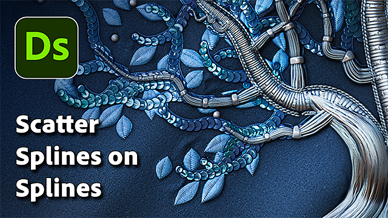

# Dispersione spline su spline

<table>
<tr style="border: 0;">
<td width="33.33%" style="border: 0;" valign="top">

<b>In:</b> Strumenti Spline E Tracciati > Strumenti spline

</td>
<td width="100.00%" style="border: 0;" valign="top">

## Descrizione

Inserisce spline lungo le spline padre di input.

Il nodo offre ampie opzioni di personalizzazione per controllare la dispersione delle spline e consente di dispersione semplici spline rette o spline personalizzate.

Il nodo consente di creare strutture complesse per la mappatura di colori e immagini utilizzando i nodi [Spline Mapper](../../../../../../compositing-graphs/nodes-reference-for-com/node-library/spline-paths-tools/spline-tools/spline-mapper-grayscale/spline-mapper-grayscale.md) o utilizzato come ossatura per posizionare forme utilizzando i nodi [Dispersione su Spline](../../../../../../compositing-graphs/nodes-reference-for-com/node-library/spline-paths-tools/spline-tools/scatter-spline-grayscale/scatter-on-spline-grayscale.md).

</td>
</tr>
</table>

<table>
<tr style="border: 0;">
<td style="border: 0;" valign="top">

### Esercitazione

Fare clic sull&#39;immagine a destra per accedere al nostro <b>tutorial dedicato</b>, per un tour guidato delle funzionalità del nodo e del relativo utilizzo nel contesto di un flusso di lavoro basato su spline.

</td>
<td style="border: 0;" valign="top">

</td>
</tr>
</table>

## Input

|  |  |
|:---|:---|
| <b>Anteprima</b> *Scala di grigi* | Anteprima delle spline di input come immagine in scala di grigio. |
| <b>Spline Coords</b> *Colore* | Coordinate dei punti delle spline principali codificati nei canali RGBA di un&#39;immagine a colori: <b>R</b> - Posizione X <b>G</b> - Posizione Y <b>B</b> - Height <b>A</b> - Dati compressi: - Segno: la spline è chiusa (negativa) o aperta (positiva) - Valore assoluto: Thickness + 1 |
| <b>Dati spline</b> *Colore* | Dati aggiuntivi delle spline principali codificate nei canali RGBA di un&#39;immagine a colori: <b>R</b> - Tangenti X <b>G</b> - Tangenti Y <b>B</b> - Tangenti Z <b>A</b> - Non in uso |
| <b>Quantità spline</b> *Numero intero* | Numero di spline padre. |
| <b>Coord spline personalizzati</b> *Colore* | Coordinate dei punti delle spline personalizzate codificate nei canali RGBA di un&#39;immagine a colori: <b>R</b> - Posizione X <b>G</b> - Posizione Y <b>B</b> - Height <b>A</b> - Dati compressi: - Segno: la spline è chiusa (negativa) o aperta (positiva) - Valore assoluto: Thickness + 1 |
| <b>Dati spline personalizzati</b> *Colore* | Dati aggiuntivi delle spline personalizzate codificate nei canali RGBA di un&#39;immagine a colori: <b>R</b> - Tangenti X <b>G</b> - Tangenti Y <b>B</b> - Tangenti Z <b>A</b> - Non in uso |
| <b>Quantità spline personalizzata</b> *Numero intero* | Numero di spline personalizzate. |
| <b>Mappa scala</b> *Scala di grigi* | Mappa in scala di grigi che controlla la scala delle spline sparse.  L&#39;effetto di questa mappa è controllato dal parametro <b>moltiplicatore input mappa scala</b> ed è combinato con gli altri parametri nel gruppo <b>Dimensioni</b>. |
| <b>Mappa di rotazione</b> *Scala di grigi* | Mappa in scala di grigi che controlla la rotazione delle spline sparse.  L&#39;effetto di questa mappa è controllato dal parametro <b>Moltiplicatore di input Mappa di rotazione</b> ed è combinato con gli altri parametri nel gruppo <b>Rotazione</b>. |

## Output

|  |  |
|:---|:---|
| <b>Anteprima</b> *Scala di grigi* | Anteprima delle spline sparse come immagine in scala di grigio. |
| <b>Spline Coords</b> *Colore* | Coordinate dei punti delle spline sparse codificate nei canali RGBA di un&#39;immagine a colori: <b>R</b> - Posizione X <b>G</b> - Posizione Y <b>B</b> - Height <b>A</b> - Dati compressi: - Segno: la spline è chiusa (negativa) o aperta (positiva) - Valore assoluto: Thickness + 1 |
| <b>Dati spline</b> *Colore* | Dati aggiuntivi delle spline sparse codificate nei canali RGBA di un&#39;immagine a colori: <b>R</b> - Tangenti X <b>G</b> - Tangenti Y <b>B</b> - <b>A</b> inutilizzati - Non usati |
| <b>Quantità spline</b> *Numero intero* | Numero di spline sparse. |

## Parametri

|  |  |
|:---|:---|
| <b>Lato</b> *Numero intero* | Determina il lato o i lati delle spline padre che devono essere dispersi, considerando che &#39;avanti&#39; è la direzione delle spline *padre*:  - <b>sinistra</b> Posizionare le spline sul lato sinistro. - <b>destra</b> Posizionare le spline sul lato destro. - <b>sinistra + destra</b> Posizionare le spline su entrambi i lati. - <b>sinistra / destra - Alternativa</b> Posizionare le spline a sinistra e a destra in alternativa (ad esempio, ogni altra  - <b>Sinistra/Destra - Casuale</b> Scegliere il lato in modo casuale per ogni spline. |
| <b>Modalità quantità</b> *Numero intero* | Metodo di dispersione delle spline lungo le spline padre, che influisce sulla quantità di spline sparse su ciascuna spline padre:  - <b>Quantità fissa per spline</b> La quantità specificata di spline uniformemente distanziate viene distribuita. - <b>Spaziatura</b> La quantità di spline viene regolata automaticamente in base alla spaziatura uniforme specificata.  In entrambi i casi, la prima e l&#39;ultima spline sparsa si trovano esattamente all&#39;inizio e alla fine di ciascuna spline padre. |
| <b>Quantità spline per spline</b> *Numero intero* | Quantità di spline uniformemente distribuite lungo ogni spline padre. |
| <b>Spaziatura spline</b> *Mobile* | Distanza minima lungo le spline padre in base alla quale le spline devono essere distanziate, mantenendo la prima e l&#39;ultima spline rispettivamente all&#39;inizio e alla fine di ogni spline padre. |
| <b>Tipo spline</b> *Numero intero* | Seleziona il tipo di spline da spargere sulle spline padre:  - <b>Dritta</b> Una spline semplice e dritta. - <b>Spline personalizzata</b> Le spline fornite agli input <b>Spline personalizzata</b>. Sono supportate più spline aggiunte insieme a un elenco. |
| <b>Selezione spline personalizzata</b> *Numero intero* | Quando si utilizzano più spline personalizzate accodate in un elenco, questo parametro consente di selezionare la modalità di distribuzione di tali spline nella dispersione.  - <b>Elenco intero</b> Tutte le spline sono sparse insieme come gruppo. - <b>Sequenziale</b> Ogni singola spline è sparsa in ordine, facendo il ciclo attorno all&#39;elenco. - <b>Casuale</b> Una spline casuale viene prelevata dall&#39;elenco per ogni spline sparsa. |
| <b>Inizio</b> *Mobile* | Sposta il punto dall’inizio delle spline principali da cui ha inizio la dispersione. Il valore è la lunghezza normalizzata di ogni spline padre. |
| <b>Fine</b> *Mobile* | Sposta il punto dall’inizio delle spline principali fino al termine della dispersione. Il valore è la lunghezza normalizzata di ogni spline padre. |
| <b>Direzione capovolgimento</b> *Booleano* | Inverte la direzione delle spline sparse. |
| <b>Modalità simmetria sinistra/destra</b> *Numero intero* | Metodo di simmetria applicato alle spline sparse su ciascun lato delle spline padre.  - <b>Disattivato</b> Non viene applicata alcuna simmetria, le spline vengono posizionate su ciascun lato utilizzando una semplice rotazione. - <b>simmetria sinistra</b> La spline a sinistra è simmetrica a quella a destra relativamente alla spline padre. - <b>simmetria destra</b> La spline a destra è simmetrica a quella a sinistra relativamente alla spline padre. |
| <b>Collegamento casuale sinistro/destro</b> *Booleano* | Controlla se le spline su ciascun lato della spline principale devono utilizzare gli stessi valori quando si utilizzano la rotazione casuale, il ridimensionamento casuale e così via. In altre parole:  - <i>False:</i> ogni spline utilizza valori casuali separati - <i>True:</i> entrambe le spline condividono gli stessi valori casuali |
| <b>Modalità pivot spline</b> *Numero intero* | Imposta il metodo di posizionamento del perno delle spline sparse, che influisce sulla rotazione e sul ridimensionamento. Si noti che il perno è *sempre posizionato sulla spline padre* e che i relativi controlli influiscono sulla spline sparsa. In altre parole: il perno non si sposta, è la spline sparsa che si sposta e si ridimensiona relativamente ad esso.  - <b>Posizione lungo la spline</b> Spostare il perno lungo la spline sparsa. - <b>Posizione assoluta</b> Impostare una posizione arbitraria per il perno. |
| <b>Posizione dei punti cardini lungo la spline</b> *Mobile* | Posizione normalizzata del perno lungo la spline dispersa, dove 0 rappresenta l&#39;inizio e 1 l&#39;estremità. Si noti che il perno segue la *direzione* della spline dispersa e l&#39;orientamento della spline può cambiare per mantenere la posizione e la rotazione del perno relativamente alla spline padre. |
| <b>Posizione assoluta pivot</b> *Float2* | Posizione del perno nello spazio UV. |
| <b>Correzione non quadrata</b> *Booleano* | Regolate le posizioni e il thickness delle spline in modo da mantenere la forma con risoluzioni non quadrate. <i>Nota:</i> Quando si utilizzano spline personalizzate, la spline personalizzata deve utilizzare le *stesse proporzioni dell&#39;immagine* dei nodi <b>Spline Dispersioni sulle spline</b>. |
| <b>Dimensioni</b> |  |
| <b>Scala spline</b> *Mobile* | Controllo globale per le dimensioni di tutte le spline, dove 1 rappresenta la dimensione originale completa. Il ridimensionamento viene applicato relativamente al perno di una spline. È possibile spostare la posizione dei punti cardini utilizzando il parametro <b>Spline Pivot</b>. |
| <b>Scala spline casuale</b> *Mobile* | Applica un moltiplicatore casuale fino al valore specificato per ridurre le dimensioni delle spline. |
| <b>Moltiplicatore input mappa scala</b> *Mobile* | Controlla l&#39;intensità dell&#39;input <b>Mappa scala</b>. Questa mappa funge da moltiplicatore per le dimensioni correnti dei pattern. L&#39;effetto di questa mappa è combinato con gli altri parametri nel gruppo <b>Dimensioni</b>. |
| <b>Modalità campionamento input mappa scala</b> *Numero intero* | Metodo di mappatura dei valori nella <b>mappa scala</b> alle spline:  - <b>spazio Texture</b> I valori vengono applicati alle spline in cui si troverebbero se inseriti in una texture utilizzando le coordinate UV della texture. In questo modo il valore viene applicato alle spline &#39;in posizione&#39; - <b>Orizzontale lungo la spline</b> I valori vengono applicati direttamente alle coordinate delle spline codificate (vedere l&#39;<b>input delle spline</b>), in cui ogni riga viene applicata a una spline diversa dall&#39;alto verso il basso - <b>Ora. lungo spline (rand. offset X)</b> I valori vengono applicati direttamente alle coordinate delle spline codificate (vedere l&#39;input <b>Coord spline</b>), con uno scostamento orizzontale casuale nella <b>Mappa scala</b> per ogni spline (ovvero ogni riga in <b>Coord spline</b>) - <b>Hor. lungo spline (rand. offset Y)</b> I valori vengono applicati direttamente alle coordinate delle spline codificate (vedere l&#39;input <b>Coord spline</b>), con uno scostamento verticale casuale nella <b>Mappa scala</b> per ogni spline (ad esempio, ogni riga in <b>Coord spline</b>) |
| <b>Attenuazione inizio/fine</b> *Float2* | Fattori nella distanza dal punto medio della spline al suo <b>Inizio</b> e <b>Fine</b> durante il ridimensionamento delle spline. Questo significa che le dimensioni vengono ridotte per le spline più vicine alle estremità di una spline. |
| <b>Posizione</b> |  |
| <b>Offset locale</b> *Float2* | Applica uno scostamento alle posizioni delle spline lungo la tangente (parallela) e la normale (perpendicolare) della spline padre. |
| <b>Scostamento su intervallo spline</b> *Numero intero* | Imposta l&#39;intervallo di offset applicato alle spline sparse lungo le spline padre.  - <b>Intervallo</b> L&#39;intervallo si estende *tra* ogni spline sparsa. - <b>Spline padre</b> L&#39;intervallo si estende per *tutta la lunghezza* della spline padre. |
| <b>Scostamento sulla spline</b> *Mobile* | Applica uno scostamento di posizione alle spline lungo le spline padre. |
| <b>Intervallo scostamento casuale</b> *Numero intero* | Imposta l&#39;intervallo di scostamento casuale applicato alle spline sparse lungo le spline padre.  - <b>Intervallo</b> L&#39;intervallo si estende *tra* ogni spline sparsa. - <b>Spline padre</b> L&#39;intervallo si estende per *tutta la lunghezza* della spline padre. |
| <b>Scostamento casuale sulla spline</b> *Mobile* | Applica uno scostamento di posizione aggiuntivo alle spline lungo le spline padre. |
| <b>Scostamento in base al Thickness</b> *Mobile* | Applica uno scostamento alle spline sparse lungo la normale delle spline padre, fino al thickness delle spline padre. In pratica, il valore 1 consente di posizionare le spline sparse sulla *superficie* dell&#39;inviluppo delle spline padre. |
| <b>Rotazione</b> |  |
| <b>Allineamento spline personalizzato</b> *Numero intero* | Controlla l&#39;orientamento iniziale delle spline personalizzate sulle spline padre.  - <b>Tangente primo punto</b> Le spline sono orientate in base alla tangente del primo punto. In altre parole, si allontanano dalle spline padre nella direzione impostata dal primo punto. - <b>Spazio immagine</b> Le spline vengono posizionate come appaiono in origine, senza ulteriori regolazioni alla loro posizione o orientamento, come se l&#39;immagine che le rappresenta fosse appoggiata sulla spline padre. |
| <b>Modalità di rotazione</b> *Numero intero* | Imposta l&#39;orientamento iniziale delle spline sparse.  - <b>Dalla spline</b> Le spline sono orientate in modo che corrispondano alla *normale* delle spline padre nella loro posizione. - <b>Assoluto</b> Le spline sono orientate tutte *allo stesso modo*, indipendentemente dalla direzione delle spline padre. |
| <b>Rotazione</b> *Mobile* | Ruota le spline attorno ai loro perni, in numero di giri. È possibile spostare la posizione dei punti cardini utilizzando il parametro <b>Spline Pivot</b>. |
| <b>Rotazione casuale</b> *Mobile* | Applica una rotazione casuale aggiuntiva alle spline attorno ai loro perni, in numero di giri. È possibile spostare la posizione dei punti cardini utilizzando il parametro <b>Spline Pivot</b>. |
| <b>Angolo sinistro/destro</b> *Mobile* | Controlla l&#39;angolo di rotazione simmetrica applicato alle spline su ciascun lato delle spline padre, in numero di giri. |
| <b>Angolo sinistro/destro casuale</b> *Mobile* | Aggiunge una quantità casuale di rotazione simmetrica alle spline su ciascun lato delle spline padre, in numero di giri. |
| <b>Moltiplicatore di input Mappa di rotazione</b> *Mobile* | Controlla l&#39;intensità dell&#39;input <b>Mappe di rotazione</b>. Questa mappa funge da moltiplicatore per la rotazione corrente dei pattern. L&#39;effetto di questa mappa è combinato con gli altri parametri nel gruppo <b>Rotazione</b>. |
| <b>Modalità campionamento input Mappa di rotazione</b> *Numero intero* | Metodo di mappatura dei valori nella <b>Mappa di rotazione</b> alle spline:  - <b>spazio Texture</b> I valori vengono applicati alle spline in cui si troverebbero se inseriti in una texture utilizzando le coordinate UV della texture. In questo modo il valore viene applicato alle spline &#39;in posizione&#39;, - <b>Orizzontale lungo la spline</b> I valori vengono applicati direttamente alle coordinate delle spline codificate (vedere l&#39;<b>input delle spine</b>), in cui ogni riga viene applicata a una spline diversa dall&#39;alto verso il basso, - <b>Hor. lungo spline (rand. offset X)</b> I valori vengono applicati direttamente alle coordinate delle spline codificate (vedere l&#39;input <b>Spline Coords</b>), con uno scostamento orizzontale casuale nella <b>Mappa di rotazione</b> per ogni spline (ovvero ogni riga in <b>Spline Coords</b>). - <b>Ora. lungo spline (rand. offset Y)</b> I valori vengono applicati direttamente alle coordinate delle spline codificate (vedere l&#39;input <b>Spline Coords</b>), con uno scostamento verticale casuale nella <b>Mappa di rotazione</b> per ogni spline (ovvero ogni riga in <b>Spline Coords</b>)<b>.</b> |
| <b>L&#39;input Mappa di rotazione ha effetto</b> *Numero intero* | Seleziona il parametro di rotazione interessato dalla <b>Mappa di rotazione</b>:  - <b>Rotazione spline</b> La mappa influisce sulla rotazione globale delle spline in senso orario. - <b>Angolo sinistro/destro</b> La mappa influisce sulla rotazione simmetrica delle spline <b>Sinistra/Destra</b>. |
| <b>Height</b> |  |
| <b>Avvia modalità Height</b> *Numero intero* | Metodo di calcolo del height iniziale delle spline sparse.  - <b>Manuale</b> Impostare lo stesso valore assoluto per tutte le spline sparse. - <b>Dalla spline padre (+ spline personalizzata)</b> Utilizzare il height della spline padre, quindi aggiungere il height della spline personalizzata utilizzando il mult <b>height iniziale spline personalizzato.</b> parametro. - <b>Dalla spline personalizzata</b> Utilizzare il height della spline personalizzata così com&#39;è.  <i>Nota:</i> Impostare <b>Spline Type</b> su &#39;Custom Spline&#39; e connettere gli input <b>Custom Spline</b> per utilizzare il height di spline personalizzate. |
| <b>Mult Height iniziale spline personalizzato.</b> *Virgola mobile* | Controlla il contributo del height iniziale della spline personalizzata al height iniziale delle spline sparse, dove 1 indica che viene utilizzato l&#39;intero height della spline personalizzata. Il height della spline personalizzata viene utilizzato in modo diverso in base alla <b>Modalità Height iniziale</b> selezionata: - <i>Dalla spline padre (+ spline personalizzata):</i> Il height viene aggiunto alla spline padre - <i>Dalla spline personalizzata:</i> Il height viene utilizzato direttamente |
| <b>Scostamento Height iniziale</b> *Virgola mobile* | Applica uno scostamento assoluto al height iniziale della spline dispersa. |
| <b>Inizia Height</b> *Mobile* | Imposta un valore assoluto per il height iniziale della spline dispersa. |
| <b>Modalità Height finale</b> *Numero intero* | Metodo di calcolo del height finale delle spline sparse.  - <b>Manuale</b> Impostare lo stesso valore assoluto per tutte le spline sparse. - <b>Dalla spline padre (+ spline personalizzata)</b> Utilizzare il height della spline padre, quindi aggiungere il height della spline personalizzata utilizzando <b>Spline personalizzata - Height finale.</b> parametro. - <b>Da spline personalizzata</b> Utilizzare il height della spline personalizzata così com&#39;è.  <i>Nota:</i> Impostare <b>Spline Type</b> su Spline personalizzata e connettere gli input <b>Spline personalizzata</b> per utilizzare il height di spline personalizzate. |
| <b>Mult Height finale spline personalizzato</b> *Mobile* | Controlla il contributo del height finale della spline personalizzata al height finale delle spline sparse, dove 1 indica che viene utilizzato l&#39;intero height della spline personalizzata. Il height della spline personalizzata viene utilizzato in modo diverso in base alla <b>Modalità Height finale</b> selezionata: - <i>Dalla spline padre (+ spline personalizzata):</i> Il height viene aggiunto alla spline padre - <i>Dalla spline personalizzata:</i> Il height viene utilizzato direttamente |
| <b>Scostamento Height finale</b> *Mobile* | Applica uno scostamento assoluto al height finale della spline dispersa. |
| <b>Fine Height</b> *Mobile* | Imposta un valore assoluto per il height finale della spline dispersa. |
| <b>Thickness</b> |  |
| <b>Avvia modalità Thickness</b> *Numero intero* | Metodo di calcolo del thickness iniziale delle spline sparse.  - <b>Manuale</b> Impostare lo stesso valore assoluto per tutte le spline sparse. - <b>Dalla spline padre</b> Utilizzare il thickness della spline padre. - <b>Dalla spline personalizzata</b> Utilizzare il thickness della spline personalizzata.  <i>Nota:</i> Impostare <b>Tipo spline</b> su Spline personalizzata e collegare gli input <b>Spline personalizzata</b> per utilizzare il thickness di spline personalizzate. |
| <b>Avvia moltiplicatore Thickness</b> *Mobile* | Ridimensiona il thickness iniziale delle spline sparse, dove 1 rappresenta il thickness completo. |
| <b>Scostamento Thickness iniziale</b> *Mobile* | Applica uno scostamento assoluto al thickness iniziale della spline dispersa. |
| <b>Inizia Thickness</b> *Virgola mobile* | Imposta un valore assoluto per il thickness iniziale della spline dispersa. |
| <b>Modalità Thickness finale</b> *Numero intero* | Metodo di calcolo del thickness finale delle spline sparse.  - <b>Manuale</b> Impostare lo stesso valore assoluto per tutte le spline sparse. - <b>Dalla spline padre</b> Utilizzare il thickness della spline padre. - <b>Dalla spline personalizzata</b> Utilizzare il thickness della spline personalizzata.  <i>Nota:</i> Impostare <b>Tipo spline</b> su Spline personalizzata e collegare gli input <b>Spline personalizzata</b> per utilizzare il thickness di spline personalizzate. |
| <b>Moltiplicatore Thickness finale</b> *Virgola mobile* | Ridimensiona il thickness iniziale delle spline sparse, dove 1 rappresenta il thickness completo. |
| <b>Scostamento Thickness finale</b> *Virgola mobile* | Applica uno scostamento assoluto al thickness finale della spline dispersa. |
| <b>Fine Thickness</b> *Virgola mobile* | Imposta un valore assoluto per il thickness finale della spline dispersa. |
| <b>Anteprima</b> |  |
| <b>Mostra helper direzione</b> *Booleano* | Visualizza un punto all&#39;inizio della spline e una freccia alla fine nell&#39;output <b>Anteprima</b>. |
| <b>Mostra busta Thickness</b> *Booleano* | Visualizza le linee aggiuntive ai bordi del thickness della spline. |
| <b>Thickness (px)</b> *Virgola mobile* | Regola il thickness della visualizzazione della spline nell&#39;output <b>Anteprima</b>, in numero di pixel. |
| <b>Importo segmenti</b> *Numero intero* | Regola il numero di segmenti utilizzati per disegnare la visualizzazione della spline nell&#39;output <b>Anteprima</b>. Un valore più alto genera una linea più morbida. |
| <b>Intensità sfondo</b> *Mobile* | Intensità dell&#39;input <b>Anteprima</b> nella visualizzazione dell&#39;output <b>Anteprima</b>. |

## Esempi

<table>
<tr style="border: 0;">
<td style="border: 0;" valign="top">

{zoomable="yes"}

</td>
<td style="border: 0;" valign="top">

{zoomable="yes"}

</td>
</tr>
</table>

<table>
<tr style="border: 0;">
<td style="border: 0;" valign="top">

{zoomable="yes"}

</td>
<td style="border: 0;" valign="top">

{zoomable="yes"}

</td>
</tr>
</table>

## Rendering

<table>
<tr style="border: 0;">
<td style="border: 0;" valign="top">

{zoomable="yes"}

</td>
<td style="border: 0;" valign="top">

{zoomable="yes"}

</td>
</tr>
</table>

{zoomable="yes"}
