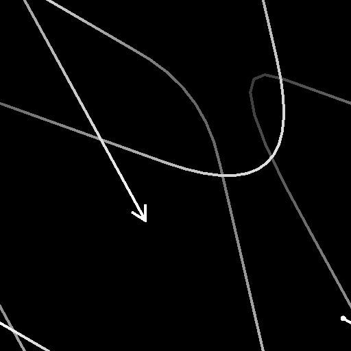

# Spline 2D Transform

<table>
<tr style="border: 0;">
<td width="33.33%" style="border: 0;" valign="top">

<b>In:</b> Strumenti Spline E Tracciati > Strumenti spline

</td>
<td width="100.00%" style="border: 0;" valign="top">

## Descrizione

Applica una trasformazione globale a tutte le spline di input, inclusa l&#39;inversione della direzione.

</td>
</tr>
</table>

## Input

|  |  |
|:---|:---|
| <b>Anteprima</b> <i>Scala di grigi</i> | Anteprima delle spline di input come immagine in scala di grigio. |
| <b>Spline Coords</b> <i>Colore</i> | Coordinate dei punti delle spline di input codificate nei canali RGBA di un&#39;immagine a colori: <b>R</b> - Posizione X <b>G</b> - Posizione Y <b>B</b> - Height <b>A</b> - Dati compressi: - Segno: la spline è chiusa (negativa) o aperta (positiva); - Valore assoluto: Thickness + 1. |
| <b>Dati spline</b> <i>Colore</i> | Dati aggiuntivi delle spline di input codificate nei canali RGBA di un&#39;immagine a colori. <b>R</b> - Tangenti X <b>G</b> - Tangenti Y <b>B</b> - Non utilizzati <b>A</b> - Non utilizzati |
| <b>Quantità spline</b> <i>Numero intero</i> | Numero di spline di input. |

## Output

|  |  |
|:---|:---|
| <b>Anteprima</b> <i>Scala di grigi</i> | Anteprima delle spline di output come immagine in scala di grigio. |
| <b>Spline Coords</b> <i>Colore</i> | Coordinate dei punti delle spline di output codificate nei canali RGBA di un&#39;immagine a colori. <b>R</b> - Posizione X <b>G</b> - Posizione Y <b>B</b> - Height <b>A</b> - Dati compressi: - Segno: la spline è chiusa (negativa) o aperta (positiva); - Valore assoluto: Thickness + 1. |
| <b>Dati spline</b> <i>Colore</i> | Dati aggiuntivi delle spline di output codificate nei canali RGBA di un&#39;immagine a colori. <b>R</b> - Tangenti X <b>G</b> - Tangenti Y <b>B</b> - Non usati <b>A</b> - Non usati |
| <b>Quantità spline</b> <i>Numero intero</i> | Numero di spline di output. |

## Parametri

|  |  |
|:---|:---|
| <b>Direzione capovolgimento</b> <i>Booleano</i> | Inverte la direzione della spline. |
| <b>Matrice di trasformazione</b> <i>Float4</i> | Matrice di trasformazione applicata alle spline. Sono disponibili tre modalità di modifica dei parametri della matrice:  - <i>Gizmo di trasformazione</i>: modificare le maniglie del gizmo visualizzato nel vista 2D quando è selezionato il nodo di Trasforma 2D della spline; - <i>Rotazione/Allungamento</i>: controllare singolarmente la rotazione e il allungamento delle spline. Si noti che i valori vengono sempre applicati relativamente alla trasformazione corrente. Ad esempio, se si applica due volte la larghezza del 50% si ottiene il 25% della larghezza; - <i>Valori matrice</i>: fare clic sul pulsante Modifica valori matrice per immettere direttamente i valori numerici non elaborati della matrice. |
| <b>Scostamento</b> <i>Float2</i> | Applica uno scostamento di posizione alle spline in X (orizzontale) e Y (verticale). |
| <b>Anteprima</b> |  |
| <b>Mostra helper direzione</b> <i>Booleano</i> | Visualizza un punto all&#39;inizio della spline e una freccia alla fine nell&#39;output di anteprima. |
| <b>Mostra busta Thickness</b> <i>Booleano</i> | Visualizza le linee aggiuntive ai bordi del thickness della spline. |
| <b>Importo segmenti</b> <i>Numero intero</i> | Regola il numero di segmenti utilizzati per disegnare la visualizzazione della spline nell&#39;output di anteprima. Un valore più alto genera una linea più morbida. |
| <b>Thickness (px)</b> <i>Mobile</i> | Regola il thickness della visualizzazione della spline in pixel nell&#39;output di anteprima. |

## Esempi

<table>
<tr style="border: 0;">
<td style="border: 0;" valign="top">

<table>
  <tr>
    <td>
      
       <i>Prima</i>
    </td>
    <td>
      
       <i>Dopo</i>
    </td>
  </tr>
</table>

</td>
<td style="border: 0;" valign="top">

<table>
  <tr>
    <td>
      
       <i>Prima</i>
    </td>
    <td>
      
       <i>Dopo</i>
    </td>
  </tr>
</table>

</td>
</tr>
</table>

<table>
<tr style="border: 0;">
<td style="border: 0;" valign="top">

</td>
<td style="border: 0;" valign="top">

</td>
</tr>
</table>
