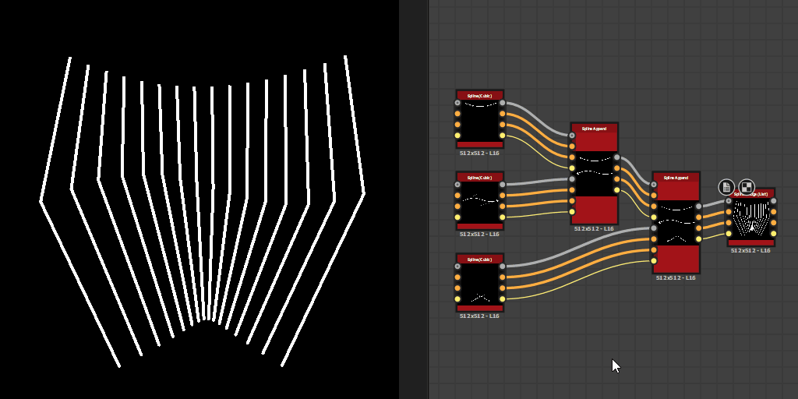

# Aggiungi spline

<table>
<tr style="border: 0;">
<td width="33.33%" style="border: 0;" valign="top">

<b>In:</b> Strumenti Spline E Tracciati > Strumenti spline

</td>
<td width="100.00%" style="border: 0;" valign="top">

## Descrizione

Le spline sono confezionate come un elenco. Questo nodo aggiunge un elenco di spline di input (set #2) a un elenco esistente (set #1).

L&#39;ordine degli elenchi viene mantenuto, il che significa che l&#39;aggiunta di un elenco D-E-F a un elenco A-B-C dà come risultato un elenco A-B-C-D-E-F.

</td>
</tr>
</table>

>[!TIP]
>
> Prestare attenzione all&#39;ordine in cui vengono aggiunte le spline, in quanto tale ordine viene preso in considerazione in altri nodi, ad esempio [Dispersione sulle spline](../../../../../../compositing-graphs/nodes-reference-for-com/node-library/spline-paths-tools/spline-tools/scatter-on-spline-color/scatter-on-spline-color.md), [Spline Bridge](../../../../../../compositing-graphs/nodes-reference-for-com/node-library/spline-paths-tools/spline-tools/spline-bridge-list/spline-bridge-list.md) e così via.

## Input

|  |  |
|:---|:---|
| <b>Anteprima #1</b> <i>Scala di grigi</i> | Anteprima del primo set di spline di input come immagine in scala di grigio. |
| <b>Spline #1 Coords</b> <i>Colore</i> | Coordinate del primo insieme di punti spline di input codificati nei canali RGBA di un&#39;immagine a colori. <b>R</b> - Posizione X <b>G</b> - Posizione Y <b>B</b> - Height <b>A</b> - Dati compressi: - Segno: la spline è chiusa (negativa) o aperta (positiva); - Valore assoluto: Thickness + 1. |
| <b>Dati #1 spline</b> <i>Colore</i> | Dati aggiuntivi del primo set di spline di input codificate nei canali RGBA di un&#39;immagine a colori. <b>R</b> - Tangenti X <b>G</b> - Tangenti Y <b>B</b> - Non utilizzati <b>A</b> - Non utilizzati |
| <b>Quantità #1 spline</b> <i>Numero intero</i> | Numero di spline di input nel primo set. |
| <b>Anteprima #2</b> <i>Scala di grigi</i> | Anteprima del secondo set di spline di input come immagine in scala di grigio. |
| <b>Spline #2 Coords</b> <i>Colore</i> | Coordinate del secondo set di punti spline di input codificati nei canali RGBA di un&#39;immagine a colori. <b>R</b> - Posizione X <b>G</b> - Posizione Y <b>B</b> - Height <b>A</b> - Dati compressi: - Segno: la spline è chiusa (negativa) o aperta (positiva); - Valore assoluto: Thickness + 1. |
| <b>Dati #2 spline</b> <i>Colore</i> | Dati aggiuntivi del secondo set di spline di input codificati nei canali RGBA di un&#39;immagine a colori. <b>R</b> - Tangenti X <b>G</b> - Tangenti Y <b>B</b> - Non utilizzati <b>A</b> - Non utilizzati |
| <b>Quantità #2 spline</b> <i>Numero intero</i> | Numero di spline di input nel secondo set. |

## Output

|  |  |
|:---|:---|
| <b>Anteprima</b> <i>Scala di grigi</i> | Anteprima delle spline di output come immagine in scala di grigio. |
| <b>Spline Coords</b> <i>Colore</i> | Coordinate dei punti delle spline di output codificate nei canali RGBA di un&#39;immagine a colori. <b>R</b> - Posizione X <b>G</b> - Posizione Y <b>B</b> - Height <b>A</b> - Dati compressi: - Segno: la spline è chiusa (negativa) o aperta (positiva); - Valore assoluto: Thickness + 1. |
| <b>Dati spline</b> <i>Colore</i> | Dati aggiuntivi delle spline di output codificate nei canali RGBA di un&#39;immagine a colori. <b>R</b> - Tangenti X <b>G</b> - Tangenti Y <b>B</b> - Non usati <b>A</b> - Non usati |
| <b>Quantità spline</b> <i>Numero intero</i> | Numero di spline di output. |

## Parametri

|  |  |
|:---|:---|
| <b>Inverti direzione #1 spline</b> <i>Booleano</i> | Inverte la direzione delle spline nel primo insieme. |
| <b>Inverti direzione #2 spline</b> <i>Booleano</i> | Inverte la direzione delle spline nel secondo insieme. |
| <b>Anteprima</b> |  |
| <b>Importo segmenti</b> <i>Numero intero</i> | Regola il numero di segmenti utilizzati per disegnare la visualizzazione della spline nell&#39;output di anteprima. Un valore più alto genera una linea più morbida. |
| <b>Mostra helper direzione</b> <i>Booleano</i> | Visualizza un punto all&#39;inizio della spline e una freccia alla fine nell&#39;output di anteprima. |
| <b>Mostra busta Thickness</b> <i>Booleano</i> | Visualizza le linee aggiuntive ai bordi del thickness della spline. |
| <b>Thickness (px)</b> <i>Mobile</i> | Regola il thickness della visualizzazione della spline in pixel nell&#39;output di anteprima. |

## Esempi

<table>
<tr style="border: 0;">
<td style="border: 0;" valign="top">

</td>
<td style="border: 0;" valign="top">

</td>
</tr>
</table>

