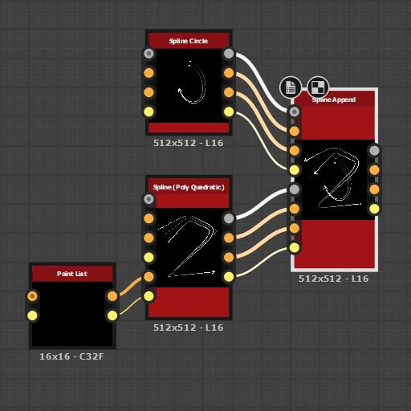

# Aggiungi spline

<table>
<tr style="border: 0;">
<td width="33.33%" style="border: 0;" valign="top">

<b>In:</b> Strumenti Spline E Tracciati > Strumenti spline

</td>
<td width="100.00%" style="border: 0;" valign="top">

## Descrizione

Le spline sono confezionate come un elenco. Questo nodo aggiunge un elenco di spline di input (set #2) a un elenco esistente (set #1).

L&#39;ordine degli elenchi viene mantenuto, il che significa che l&#39;aggiunta di un elenco D-E-F a un elenco A-B-C dà come risultato un elenco A-B-C-D-E-F.

</td>
</tr>
</table>

>[!TIP]
>
> Prestare attenzione all&#39;ordine in cui vengono aggiunte le spline, in quanto tale ordine viene preso in considerazione in altri nodi, ad esempio [Dispersione sulle spline](../../../../../../compositing-graphs/nodes-reference-for-com/node-library/spline-paths-tools/spline-tools/scatter-on-spline-color/scatter-on-spline-color.md), [Spline Bridge](../../../../../../compositing-graphs/nodes-reference-for-com/node-library/spline-paths-tools/spline-tools/spline-bridge-list/spline-bridge-list.md) e così via.

## Connettori di ingresso

<b>Anteprima #1</b> *Scala di grigio* Anteprima del primo set di spline di input come immagine in scala di grigio.

<b>Spline #1 Coords</b> *Colore* Coordinate dei punti del primo gruppo di spline di input codificate nei canali RGBA di un&#39;immagine a colori.\
    <b>R</b> - Posizione X\
    <b>G</b> - Posizione Y\
    <b>B</b> - Height\
    <b>A</b> - Dati compressi:\
        * Segno: la spline è chiusa (negativa) o aperta (positiva);\
        * Valore assoluto: Thickness + 1.

<b>Dati #1 spline</b> *Colore* Dati aggiuntivi del primo set di spline di input codificati nei canali RGBA di un&#39;immagine a colori.\
    <b>R</b> - Tangenti X\
    <b>G</b> - Tangenti Y\
    <b>B</b> - Non utilizzato\
    <b>A</b> - Non in uso

<b>Quantità #1 spline</b> *Numero intero* Numero di spline di input nel primo set.

<b>Anteprima #2</b> *Scala di grigio* Anteprima del secondo set di spline di input come immagine in scala di grigio.

<b>Spline #2 Coords</b> *Colore* Coordinate del secondo gruppo di punti spline di input codificati nei canali RGBA di un&#39;immagine a colori.\
    <b>R</b> - Posizione X\
    <b>G</b> - Posizione Y\
    <b>B</b> - Height\
    <b>A</b> - Dati compressi:\
        * Segno: la spline è chiusa (negativa) o aperta (positiva);\
        * Valore assoluto: Thickness + 1.

<b>Dati #2 spline</b> *Colore* Dati aggiuntivi del secondo set di spline di input codificati nei canali RGBA di un&#39;immagine a colori.\
    <b>R</b> - Tangenti X\
    <b>G</b> - Tangenti Y\
    <b>B</b> - Non utilizzato\
    <b>A</b> - Non in uso

<b>Quantità #2 spline</b> *Numero intero* Numero di spline di input nel secondo set.

## Connettori di uscita

<b>Anteprima</b> *Scala di grigi* Anteprima delle spline di output come immagine in scala di grigi.

<b>Spline Coords</b> *Colore* Coordinate dei punti delle spline di output codificate nei canali RGBA di un&#39;immagine a colori.\
    <b>R</b> - Posizione X\
    <b>G</b> - Posizione Y\
    <b>B</b> - Height\
    <b>A</b> - Dati compressi:\
        * Segno: la spline è chiusa (negativa) o aperta (positiva);\
        * Valore assoluto: Thickness + 1.

<b>Dati spline</b> *Colore* Dati aggiuntivi delle spline di output codificate nei canali RGBA di un&#39;immagine a colori.\
    <b>R</b> - Tangenti X\
    <b>G</b> - Tangenti Y\
    <b>B</b> - Non utilizzato\
    <b>A</b> - Non in uso

<b>Quantità spline</b> *Numero intero* Numero di spline di output.

## Parametri

<b>Inverti direzione spline #1 </b>*Booleano* Inverte la direzione delle spline nel primo set.

<b>Inverti direzione spline #2 </b>*Booleano* Inverte la direzione delle spline nel secondo set.

+++Anteprima
<b>Importo segmenti</b> *Numero intero* Regola il numero di segmenti utilizzati per disegnare la visualizzazione della spline nell&#39;output di anteprima.\
Un valore più alto genera una linea più morbida.

<b>Mostra helper direzione</b> *Booleano* Visualizza un punto all&#39;inizio della spline e una freccia alla fine nell&#39;output di anteprima.

<b>Mostra busta Thickness</b> *Booleano*\
Visualizza le linee aggiuntive ai bordi del thickness della spline.

<b>Thickness (px)</b> *Mobile* Regola il thickness della visualizzazione della spline in pixel nell&#39;output di anteprima.

+++

## Esempi

<table>
<tr style="border: 0;">
<td style="border: 0;" valign="top">

</td>
<td style="border: 0;" valign="top">

</td>
</tr>
</table>

