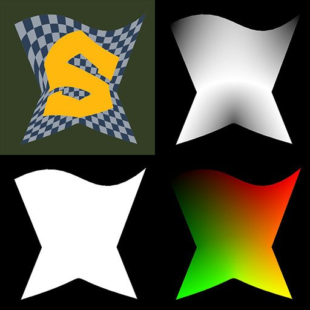

# Colore mapping spline bridge

<table>
<tr style="border: 0;">
<td width="33.33%" style="border: 0;" valign="top">

<b>In:</b> Strumenti Spline E Tracciati > Strumenti spline

</td>
<td width="100.00%" style="border: 0;" valign="top">

## Descrizione

Esegue la mappatura di un&#39;immagine a colori su un elenco di spline di input in modo che l&#39;immagine attraversi le spline in ordine.

</td>
</tr>
</table>

>[!TIP]
>
> La mappatura va dalla prima spline dell&#39;elenco all&#39;ultima e attraversa le spline intermedie seguendo rigorosamente l&#39;ordine di queste spline nell&#39;elenco.
> 
> Pertanto, dovete prestare attenzione all’ordine in cui aggiungete le spline in anticipo.

>[!NOTE]
>
> Vedere anche [Scala di grigi Mappatura ponti spline](../../../../../../compositing-graphs/nodes-reference-for-com/node-library/spline-paths-tools/spline-tools/spline-bridge-mapper-gra/spline-bridge-mapper-grayscale.md).

## Input

|  |  |
|:---|:---|
| <b>Spline Coords</b> <i>Colore</i> | Coordinate dei punti delle spline di input codificate nei canali RGBA di un&#39;immagine a colori: <b>R</b> - Posizione X <b>G</b> - Posizione Y <b>B</b> - Height <b>A</b> - Dati compressi: - Segno: la spline è chiusa (negativa) o aperta (positiva); - Valore assoluto: Thickness + 1. |
| <b>Dati spline</b> <i>Colore</i> | Dati aggiuntivi delle spline di input codificate nei canali RGBA di un&#39;immagine a colori. <b>R</b> - Tangenti X <b>G</b> - Tangenti Y <b>B</b> - Non utilizzati <b>A</b> - Non utilizzati |
| <b>Quantità spline</b> <i>Numero intero</i> | Numero di spline di input. |
| <b>Mappa colori</b> <i>Colore</i> | Immagine del colore di input da mappare sulle spline di input. |

## Output

|  |  |
|:---|:---|
| <b>Colore</b> <i>Scala di grigi</i> | Risultato della mappatura dell&#39;immagine a colori di input sulle spline sullo sfondo, come immagine a colori. |
| <b>Height</b> <i>Scala di grigi</i> | Height delle spline mappato sulle spline, come immagine in scala di grigio. |
| <b>UV</b> <i>Colore</i> | Gli UV (coordinate) dell’immagine mappata, codificati nei canali rosso (U) e verde (V) di un’immagine a colori. |
| <b>Maschera</b> <i>Scala di grigi</i> | Maschera della mappatura sulle spline. |

## Parametri

|  |  |
|:---|:---|
| <b>Importo segmenti</b> <i>Numero intero</i> | Le spline vengono semplificate in segmenti prima che le coordinate dell&#39;immagine le attraversino. Una maggiore quantità di segmenti determina una mappatura più uniforme lungo le curve. |
| <b>Riduci dilatazione UV</b> <i>Booleano</i> | Regola il metodo utilizzato per interpolare le coordinate dell&#39;immagine da una spline all&#39;altra per ridurre al minimo il allungamento quando la distanza tra le spline è irregolare. |
| <b>Scala UV</b> <i>Float2</i> | Regola la scala delle coordinate dell’immagine. Più alti sono i valori, maggiore sarà la densità delle immagini. |
| <b>Rotazione UV</b> <i>Mobile</i> | Ruota le coordinate dell’immagine attorno al loro centro. |
| <b>Colore di sfondo</b> <i>Float4</i> | Colore dello sfondo nell&#39;immagine di output. |

## Esempi

<table>
<tr style="border: 0;">
<td style="border: 0;" valign="top">

<table>
  <tr>
    <td>
      
       <i>Prima</i>
    </td>
    <td>
      
       <i>Dopo</i>
    </td>
  </tr>
</table>

</td>
<td style="border: 0;" valign="top">

</td>
</tr>
</table>

<table>
<tr style="border: 0;">
<td style="border: 0;" valign="top">

</td>
<td style="border: 0;" valign="top">

</td>
</tr>
</table>
