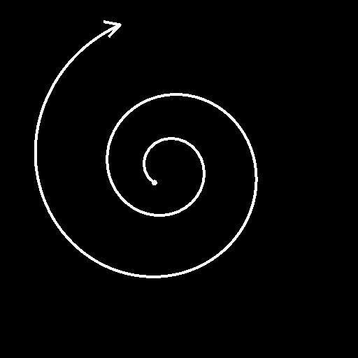

# Cerchio spline

<table>
<tr style="border: 0;">
<td width="33.33%" style="border: 0;" valign="top">

<b>In:</b> Strumenti Spline E Tracciati > Strumenti spline

</td>
<td width="100.00%" style="border: 0;" valign="top">

## Descrizione

Genera una singola spline a forma di cerchio.

</td>
</tr>
</table>

## Input

|  |  |
|:---|:---|
| <b>Anteprima</b> <i>Scala di grigi</i> | Anteprima delle spline di input come immagine in scala di grigio. |
| <b>Spline Coords</b> <i>Colore</i> | Coordinate dei punti delle spline di input codificate nei canali RGBA di un&#39;immagine a colori: <b>R</b> - Posizione X <b>G</b> - Posizione Y <b>B</b> - Height <b>A</b> - Dati compressi: - Segno: la spline è chiusa (negativa) o aperta (positiva); - Valore assoluto: Thickness + 1. |
| <b>Dati spline</b> <i>Colore</i> | Dati aggiuntivi delle spline di input codificate nei canali RGBA di un&#39;immagine a colori. <b>R</b> - Tangenti X <b>G</b> - Tangenti Y <b>B</b> - Non utilizzati <b>A</b> - Non utilizzati |
| <b>Quantità spline</b> <i>Numero intero</i> | Numero di spline di input. |

## Output

|  |  |
|:---|:---|
| <b>Anteprima</b> <i>Scala di grigi</i> | Anteprima delle spline di output come immagine in scala di grigio. |
| <b>Spline Coords</b> <i>Colore</i> | Coordinate dei punti delle spline di output codificate nei canali RGBA di un&#39;immagine a colori. <b>R</b> - Posizione X <b>G</b> - Posizione Y <b>B</b> - Height <b>A</b> - Dati compressi: - Segno: la spline è chiusa (negativa) o aperta (positiva); - Valore assoluto: Thickness + 1. |
| <b>Dati spline</b> <i>Colore</i> | Dati aggiuntivi delle spline di output codificate nei canali RGBA di un&#39;immagine a colori. <b>R</b> - Tangenti X <b>G</b> - Tangenti Y <b>B</b> - Non usati <b>A</b> - Non usati |
| <b>Quantità spline</b> <i>Numero intero</i> | Numero di spline di output. |

## Parametri

|  |  |
|:---|:---|
| <b>Raggio cerchio</b> <i>Mobile</i> | Regola il raggio del cerchio nello spazio della texture. |
| <b>Pre-rotazione cerchio</b> <i>Mobile</i> | Applica una rotazione al cerchio di base prima di applicare la dimensione. |
| <b>Dimensione cerchio</b> <i>Float2</i> | Regola la dimensione orizzontale (X) e verticale (Y) del cerchio. |
| <b>Cerchio dopo la rotazione</b> <i>Mobile</i> | Applica una rotazione al cerchio di base dopo l’applicazione di Dimensione. |
| <b>Posizione cerchio</b> <i>Float2</i> | Imposta la posizione del centro del cerchio nello spazio della texture. |
| <b>Inizia Thickness</b> <i>Mobile</i> | Regola il thickness del punto iniziale del cerchio. Questo thickness viene interpolato lungo la spline fino al Thickness finale. Nota: il Thickness viene utilizzato da nodi della spline specifici. |
| <b>Fine Thickness</b> <i>Mobile</i> | Regola il thickness del punto finale del cerchio. Questo thickness viene interpolato lungo la spline nel Thickness iniziale. Nota: il Thickness viene utilizzato da nodi della spline specifici. |
| <b>Inizia Height</b> <i>Mobile</i> | Regola il height del punto iniziale del cerchio in cui un valore più basso indica una posizione più bassa o più profonda. Questo height viene interpolato lungo la spline fino al Height finale. |
| <b>Fine Height</b> <i>Mobile</i> | Regola il height del punto finale del cerchio in cui un valore più basso indica una posizione più bassa o più profonda. Questo height viene interpolato lungo la spline dal Height Inizio. |
| <b>Taglia</b> <i>Float2</i> | Sposta i punti iniziale e finale della spline lungo il cerchio. Questi valori vengono normalizzati. |
| <b>Spirale</b> <i>Mobile</i> | Sposta il punto iniziale del cerchio dal raggio al centro. La distanza dal centro viene quindi interpolata lungo la spline fino all&#39;estremità della spline. Questo valore è normalizzato. |
| <b>Cicli a spirale</b> <i>Mobile</i> | Definisce il numero di giri effettuati dalla spirale attorno al suo centro. |
| <b>Potenza a spirale</b> <i>Mobile</i> | Applica una curva di potenza alla distanza dal centro utilizzata per disegnare la spirale. Un valore maggiore di uno significa che una porzione maggiore della spirale rimane vicina al centro. |
| <b>Direzione capovolgimento</b> <i>Booleano</i> | Inverte la direzione della spline. |
| <b>Distribuzione uniforme</b> <i>Booleano</i> | Se è impostato su True, i punti della spline sono distribuiti uniformemente dall&#39;inizio alla fine. |
| <b>Aggiungi spline di input</b> <i>Booleano</i> | Aggiunge la spline generata alla fine dell&#39;elenco di spline connesse agli input <b>Spline</b>. |
| <b>Correzione non quadrata</b> <i>Booleano</i> | Regolate le posizioni e il thickness dei punti per mantenere la forma della spline con risoluzioni non quadrate. Questo incide anche sulla distribuzione uniforme. |
| <b>Anteprima</b> |  |
| <b>Mostra helper direzione</b> <i>Booleano</i> | Visualizza un punto all&#39;inizio della spline e una freccia alla fine nell&#39;output di anteprima. |
| <b>Mostra busta Thickness</b> <i>Booleano</i> | Visualizza le linee aggiuntive ai bordi del thickness della spline. |
| <b>Importo segmenti</b> <i>Numero intero</i> | Regola il numero di segmenti utilizzati per disegnare la visualizzazione della spline nell&#39;output di anteprima. Un valore più alto genera una linea più morbida. |
| <b>Thickness (px)</b> <i>Mobile</i> | Regola il thickness in pixel della visualizzazione spline nell&#39;output di anteprima. |

## Esempi

<table>
<tr style="border: 0;">
<td style="border: 0;" valign="top">

</td>
<td style="border: 0;" valign="top">

</td>
</tr>
</table>

<table>
<tr style="border: 0;">
<td style="border: 0;" valign="top">

</td>
<td style="border: 0;" valign="top">

</td>
</tr>
</table>
