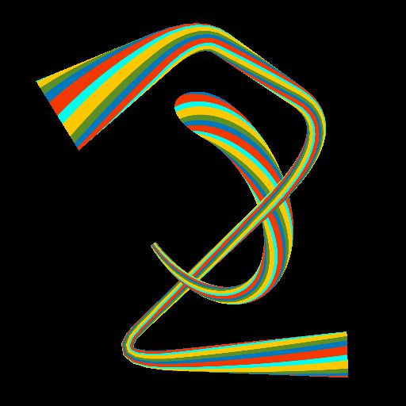

# Colore mappatura spline

<table>
<tr style="border: 0;">
<td width="33.33%" style="border: 0;" valign="top">

<b>In:</b> Strumenti Spline E Tracciati > Strumenti spline

</td>
<td width="100.00%" style="border: 0;" valign="top">

## Descrizione

Esegue la mappatura di un&#39;immagine a colori di input su una forma primitiva allungata lungo le spline di input.

La forma primitiva può essere un piano, un semicilindro o un cilindro. I cilindri possono essere ruotati lungo la spline per deformare di conseguenza l&#39;immagine mappata.

</td>
</tr>
</table>

Il nodo genera l&#39;immagine mappata come immagine a colori, nonché altre informazioni quali height, UV (ad esempio, coordinate dell&#39;immagine) e una maschera ID per selezionare ciascuna spline mappata in modo indipendente.

>[!IMPORTANT]
>
> Il risultato può includere artefatti indesiderati all&#39;esterno dell&#39;inviluppo della spline quando si utilizzano valori di thickness molto bassi. Questo è un problema noto.

>[!NOTE]
>
> Vedere anche [Scala di grigi Mappatura spline](../../../../../../compositing-graphs/nodes-reference-for-com/node-library/spline-paths-tools/spline-tools/spline-mapper-grayscale/spline-mapper-grayscale.md).

## Input

|  |  |
|:---|:---|
| <b>Spline Coords</b> <i>Colore</i> | Coordinate dei punti delle spline di input codificate nei canali RGBA di un&#39;immagine a colori: <b>R</b> - Posizione X <b>G</b> - Posizione Y <b>B</b> - Height <b>A</b> - Dati compressi:  - Segno: la spline è chiusa (negativa) o aperta (positiva);  - Valore assoluto: Thickness + 1. |
| <b>Dati spline</b> <i>Colore</i> | Dati aggiuntivi delle spline di input codificate nei canali RGBA di un&#39;immagine a colori. <b>R</b> - Tangenti X <b>G</b> - Tangenti Y <b>B</b> - Non utilizzati <b>A</b> - Non utilizzati |
| <b>Quantità spline</b> <i>Numero intero</i> | Numero di spline di input. |
| <b>Mappa colori</b> <i>Colore</i> | Immagine del colore di input da mappare lungo le spline di input. |
| <b>Mappa Height</b> <i>Scala di grigi</i> | Mappa dell&#39;altezza in scala di grigi di input da mappare lungo le spline di input. |
| <b>Twist curve</b> <i>Scala di grigi</i> | Immagine che descrive una curva utilizzando i valori della prima riga di pixel. Quando il parametro <b>Shape</b> è impostato su <i>Half-Cylinder</i> o <i>Cylinder</i>, questo input viene utilizzato per controllare la torsione degli UV attorno alla forma. Il suo impatto è controllato utilizzando il parametro <b>Moltiplicatore curva UV torsione</b>. La curva fornisce un profilo per la quantità di rotazione lungo la spline, dove il primo pixel della riga è la rotazione all&#39;inizio della spline e l&#39;ultimo è la rotazione alla fine. Il valore in scala di grigi rappresenta un numero di giri. È possibile utilizzare un nodo [Curva](../../../../../../compositing-graphs/nodes-reference-for-com/atomic-nodes/curve/curve.md) per creare la curva. |

## Output

|  |  |
|:---|:---|
| <b>Colore</b> <i>Colore</i> | Risultato della mappatura dell&#39;immagine a colori di input sulle spline di input, come immagine a colori. |
| <b>Height</b> <i>Scala di grigi</i> | Risultato della mappatura dell&#39;immagine del Height di input sulle spline di input, come immagine in scala di grigio. |
| <b>UV</b> <i>Colore</i> | Gli UV (cioè le coordinate) della mappatura attraverso le spline di input, codificati in un&#39;immagine a colori. |
| <b>ID</b> <i>Scala di grigi</i> | Maschera delle immagini mappate lungo le spline di input, in cui i valori di bianco vengono incrementati di 1 da una spline all&#39;altra in modo che ogni forma possa essere selezionata in modo indipendente. |

## Parametri

|  |  |
|:---|:---|
| <b>Importo segmenti</b> <i>Numero intero</i> | Le spline vengono semplificate in segmenti prima che le coordinate dell&#39;immagine le attraversino. Una quantità maggiore di segmenti determina una mappatura più fluida lungo le curve. |
| <b>Scala automatica UV</b> <i>Booleano</i> | Regola automaticamente la scala delle coordinate in modo da mantenere un&#39;immagine quadrata durante la mappatura lungo le spline. |
| <b>Scala UV</b> <i>Float2</i> | Regola la scala delle coordinate mappate in X (orizzontale) e Y (verticale). Valori più alti generano un&#39;immagine con una maggiore densità di porzioni. |
| <b>Modalità</b> <i>Numero intero</i> | Metodo di selezione delle spline lungo le quali deve essere eseguito il mapping dell&#39;immagine: - <i>Disegna elenco spline</i>: vengono utilizzate tutte le spline dell&#39;elenco di input; - <i>Disegna spline singola</i>: viene utilizzata solo la spline con l&#39;indice specificato; - <i>Disegna intervallo spline</i>: vengono utilizzate solo le spline che contengono l&#39;indice nell&#39;intervallo specificato. |
| <b>Disegna indice spline</b> <i>Numero intero</i> | (Disponibile quando Metodo è impostato su Disegna singola spline) Indice della spline lungo la quale deve essere mappata l&#39;immagine. |
| <b>Disegna intervallo spline</b> <i>Intero2</i> | (Disponibile quando Metodo è impostato su Disegna intervallo spline) Intervallo di indici per le spline lungo le quali deve essere mappata l&#39;immagine. |
| <b>Inizio</b> <i>Mobile</i> | Sposta l&#39;inizio della porzione della spline da mappare. Il valore rappresenta la lunghezza normalizzata della spline. |
| <b>Fine</b> <i>Mobile</i> | Sposta l&#39;estremità della porzione della spline da mappare. Il valore rappresenta la lunghezza normalizzata della spline. |
| <b>Modalità Thickness</b> <i>Numero intero</i> | Metodo di impostazione del thickness dell&#39;immagine mappata: - <i>Manuale</i>: impostare il thickness in modo esplicito con un valore arbitrario; - <i>Da spline</i>: utilizzare il thickness della spline. |
| <b>Thickness</b> <i>Mobile</i> | (Disponibile quando &quot;Modalità Thickness&quot; è impostato su &quot;Manuale&quot;) Valore arbitrario per il thickness dell&#39;immagine mappata lungo le spline. |
| <b>Moltiplicatore Thickness</b> <i>Mobile</i> | (Disponibile quando &quot;Modalità Thickness&quot; è impostato su &quot;Da spline&quot;) Moltiplicatore globale per il thickness dell&#39;immagine mappata lungo le spline, quando tale thickness è guidato da quello delle spline. |
| <b>Forma</b> <i>Numero intero</i> | Forma primitiva utilizzata per mappare le coordinate dell&#39;immagine lungo le spline: - <i>Piano</i>: le coordinate sono mappate su un piano piatto; - <i>Mezzo cilindro</i>: le coordinate sono mappate su un semicilindro l&#39;asse del cerchio di base segue la direzione della spline; - <i>Cilindro</i>: le coordinate sono mappate su un cilindro l&#39;asse del cerchio di base segue la direzione della spline. |
| <b>Moltiplicatore Height Cilindro</b> <i>Mobile</i> | (disponibile quando &quot;Shape&quot; è impostato su &quot;Half Cylinder&quot; o &quot;Cylinder&quot;) Un moltiplicatore per l’intensità del contributo del height del cilindro all’uscita del Height. Le regolazioni di Height sono cumulative. |
| <b>Scostamento Height cilindro</b> <i>Mobile</i> | (Disponibile quando &quot;Shape&quot; (Forma) è impostato su &quot;Half Cylinder&quot; (Mezzo cilindro) o &quot;Cylinder&quot;) Sposta il centro del profilo di forma del cilindro o del semicilindro dalla superficie della spline a un diametro al di sotto della superficie. |
| <b>Intensità UV torsione</b> <i>Mobile</i> | (disponibile quando &quot;Shape&quot; (Forma) è impostato su &quot;Half Cylinder&quot; (Mezzo cilindro) o &quot;Cylinder&quot;) La torsione delle coordinate dell’immagine attorno al cilindro, in numero di giri. La torsione comporta la rotazione del cilindro solo alla fine della spline. La rotazione viene quindi interpolata lungo la spline. |
| <b>Moltiplicatore curva UV torsione</b> <i>Mobile</i> | (disponibile quando &quot;Shape&quot; è impostato su &quot;Half Cylinder&quot; o &quot;Cylinder&quot;) Un moltiplicatore per l’intensità del contributo dell’input del Twist curve alla torsione del cilindro. La curva fornisce un profilo per la quantità di rotazione lungo la spline, dove il primo pixel della riga è la rotazione all&#39;inizio della spline e l&#39;ultimo è la rotazione alla fine. Il valore in scala di grigi rappresenta un numero di giri. |
| <b>Scostamento curva UV torsione</b> <i>Mobile</i> | (Disponibile quando &quot;Shape&quot; è impostato su &quot;Half Cylinder&quot; o &quot;Cylinder&quot;) Applica uno scostamento globale ai valori di rotazione forniti dal Twist curve, in numero di giri. |
| <b>Moltiplicatore Height spline</b> <i>Mobile</i> | Regola l’intensità del contributo dell’input del Height spline all’output del Height. Le regolazioni di Height sono cumulative. |
| <b>Moltiplicatore Height Di Input</b> <i>Mobile</i> | Regola l’intensità del contributo dell’input Mappa altezza all’output del Height. Le regolazioni di Height sono cumulative. |
| <b>Colore di sfondo</b> <i>Float4</i> | Il colore dello sfondo nell’output Colore. |
| <b>Correzione non quadrata</b> <i>Booleano</i> | Regolate le posizioni e il thickness dei punti per mantenere la forma della spline in risoluzioni non quadrate. Questo influisce anche sulla distribuzione uniforme. |

## Esempi

<table>
<tr style="border: 0;">
<td style="border: 0;" valign="top">

<table>
  <tr>
    <td>
      
       <i>Prima</i>
    </td>
    <td>
      
       <i>Dopo</i>
    </td>
  </tr>
</table>

</td>
<td style="border: 0;" valign="top">

</td>
</tr>
</table>

<table>
<tr style="border: 0;">
<td style="border: 0;" valign="top">

</td>
<td style="border: 0;" valign="top">

</td>
</tr>
</table>
