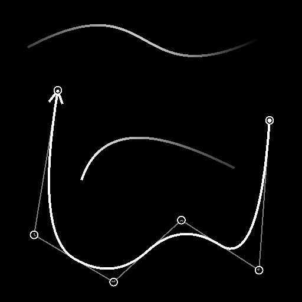

# Spline (Poly Quadratic)

<table>
<tr style="border: 0;">
<td style="border: 0;" valign="top">

<table>
<tr style="border: 0;">
<td width="33.33%" style="border: 0;" valign="top">

<b>In:</b> Strumenti Spline E Tracciati > Strumenti spline

</td>
<td width="100.00%" style="border: 0;" valign="top">

## Descrizione

Genera una spline lungo diversi punti. La quantità e le posizioni di questi punti potrebbero essere arbitrarie o raccolte da un nodo [Elenco di punti](../../../../../../compositing-graphs/nodes-reference-for-com/node-library/spline-paths-tools/spline-tools/point-list/point-list.md).

</td>
</tr>
</table>

La traiettoria della spline può essere smussata dai suoi punti intermedi, in quanto ogni punto intermedio è il punto di incontro delle tangenti &quot;out&quot; e &quot;in&quot; dei suoi vicini.

## Connettori di ingresso

<b>Anteprima</b> *Scala di grigio* Anteprima delle spline di input come immagine in scala di grigio.

<b>Spline Coords</b> *Colore* Coordinate dei punti delle spline di input codificate nei canali RGBA di un&#39;immagine a colori:\
<b> R</b> - Posizione X\
<b> G</b> - Posizione Y\
<b> B</b> - Height\
<b> A</b> - Dati compressi:\
* Segno: la spline è chiusa (negativa) o aperta (positiva);\
* Valore assoluto: Thickness + 1.

<b>Dati spline</b> *Colore* Dati aggiuntivi delle spline di input codificate nei canali RGBA di un&#39;immagine a colori.\
<b> R</b> - Tangenti X\
<b> G</b> - Tangenti Y\
<b> B</b> - Non in uso\
<b> A</b> - Non in uso

<b>Quantità spline</b> *Numero intero* Numero di spline di input.

<b>Anteprima punti </b>*Scala di grigio* Anteprima dei punti come immagine in scala di grigio.

<b>Elenco dei punti di input</b> *Colore* (disponibile quando &quot;Usa elenco punti di input&quot; è True)\
Un elenco di punti codificati nei canali RGBA di un’immagine a colori:\
<b>R</b> - Posizione X\
<b>G</b> - Posizione Y\
<b>B</b> - Height\
<b>A</b> - Dati compressi:\
* Parte intera: Smoothness;\
* Parte frazionaria: Thickness.

<b>Numero punto</b> *Intero* (disponibile quando &quot;Usa elenco punti di input&quot; è True)\
Numero di punti.

>[!IMPORTANT]
>
> I connettori <b>Elenco punti</b> e <b>Numero punto</b> sono *incompatibili* con <b>Coord spline</b>, <b>Dati spline</b> e <b>Quantità spline</b>, in quanto si basano su dati diversi.

## Connettori di uscita

<b>Anteprima</b> *Scala di grigi* Anteprima delle spline di output come immagine in scala di grigi.

<b>Spline Coords</b> *Colore* Coordinate dei punti delle spline di output codificate nei canali RGBA di un&#39;immagine a colori.\
<b>R</b> - Posizione X\
<b>G</b> - Posizione Y\
<b>B</b> - Height\
<b>A</b> - Dati compressi:\
* Segno: la spline è chiusa (negativa) o aperta (positiva);\
* Valore assoluto: Thickness + 1.

<b>Dati spline</b> *Colore* Dati aggiuntivi delle spline di output codificate nei canali RGBA di un&#39;immagine a colori.\
<b>R</b> - Tangenti X\
<b>G</b> - Tangenti Y\
<b>B</b> - Non utilizzato\
<b>A</b> - Non in uso

<b>Quantità spline</b> *Numero intero* Numero di spline di output.

## Parametri

<b>Quantità punti</b> *Intero* Numero arbitrario di punti utilizzato per creare la spline.

<b>Modalità connessione spline di input</b> *Intero* Metodo utilizzato per connettere le spline di input:\
*- Automatico:* La fine dell&#39;ultima spline di input è connessa all&#39;inizio della spline generata e la fine della spline generata è connessa all&#39;inizio della prima spline di input.\
*- Manuale:* È possibile specificare quali spline di input devono essere collegate alle estremità della spline generata e dove sulle spline di input devono atterrare queste connessioni.

<b>Chiudi spline</b> *Booleano* Controlla se il punto finale della spline deve essere collegato al punto iniziale.\
La smussatura applicata alla spline nei punti iniziale e finale è specificata dai valori di Smoothness di tali punti.

<b>Direzione capovolgimento</b> *Booleano*\
Inverte la direzione della spline.

<b>Usa elenco punti di input</b> *Booleano* Utilizzare l&#39;elenco di punti fornito ai connettori di input Elenco punti di input e Numero punti invece di un elenco arbitrario di punti.\
L&#39;elenco di punti può essere fornito da un nodo [Elenco punti](../../../../../../compositing-graphs/nodes-reference-for-com/node-library/spline-paths-tools/spline-tools/point-list/point-list.md).

<b>Collega avvio a spline di input</b> *Booleano* Se è impostato su True, l&#39;inizio della spline generata è collegato all&#39;ultimo punto dell&#39;ultima spline nelle spline di input.

<b>Avvia indice spline connessione</b> *Intero* (disponibile quando &quot;Modalità connessione spline di input&quot; è impostato su &quot;Manuale&quot; e &quot;Avvia connessione a spline di input&quot; è impostato su &quot;True&quot;)L&#39;indice della spline di input che deve essere collegato all&#39;inizio della spline generata.

<b>Avvia posizione connessione</b> *Mobile* (disponibile quando &quot;Modalità connessione spline di input&quot; è impostato su &quot;Manuale&quot; e &quot;Avvia connessione a spline di input&quot; è impostato su &quot;True&quot;)La posizione sulla spline di input selezionata in cui dovrebbe atterrare la connessione all&#39;inizio della spline generata.\
Questo valore rappresenta la lunghezza normalizzata della spline di input selezionata.

<b>Connetti estremità alla spline di input</b> *Booleano* Se è impostato su True, l&#39;estremità della spline generata è connessa al primo punto della prima spline nelle spline di input.

<b>Fine indice spline connessione</b> *Intero* (disponibile quando &quot;Modalità connessione spline di input&quot; è impostato su &quot;Manuale&quot; e &quot;Connetti estremità a spline di input&quot; è impostato su &quot;True&quot;)L&#39;indice della spline di input che deve essere collegato all&#39;estremità della spline generata.

<b>Posizione di fine connessione</b> *Mobile* (disponibile quando &quot;Modalità connessione spline di input&quot; è impostato su &quot;Manuale&quot; e &quot;Connetti estremità a spline di input&quot; è impostato su &quot;True&quot;)La posizione sulla spline di input selezionata in cui deve atterrare la connessione all&#39;estremità della spline generata.\
Questo valore rappresenta la lunghezza normalizzata della spline di input selezionata.

<b>Distribuzione uniforme</b> *Booleano*\
Se è impostato su True, i punti della spline sono distribuiti uniformemente dall&#39;inizio alla fine.

<b>Aggiungi spline di input</b> *Booleano*\
Aggiunge la spline generata alla fine dell&#39;elenco di spline connesse agli input <b>Spline</b>.

<b>Correzione non quadrata </b>*Booleano* Regola le posizioni e il thickness dei punti per mantenere la forma della spline con risoluzioni non quadrate.\
Questo incide anche sulla distribuzione uniforme.

<b>Regolazione Smoothness globale</b> *Mobile* Applica un offset uniforme al valore di smoothness di tutti i punti.\
Il valore di smoothness risultante viene fissato all&#39;intervallo [0;1].

+++Proprietà punti
<b>p# Proprietà</b> *Float3* Imposta le proprietà del punto p#.\
*- Height:* regola il height del punto in cui un valore inferiore indica una posizione inferiore o più profonda;\
*- Smoothness:* Sposta l&#39;inizio dell&#39;attenuazione della spline a p#, dove un valore pari a 0 determina una traiettoria rigida e 1 una traiettoria completamente liscia;\
*- Thickness:* Regola il thickness della spline a p#. Thickness viene utilizzato da nodi Spline specifici.

+++

+++Coordinate punti
<b>p#</b> *Float2* Imposta la posizione del punto p# nello spazio della texture.

+++

+++Anteprima
<b>Mostra tangenti</b> *Booleano* Visualizza le tangenti dei punti p1 e p3 a p2 nell&#39;output di anteprima.

<b>Mostra helper direzione</b> *Booleano* Visualizza un punto all&#39;inizio della spline e una freccia alla fine nell&#39;output di anteprima.

<b>Mostra busta Thickness</b> *Booleano*\
Visualizza le linee aggiuntive ai bordi del thickness della spline.

<b>Mostra etichetta punti</b> *Booleano*\
Per ogni punto, visualizza il nome del punto accanto nell&#39;output &quot;Anteprima&quot;.

<b>Dimensioni etichetta punti</b> *Float* (disponibile quando &#39;Mostra etichetta punti&#39; è impostato su &#39;True&#39;)\
Dimensione dell’etichetta per ogni punto nello spazio della texture, dove 0,1 è un decimo della larghezza della texture.

<b>Mostra punti</b> *Booleano*\
Visualizza i punti di controllo della spline.

<b>Dimensioni Punti</b> *Mobile* (disponibile quando &#39;Mostra punti&#39; è impostato su &#39;True&#39;)\
Raggio dei punti nello spazio della texture, dove 0,1 è un decimo della larghezza della texture.

<b>Importo segmenti</b> *Numero intero* Regola il numero di segmenti utilizzati per disegnare la visualizzazione della spline nell&#39;output di anteprima.\
Un valore più alto genera una linea più morbida.

<b>Thickness (px)</b> *Mobile* Regola il thickness della visualizzazione della spline in pixel nell&#39;output di anteprima.

+++

## Esempi

<table>
<tr style="border: 0;">
<td style="border: 0;" valign="top">

<table>
  <tr>
    <td>
      
       <i>Prima</i>
    </td>
    <td>
      
       <i>Dopo</i>
    </td>
  </tr>
</table>

</td>
<td style="border: 0;" valign="top">

</td>
</tr>
</table>

</td>
<td style="border: 0;" valign="top">

</td>
<td style="border: 0;" valign="top">

</td>
</tr>
</table>
