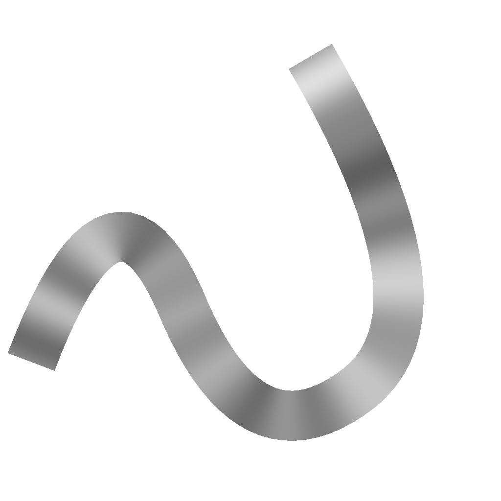

# Height di campionamento spline

<table>
<tr style="border: 0;">
<td width="33.33%" style="border: 0;" valign="top">

<b>In:</b> Strumenti Spline E Tracciati > Strumenti spline

</td>
<td width="100.00%" style="border: 0;" valign="top">

## Descrizione

Modifica il height delle spline di input mappando su di esse una mappa del Height di input.

L’effetto della mappa del height mappato può essere regolato modificandone il metodo di fusione e l’opacità.

</td>
</tr>
</table>

## Input

|  |  |
|:---|:---|
| <b>Anteprima</b> <i>Scala di grigi</i> | Anteprima delle spline di input come immagine in scala di grigio. |
| <b>Spline Coords</b> <i>Colore</i> | Coordinate dei punti delle spline di input codificate nei canali RGBA di un&#39;immagine a colori: <b>R</b> - Posizione X <b>G</b> - Posizione Y <b>B</b> - Height <b>A</b> - Dati compressi:  - Segno: la spline è chiusa (negativa) o aperta (positiva);  - Valore assoluto: Thickness + 1. |
| <b>Dati spline</b> <i>Colore</i> | Dati aggiuntivi delle spline di input codificate nei canali RGBA di un&#39;immagine a colori. <b>R</b> - Tangenti X <b>G</b> - Tangenti Y <b>B</b> - Non utilizzati <b>A</b> - Non utilizzati |
| <b>Quantità spline</b> <i>Numero intero</i> | Numero di spline di input. |
| <b>Mappa Height</b> <i>Scala di grigi</i> | Immagine in scala di grigio di input utilizzata per modificare il height della spline di input. |

## Output

|  |  |
|:---|:---|
| <b>Anteprima</b> <i>Scala di grigi</i> | Anteprima delle spline di output come immagine in scala di grigio. |
| <b>Spline Coords</b> <i>Colore</i> | Coordinate dei punti delle spline di output codificate nei canali RGBA di un&#39;immagine a colori. <b>R</b> - Posizione X <b>G</b> - Posizione Y <b>B</b> - Height <b>A</b> - Dati compressi:  - Segno: la spline è chiusa (negativa) o aperta (positiva);  - Valore assoluto: Thickness + 1. |
| <b>Dati spline</b> <i>Colore</i> | Dati aggiuntivi delle spline di output codificate nei canali RGBA di un&#39;immagine a colori. <b>R</b> - Tangenti X <b>G</b> - Tangenti Y <b>B</b> - Non usati <b>A</b> - Non usati |
| <b>Quantità spline</b> <i>Numero intero</i> | Numero di spline di output. |

## Parametri

|  |  |
|:---|:---|
| <b>Modalità campionamento</b> <i>Numero intero</i> | Metodo di mappatura dei valori nella mappa altezza alle spline: - <i>spazio Texture</i>: i valori vengono applicati alle spline in cui si troverebbero se inseriti in una texture utilizzando le coordinate UV della texture. Questo applica efficacemente il valore alle spline &quot;in posizione&quot;; - <i>Orizzontale lungo la spline</i>: i valori vengono applicati direttamente alle coordinate delle spline codificate (vedere l&#39;input Coord spline), in cui ogni riga viene applicata a una spline diversa dall&#39;alto verso il basso; - <i>Hor. lungo spline (rand. offset X)</i>: i valori vengono applicati direttamente alle coordinate delle spline codificate (vedere l&#39;input Coord spline), con uno scostamento orizzontale casuale nella mappa Scala per ogni spline (ovvero, ogni riga nelle coordinate spline); - <i>Hor. lungo spline (rand. offset Y)</i>: i valori vengono applicati direttamente alle coordinate delle spline codificate (vedere l&#39;input Coord spline), con uno scostamento verticale casuale nella mappa Scala per ogni spline (ovvero, ogni riga nelle coordinate spline). |
| <b>Opacità</b> <i>Mobile</i> | Un moltiplicatore per l’intensità del contributo dell’input della mappa dell’altezza al height della spline. |
| <b>Metodo fusione</b> <i>Numero intero</i> | Metodo di fusione dei dati della mappa dell&#39;altezza con il height della spline di input: - <i>Copia</i>: ignorare il height della spline con i valori della mappa dell&#39;altezza; - <i>Aggiungi</i>: aggiungere i valori della mappa dell&#39;altezza al height della spline; - <i>Sottrai</i>: Sottrai dei valori della mappa dell&#39;altezza al height della spline; - <i>Moltiplica</i>: moltiplicare i valori della mappa dell&#39;altezza rispetto al height della spline. |
| <b>Anteprima</b> |  |
| <b>Importo segmenti</b> <i>Numero intero</i> | Regola il numero di segmenti utilizzati per disegnare la visualizzazione della spline nell&#39;output di anteprima. Un valore più elevato determina una linea più fluida. |
| <b>Mostra helper direzione</b> <i>Booleano</i> | Visualizza un punto all&#39;inizio della spline e una freccia alla fine nell&#39;output di anteprima. |
| <b>Mostra busta Thickness</b> <i>Booleano</i> | Visualizza le linee aggiuntive ai bordi del thickness della spline. |
| <b>Thickness (px)</b> <i>Mobile</i> | Regola il thickness della visualizzazione della spline in pixel nell&#39;output di anteprima. |

## Esempi

<table>
<tr style="border: 0;">
<td style="border: 0;" valign="top">

<table>
  <tr>
    <td>
      
       <i>Prima</i>
    </td>
    <td>
      
       <i>Dopo</i>
    </td>
  </tr>
</table>

</td>
<td style="border: 0;" valign="top">

<table>
  <tr>
    <td>
      
       <i>Prima</i>
    </td>
    <td>
      
       <i>Dopo</i>
    </td>
  </tr>
</table>

</td>
</tr>
</table>

<table>
<tr style="border: 0;">
<td style="border: 0;" valign="top">

</td>
<td style="border: 0;" valign="top">

</td>
</tr>
</table>
