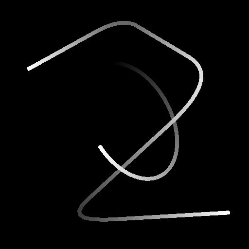

# Alterazione spline

<table>
<tr style="border: 0;">
<td width="33.33%" style="border: 0;" valign="top">

<b>In:</b> Strumenti Spline E Tracciati > Strumenti spline

</td>
<td width="100.00%" style="border: 0;" valign="top">

## Descrizione

Sposta le spline di input in base alla Mappa intensità di input o alla Mappa vettoriale.

L’intensità dell’effetto di alterazione può essere regolata lungo la spline utilizzando i controlli di attenuazione.

</td>
</tr>
</table>

## Input

|  |  |
|:---|:---|
| <b>Anteprima</b> <i>Scala di grigi</i> | Anteprima delle spline di input come immagine in scala di grigio. |
| <b>Spline Coords</b> <i>Colore</i> | Coordinate dei punti delle spline di input codificate nei canali RGBA di un&#39;immagine a colori: <b>R</b> - Posizione X <b>G</b> - Posizione Y <b>B</b> - Height <b>A</b> - Dati compressi:  - Segno: la spline è chiusa (negativa) o aperta (positiva);  - Valore assoluto: Thickness + 1. |
| <b>Dati spline</b> <i>Colore</i> | Dati aggiuntivi delle spline di input codificate nei canali RGBA di un&#39;immagine a colori. <b>R</b> - Tangenti X <b>G</b> - Tangenti Y <b>B</b> - Non utilizzati <b>A</b> - Non utilizzati |
| <b>Quantità spline</b> <i>Numero intero</i> | Numero di spline di input. |
| <b>Mappa intensità</b> <i>Scala di grigi</i> | (Disponibile quando &quot;Usa mappa vettoriale&quot; è impostato su &quot;False&quot;) L’immagine in scala di grigio di input utilizzata per controllare la direzione e l’intensità dell’effetto di alterazione sulle spline di input. Il colore di ciascun pixel nell&#39;immagine specifica un moltiplicatore per spostare i punti della spline lungo la normale (ovvero la direzione perpendicolare alla spline), fino all&#39;intera estensione dell&#39;immagine. I valori [0; 1] nell&#39;immagine vengono riassociati all&#39;intervallo [-1; 1] se letti come moltiplicatore: 0 e 1 spostano la spline della stessa distanza ma in direzioni opposte. 0,5 lascia la spline in posizione. |
| <b>Mappa vettoriale</b> <i>Scala di grigi</i> | (Disponibile quando &quot;Usa mappa vettoriale&quot; è impostato su &quot;True&quot;) L’immagine a colori di input utilizzata per controllare la direzione e l’intensità dell’effetto di alterazione sulle spline di input. Il colore di ciascun pixel nell&#39;immagine specifica il vettore (X, Y) le coordinate codificate nei canali rosso (X) e verde (Y). +X è corretto e +Y è inattivo. I valori [0; 1] nell&#39;immagine vengono riassociati all&#39;intervallo [-1; 1] quando letti come coordinate vettoriali: 0 rosso sposta i punti a sinistra e 0 verde sposta i punti verso l&#39;alto. 0,5 rosso e verde lasciano la spline in posizione. |
| <b>Curva di attenuazione</b> <i>Scala di grigi</i> | Immagine che descrive una curva utilizzando i valori della prima riga di pixel. Quando il parametro Usa curva di attenuazione è impostato su True, questo input viene utilizzato per controllare l&#39;attenuazione dell&#39;effetto di alterazione vicino all&#39;inizio e alla fine della spline. La curva fornisce un profilo per l&#39;attenuazione, in cui il primo pixel della riga è l&#39;intensità dell&#39;effetto di alterazione all&#39;inizio della spline e l&#39;ultimo è l&#39;intensità alla fine. Il valore della scala di grigi è l’intensità. È possibile utilizzare un nodo Curva per creare la curva. |

## Output

|  |  |
|:---|:---|
| <b>Anteprima</b> <i>Scala di grigi</i> | Anteprima delle spline di output come immagine in scala di grigio. |
| <b>Spline Coords</b> <i>Colore</i> | Coordinate dei punti delle spline di output codificate nei canali RGBA di un&#39;immagine a colori. <b>R</b> - Posizione X <b>G</b> - Posizione Y <b>B</b> - Height <b>A</b> - Dati compressi:  - Segno: la spline è chiusa (negativa) o aperta (positiva);  - Valore assoluto: Thickness + 1. |
| <b>Dati spline</b> <i>Colore</i> | Dati aggiuntivi delle spline di output codificate nei canali RGBA di un&#39;immagine a colori. <b>R</b> - Tangenti X <b>G</b> - Tangenti Y <b>B</b> - Non usati <b>A</b> - Non usati |
| <b>Quantità spline</b> <i>Numero intero</i> | Numero di spline di output. |

## Parametri

|  |  |
|:---|:---|
| <b>Intensità alterazione</b> <i>Mobile</i> | Intensità di spostamento delle spline. |
| <b>Centro alterazione</b> <i>Mobile</i> | Specifica il valore di Mappa intensità che corrisponde a lasciare le spline in posizione. Un valore pari a 0 o 1 indica che le spline possono essere spostate solo su un lato. |
| <b>Modalità campionamento</b> <i>Numero intero</i> | Metodo di mappatura dei valori nella mappa di intensità o nella mappa vettoriale sulle spline: - <i>spazio Texture</i>: i valori vengono applicati alle spline in cui si troverebbero se inseriti in una texture utilizzando le coordinate UV della texture. Questo applica efficacemente il valore alle spline &quot;in posizione&quot;; - <i>Orizzontale lungo la spline</i>: i valori vengono applicati direttamente alle coordinate delle spline codificate (vedere l&#39;input Coord spline), in cui ogni riga viene applicata a una spline diversa dall&#39;alto verso il basso; - <i>Hor. lungo spline (rand. offset X)</i>: i valori vengono applicati direttamente alle coordinate delle spline codificate (vedere l&#39;input Coord spline), con uno scostamento orizzontale casuale nella mappa Scala per ogni spline (ovvero, ogni riga nelle coordinate spline); - <i>Hor. lungo spline (rand. offset Y)</i>: i valori vengono applicati direttamente alle coordinate delle spline codificate (vedere l&#39;input Coord spline), con uno scostamento verticale casuale nella mappa Scala per ogni spline (ovvero, ogni riga nelle coordinate spline). |
| <b>Usa mappa vettoriale</b> <i>Booleano</i> | Passa il metodo di spostamento delle spline all&#39;uso di un input Mappa vettoriale per specificare la direzione dello spostamento. Il colore di ciascun pixel nell&#39;immagine specifica il vettore (X, Y) le coordinate codificate nei canali rosso (X) e verde (Y). +X è corretto e +Y è inattivo. I valori [0; 1] nell&#39;immagine vengono riassociati all&#39;intervallo [-1; 1] quando letti come coordinate vettoriali: 0 rosso sposta i punti a sinistra e 0 verde sposta i punti verso l&#39;alto. 0,5 rosso e verde lasciano la spline in posizione. |
| <b>Usa curva di attenuazione</b> <i>Booleano</i> | Consente di controllare l’intensità dell’effetto di alterazione lungo una spline utilizzando una curva codificata nell’immagine di input Curva di attenuazione. |
| <b>Porzioni mappa intensità</b> <i>Mobile</i> | (Disponibile quando &quot;Modalità campionamento&quot; non è impostato su &quot;Spazio Texture&quot;) Regola l&#39;Affiancamento della mappa di intensità quando viene mappata direttamente alle coordinate della spline (vedere l&#39;input Coord spline). |
| <b>Avvia attenuazione</b> <i>Mobile</i> | (Disponibile quando &quot;Usa curva di attenuazione&quot; è impostato su &quot;False&quot;) Un moltiplicatore per l&#39;attenuazione dell&#39;effetto di alterazione vicino all&#39;inizio della spline. Un valore pari a 1 significa che non viene applicata alcuna alterazione all&#39;inizio della spline. |
| <b>Termina attenuazione</b> <i>Mobile</i> | (Disponibile quando &quot;Usa curva di attenuazione&quot; è impostato su &quot;False&quot;) Moltiplicatore per l&#39;attenuazione dell&#39;effetto di alterazione vicino alla fine della spline. Il valore 1 indica che non viene applicata alcuna alterazione alla fine della spline. |
| <b>Ricalcola tangenti</b> <i>Booleano</i> | Se è True, le tangenti di una spline vengono ricalcolate dopo l&#39;applicazione dell&#39;effetto di alterazione. In questo modo le tangenti della spline rimangono coerenti con la traiettoria quando vengono utilizzate in nodi quali Dispersione su spline o Spline Flow Mapper. |
| <b>Anteprima</b> |  |
| <b>Importo segmenti</b> <i>Numero intero</i> | Regola il numero di segmenti utilizzati per disegnare la visualizzazione della spline nell&#39;output di anteprima. Un valore più elevato determina una linea più fluida. |
| <b>Mostra helper direzione</b> <i>Booleano</i> | Visualizza un punto all&#39;inizio della spline e una freccia alla fine nell&#39;output di anteprima. |
| <b>Mostra busta Thickness</b> <i>Booleano</i> | Visualizza le linee aggiuntive ai bordi del thickness della spline. |
| <b>Thickness (px)</b> <i>Mobile</i> | Regola il thickness della visualizzazione della spline in pixel nell&#39;output di anteprima. |
| <b>Intensità anteprima in background</b> <i>Mobile</i> | Valore moltiplicato per l’immagine di input Anteprima sfondo. |

## Esempi

<table>
<tr style="border: 0;">
<td style="border: 0;" valign="top">

<table>
  <tr>
    <td>
      
       <i>Prima</i>
    </td>
    <td>
      
       <i>Dopo</i>
    </td>
  </tr>
</table>

</td>
<td style="border: 0;" valign="top">

<table>
  <tr>
    <td>
      
       <i>Prima</i>
    </td>
    <td>
      
       <i>Dopo</i>
    </td>
  </tr>
</table>

</td>
</tr>
</table>

<table>
<tr style="border: 0;">
<td style="border: 0;" valign="top">

</td>
<td style="border: 0;" valign="top">

</td>
</tr>
</table>
