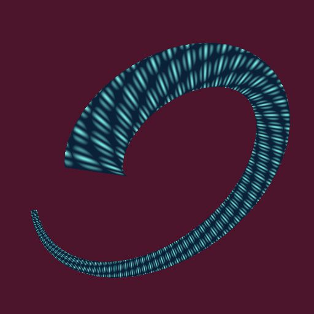
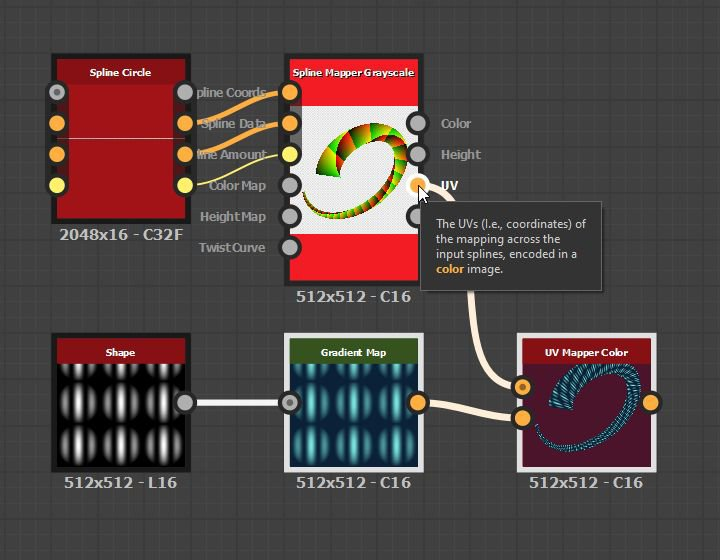

# Colore mappatore UV

<table>
<tr style="border: 0;">
<td width="33.33%" style="border: 0;" valign="top">

<b>In:</b> Strumenti Spline E Tracciati > Strumenti spline

</td>
<td width="100.00%" style="border: 0;" valign="top">

## Descrizione

Esegue la mappatura dell&#39;immagine a colori di input usando le coordinate fornite nell&#39;input UV.

</td>
</tr>
</table>

>[!NOTE]
>
> Consultate anche [Grafica con mappatura UV](../../../../../../compositing-graphs/nodes-reference-for-com/node-library/spline-paths-tools/spline-tools/uv-mapper-grayscale/uv-mapper-grayscale.md).

## Input

|  |  |
|:---|:---|
| <b>UV</b> <i>Colore</i> | Coordinate immagine codificate nei canali rosso (U) e verde (V) di un’immagine a colori. |
| <b>Input</b> <i>Colore</i> | L&#39;immagine a colori che deve essere mappata alle coordinate fornite nell&#39;input UV. |

## Output

|  |  |
|:---|:---|
| <b>Output</b> <i>Colore</i> | Risultato della mappatura dell&#39;immagine di input utilizzando le coordinate UV di input come immagine a colori. |

## Parametri

|  |  |
|:---|:---|
| <b>Colore di sfondo</b> <i>Float4</i> | Colore di sfondo dell&#39;immagine di output. Lo sfondo è visibile nelle aree dell&#39;immagine in cui gli UV non sono definiti (ovvero il valore è (0, 0, 0, 0)). |

## Esempi

<table>
<tr style="border: 0;">
<td style="border: 0;" valign="top">

<table>
  <tr>
    <td>
      
       <i>Prima</i>
    </td>
    <td>
      
       <i>Dopo</i>
    </td>
  </tr>
</table>

</td>
<td style="border: 0;" valign="top">

<table>
  <tr>
    <td>
      
       <i>Prima</i>
    </td>
    <td>
      
       <i>Dopo</i>
    </td>
  </tr>
</table>

</td>
</tr>
</table>

