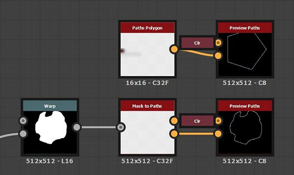

# Utilizzo di tracciato e Strumenti spline

Il set di strumenti Tracciato e spline è una raccolta di nodi che consente di creare e modificare forme e curve indipendenti dalla risoluzione utilizzate per disegnare, mappare e dispersione le immagini.

## Panoramica

### Che cosa sono i tracciati e le spline?

<b>I tracciati</b> sono una serie di punti collegati in linee rette.

Le <b>spline</b> sono curve smussate le cui traiettorie sono modellate dai punti di controllo e dalle tangenti di tali punti.\
Ogni punto controlla inoltre gli attributi di height e thickness di una spline utilizzati per guidare la mappatura, l&#39;alterazione e la dispersione delle immagini.

Ognuno può creare forme chiuse o aperte.

<table>
<tr style="border: 0;">
<td width="100.00%" style="border: 0;" valign="top">

### Uscita nodo

I nodi generano immagini che contengono <b>dati codificati</b> che rappresentano percorsi e spline.

Ad esempio, l&#39;immagine a destra rappresenta l&#39;output dell&#39;immagine da un nodo [Poligono percorsi](../../../../../compositing-graphs/nodes-reference-for-com/node-library/spline-paths-tools/path-tools/paths-polygon/paths-polygon.md).

</td>
<td width="33.33%" style="border: 0;" valign="top">

</td>
</tr>
</table>

Di conseguenza, le immagini prodotte non sono direttamente utilizzabili come elemento grafico. Devono essere elaborati da altri nodi nel set di strumenti che possono convertirli in un risultato grafico che può quindi essere utilizzato con gli altri nodi disponibili per i grafici a Substance.

Mentre lavorate con tracciati e spline, potete visualizzare in anteprima questi oggetti mappati in un&#39;immagine utilizzando il nodo [Anteprima tracciati](../../../../../compositing-graphs/nodes-reference-for-com/node-library/spline-paths-tools/path-tools/preview-paths/preview-paths.md) dedicato per i tracciati e l&#39;output <b>Anteprima</b> dedicato per le spline.

<table>
<tr style="border: 0;">
<td width="100.00%" style="border: 0;" valign="top">

### Interazione vista 2D

Un numero significativo di nodi nel set di strumenti offre la possibilità di eseguire modifiche direttamente nella [vista 2D](../../../../../interface/2d-view/2d-view.md) utilizzando gizmo di controllo. Questi gizmo includono la posizione gizmo e la matrice di trasformazione.

Ad esempio, i nodi di generazione della spline come [Spline (Cubic)](../../../../../compositing-graphs/nodes-reference-for-com/node-library/spline-paths-tools/spline-tools/spline-cubic/spline-cubic.md) o [Spline (Poly Quadratic)](../../../../../compositing-graphs/nodes-reference-for-com/node-library/spline-paths-tools/spline-tools/spline-poly-quadratic/spline-poly-quadratic.md) consentono di spostare i punti di controllo delle spline. Per i percorsi, [Quad Transform on Path](../../../../../compositing-graphs/nodes-reference-for-com/node-library/spline-paths-tools/path-tools/quad-transform-on-path/quad-transform-on-path.md) dispone di controlli simili quando è selezionato.

</td>
<td width="33.33%" style="border: 0;" valign="top">

</td>
</tr>
</table>

### Prestazioni

Percorso e strumenti spline richiedono calcoli intensivi, al punto che è necessario prestare attenzione a un paio di impostazioni per garantire prestazioni e tempi di risposta ottimali quando si lavora con il set di strumenti:

1. Il set di strumenti utilizza in modo esteso le funzionalità di <b>Substance Engine</b> che vengono eseguite molto più velocemente sulla GPU. Pertanto, utilizzate la versione GPU del motore del sistema in uso: <b>Direct3D</b> (Windows) o <b>OpenGL</b> (macOS).\
   È possibile cambiare motore premendo il tasto <b>F9</b> o selezionando <b>Strumenti > Cambia motore...</b> nella barra dei menu principale.
1. Si consiglia quindi di disattivare <b>Modifica contestuale</b> nella sezione <b>Grafico</b> delle [Preferenze](../../../../../interface/preferences-window/preferences-window.md) (per accedere a questa finestra, seleziona <b>Modifica > Preferenze...</b> nella barra dei menu principale).\
   La modifica in contesto consente di aprire i nodi di istanza nel contesto del grafico host, il che è certamente molto pratico ma ha l&#39;effetto collaterale di aumentare esponenzialmente i calcoli richiesti dalla cache delle immagini del set di strumenti.

Quando impostate una di queste due impostazioni sullo stato consigliato, notate un miglioramento significativo delle prestazioni.

## Strumenti percorso

### Generazione dei tracciati

Il [poligono dei tracciati](../../../../../compositing-graphs/nodes-reference-for-com/node-library/spline-paths-tools/path-tools/paths-polygon/paths-polygon.md) genera un tracciato nella forma di un poligono del raggio e del numero di lati specificati.

In alternativa, è possibile estrarre i tracciati da un&#39;immagine in scala di grigio utilizzando il nodo [Maschera in tracciati](../../../../../compositing-graphs/nodes-reference-for-com/node-library/spline-paths-tools/path-tools/mask-to-paths/mask-to-paths.md).\
Questo è attualmente l&#39;unico modo per produrre forme complesse e consente di sfruttare l&#39;intera libreria di [nodi del grafico a Substance](../../../../../compositing-graphs/nodes-reference-for-com/nodes-reference-for-substance-compositing-graphs.md) per produrre le forme che verranno infine convertite in tracciati.

{width="600px"}

### Modifica dei tracciati

[Trasformazione 2D tracciato](../../../../../compositing-graphs/nodes-reference-for-com/node-library/spline-paths-tools/path-tools/path-2d-transform/path-2d-transform.md), [Alterazione tracciati](../../../../../compositing-graphs/nodes-reference-for-com/node-library/spline-paths-tools/path-tools/paths-warp/paths-warp.md) e [Trasformazione quadrupla sul tracciato](../../../../../compositing-graphs/nodes-reference-for-com/node-library/spline-paths-tools/path-tools/quad-transform-on-path/quad-transform-on-path.md) consentono di modificare la forma dei tracciati.

È inoltre possibile rimuovere i percorsi indesiderati selezionando i percorsi in base all&#39;indice o alla lunghezza, utilizzando il nodo [Selezione percorsi](../../../../../compositing-graphs/nodes-reference-for-com/node-library/spline-paths-tools/path-tools/paths-select/paths-select.md).

L&#39;elaborazione più complessa può essere eseguita su ogni punto di un percorso con l&#39;aiuto del nodo [Processore vertici tracciati](../../../../../compositing-graphs/nodes-reference-for-com/node-library/spline-paths-tools/path-tools/paths-vertex-processor/paths-vertex-processor.md). Esiste una [versione più semplice](../../../../../compositing-graphs/nodes-reference-for-com/node-library/spline-paths-tools/path-tools/paths-vertex-processor-1/paths-vertex-processor-simple.md) per regolazioni più leggere.

<table>
<tr style="border: 0;">
<td width="100.00%" style="border: 0;" valign="top">

### Nodo Anteprima tracciati

L&#39;anteprima dei risultati dei nodi Paths viene eseguita utilizzando il nodo [Preview Paths](../../../../../compositing-graphs/nodes-reference-for-com/node-library/spline-paths-tools/path-tools/preview-paths/preview-paths.md) dedicato.\
Il nodo non dispone di output. Fare doppio clic su LMB sul nodo per visualizzare l&#39;anteprima nella [vista 2D](../../../../../interface/2d-view/2d-view.md).

I tracciati separati hanno un colore unico nell&#39;anteprima per distinguere facilmente ogni tracciato.

</td>
<td width="33.33%" style="border: 0;" valign="top">

</td>
</tr>
</table>

### Tracciati da spline

È possibile sfruttare l&#39;intero set di strumenti dedicato alle spline con percorsi convertendo i percorsi in spline utilizzando il nodo [Tracciati da spline](../../../../../compositing-graphs/nodes-reference-for-com/node-library/spline-paths-tools/path-tools/paths-to-spline/paths-to-spline.md).

Tenete presente che le spline sono curve e quindi non possono mantenere la nitidezza dei tracciati. Quando si convertono i tracciati in spline, ci si aspetta una certa attenuazione delle forme.

Una combinazione molto utile per sfruttare il set di strumenti spline attraverso i percorsi è la seguente:

<b>Maschera > Maschera su tracciati > Tracciati su spline</b>

### Specifiche del formato del tracciato

Il nodo Anteprima tracciati è obbligatorio perché i nodi tracciati generano i dati dei tracciati codificati in un’immagine a colori.\
Questa codifica segue una specifica descritta nella pagina [Specifiche formato tracciati](../../../../../compositing-graphs/nodes-reference-for-com/node-library/spline-paths-tools/path-tools/paths-format-spe/paths-format-specifications.md).

È possibile utilizzare questa specifica per produrre nodi personalizzati utilizzando questo formato e sfruttare al meglio i nodi [Paths Vertex Processor](../../../../../compositing-graphs/nodes-reference-for-com/node-library/spline-paths-tools/path-tools/paths-vertex-processor/paths-vertex-processor.md).

## Strumenti spline

### Generazione delle spline

Le spline possono essere generate utilizzando nodi come [Spline Circle](../../../../../compositing-graphs/nodes-reference-for-com/node-library/spline-paths-tools/spline-tools/spline-circle/spline-circle.md), [Spline (Cubic)](../../../../../compositing-graphs/nodes-reference-for-com/node-library/spline-paths-tools/spline-tools/spline-cubic/spline-cubic.md) o [Spline (Poly Quadratic)](../../../../../compositing-graphs/nodes-reference-for-com/node-library/spline-paths-tools/spline-tools/spline-poly-quadratic/spline-poly-quadratic.md). Questi nodi consentono di disegnare una spline di una traiettoria arbitraria utilizzando controlli diversi a seconda del nodo.

In alternativa, è possibile estrarre le spline dai percorsi utilizzando il nodo [Tracciati per spline](../../../../../compositing-graphs/nodes-reference-for-com/node-library/spline-paths-tools/path-tools/paths-to-spline/paths-to-spline.md).\
Tenete presente che le spline sono curve e quindi non possono mantenere la nitidezza dei tracciati. Quando si convertono i tracciati in spline, ci si aspetta una certa attenuazione delle forme.

Una combinazione molto utile per sfruttare il set di strumenti spline attraverso i percorsi è la seguente:

<b>Maschera > Maschera su tracciati > Tracciati su spline</b>

Le spline possono anche aiutarvi a generare più spline. Ad esempio, [Spline Bridge (2 Spline)](../../../../../compositing-graphs/nodes-reference-for-com/node-library/spline-paths-tools/spline-tools/spline-bridge-2-splines/spline-bridge-2-splines.md) e [Spline Bridge (List)](../../../../../compositing-graphs/nodes-reference-for-com/node-library/spline-paths-tools/spline-tools/spline-bridge-list/spline-bridge-list.md) generano spline che attraversano un elenco di spline in ordine.

### Modifica delle spline

Le opzioni [Trasformazione 2D spline](../../../../../compositing-graphs/nodes-reference-for-com/node-library/spline-paths-tools/spline-tools/spline-2d-transform/spline-2d-transform.md) e [Alterazione spline](../../../../../compositing-graphs/nodes-reference-for-com/node-library/spline-paths-tools/spline-tools/spline-warp/spline-warp.md) consentono di modificare la forma delle spline.

È inoltre possibile rimuovere le spline indesiderate selezionando i percorsi in base all&#39;indice e rifilare le spline utilizzando il nodo [Selezione spline](../../../../../compositing-graphs/nodes-reference-for-com/node-library/spline-paths-tools/spline-tools/spline-select/spline-select.md).

Oltre alla traiettoria, le proprietà di height e thickness delle spline possono essere regolate dopo il fatto utilizzando [Height campione spline](../../../../../compositing-graphs/nodes-reference-for-com/node-library/spline-paths-tools/spline-tools/spline-sample-height/spline-sample-height.md) e [Thickness campione spline](../../../../../compositing-graphs/nodes-reference-for-com/node-library/spline-paths-tools/spline-tools/spline-sample-thickness/spline-sample-thickness.md).

Infine, è possibile unire spline separate in un&#39;unica spline mediante il nodo [Elenco unione spline](../../../../../compositing-graphs/nodes-reference-for-com/node-library/spline-paths-tools/spline-tools/spline-merge-list/spline-merge-list.md).

### Aggiunta di spline

Durante la creazione e la modifica delle spline, potrebbe essere necessario combinare più spline per regolarle o utilizzarle tutte contemporaneamente.

È importante tenere presente che le spline vengono archiviate ed elaborate come <b>elenco ordinato</b>.

La combinazione delle spline viene eseguita utilizzando il nodo [Aggiungi spline](../../../../../compositing-graphs/nodes-reference-for-com/node-library/spline-paths-tools/spline-tools/spline-append/spline-append.md). L&#39;aggiunta è l&#39;aggiunta di un elemento alla fine di un&#39;entità ordinata. In effetti, il nodo combina due elenchi di spline aggiungendo il secondo insieme alla fine del primo.

Pertanto, è molto importante considerare l&#39;ordine in cui si aggiungono spline insieme.

Ciò influisce sui nodi che devono combinare spline, ad esempio [Spline Bridge (List)](../../../../../compositing-graphs/nodes-reference-for-com/node-library/spline-paths-tools/spline-tools/spline-bridge-list/spline-bridge-list.md), [Spline Bridge Mapper](../../../../../compositing-graphs/nodes-reference-for-com/node-library/spline-paths-tools/spline-tools/spline-bridge-mapper-gra/spline-bridge-mapper-grayscale.md) e [Spline Merge List](../../../../../compositing-graphs/nodes-reference-for-com/node-library/spline-paths-tools/spline-tools/spline-merge-list/spline-merge-list.md).

### Ingressi e uscite spline

Le spline vengono passate da un nodo all&#39;altro utilizzando un gruppo di connettori:

* <b>Spline coords </b>*Color* Coordinate dei punti delle spline di input codificate nei canali RGBA di un&#39;immagine a colori.
* <b>Dati spline </b>*Colore* Dati aggiuntivi delle spline di input codificate nei canali RGBA di un&#39;immagine a colori.
* <b>Quantità spline </b>*Numero intero* Numero di spline di input.

Ogni connettore di output del nodo di origine deve essere collegato al connettore di input con nome corrispondente nel nodo di destinazione.

Per rendere queste connessioni più veloci, puoi utilizzare <b>Materiale</b> o <b>Materiale compatto</b> [modalità di creazione del collegamento](../../../../../interface/the-graph-view/link-creation-modes/link-creation-modes.md). In questo modo è possibile collegare i tre connettori spline in un&#39;unica operazione.

<table>
<tr style="border: 0;">
<td style="border: 0;" valign="top">

### Anteprima output

La maggior parte dei nodi offre un output <b>Anteprima</b> che esegue il rendering delle spline in un&#39;immagine in modo da avere un&#39;idea di quali sono le traiettorie e le proprietà.

Questa anteprima può essere modificata nei parametri del nodo, utilizzando i parametri nel gruppo <b>Anteprima</b>.

</td>
<td style="border: 0;" valign="top">

</td>
</tr>
</table>

<table>
<tr style="border: 0;">
<td width="100.00%" style="border: 0;" valign="top">

### Rendering come segmenti

Le spline sono curve senza risoluzione intrinseca, il che significa che possono essere ridimensionate verso l&#39;alto o il basso a tempo indeterminato, con l&#39;unico limite nel rappresentarle accuratamente essendo la precisione utilizzata per memorizzare i dati.

Per disegnare una spline come pixel, il set di strumenti li semplifica in linee o segmenti disegnati lungo la traiettoria delle spline.

</td>
<td width="33.33%" style="border: 0;" valign="top">

</td>
</tr>
</table>

Ciò significa che potrebbe essere necessario prestare attenzione al numero di segmenti utilizzati per disegnare una spline in un&#39;immagine, in quanto tale numero potrebbe essere troppo basso per disegnare curve uniformi o troppo alto e sprecato per la risoluzione di destinazione.

I nodi che disegnano spline in un&#39;immagine hanno un parametro <b>Quantità segmenti</b> che consente di controllare la quantità di segmenti. Un valore più elevato determina curve più uniformi a costo delle prestazioni.

### Creazione di immagini dalle spline

Una volta completate le operazioni di creazione e modifica delle spline, queste possono essere utilizzate per produrre immagini che possono sfruttare gli altri nodi del grafico Substance.

Esistono tre modi principali per utilizzare le spline per generare la grafica:

* Eseguite il rendering della spline utilizzando la forma e le proprietà con il nodo [Rendering spline](../../../../../compositing-graphs/nodes-reference-for-com/node-library/spline-paths-tools/spline-tools/spline-render/spline-render.md) o [Riempimento spline](../../../../../compositing-graphs/nodes-reference-for-com/node-library/spline-paths-tools/spline-tools/spline-fill/spline-fill.md);
* Mappate le immagini lungo le spline con nodi di mappatura come [Mappatura spline](../../../../../compositing-graphs/nodes-reference-for-com/node-library/spline-paths-tools/spline-tools/spline-mapper-grayscale/spline-mapper-grayscale.md), [Mappatura ponti spline](../../../../../compositing-graphs/nodes-reference-for-com/node-library/spline-paths-tools/spline-tools/spline-bridge-mapper-gra/spline-bridge-mapper-grayscale.md) e [Mappatura flusso spline](../../../../../compositing-graphs/nodes-reference-for-com/node-library/spline-paths-tools/spline-tools/spline-flow-mapper/spline-flow-mapper.md);
* Dispersione i pattern lungo le spline con il nodo [Dispersione su spline](../../../../../compositing-graphs/nodes-reference-for-com/node-library/spline-paths-tools/spline-tools/scatter-spline-grayscale/scatter-on-spline-grayscale.md).
