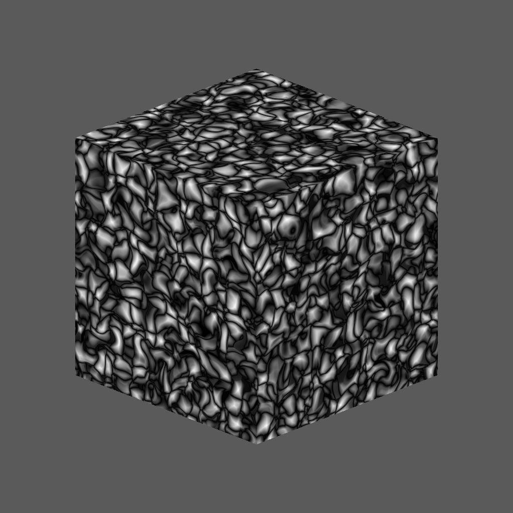
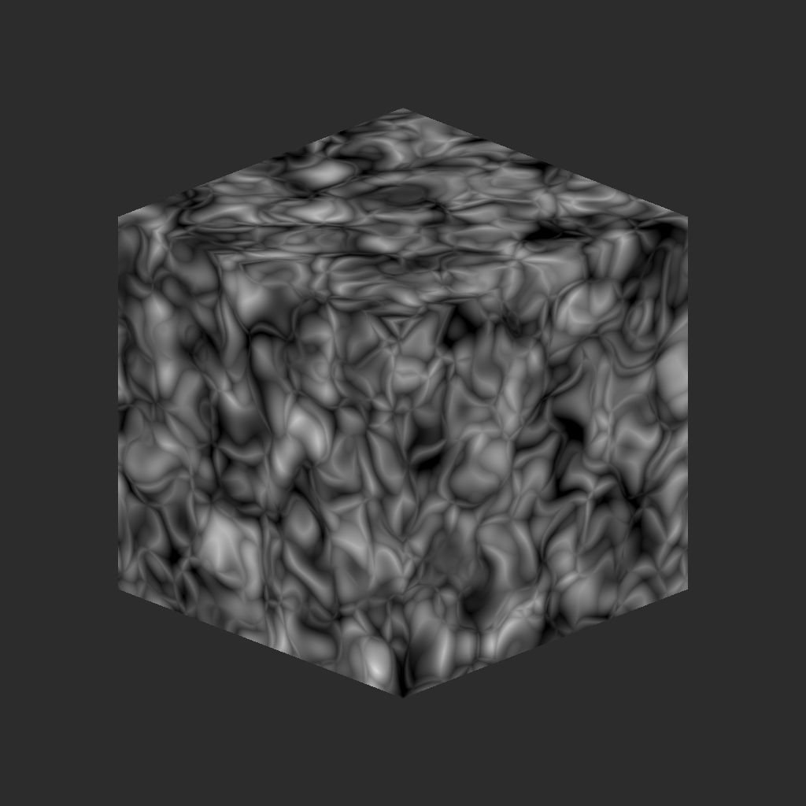

# Voronoi 3D

<table>
<tr style="border: 0;">
<td width="41.60%" style="border: 0;" valign="top">

{width="200px"}

**Ingresso:** *Generatori Di Texture* */Rumori*

**Intermedio**

</td>
<td width="58.30%" style="border: 0;" valign="top">

## Descrizione

Il nodo **3D Voronoi** genera un rumore Voronoi nello spazio 3D in base all&#39;input **Mappa posizione**.

Questo nodo può essere testato con [Cubo 3D GBuffers](../../../../../../compositing-graphs/nodes-reference-for-com/node-library/texture-generators/patterns/cube-3d-gbuffers/cube-3d-gbuffers.md) come input anziché come mappa con baking effettiva (come illustrato nell&#39;immagine di esempio seguente).

>[!WARNING]
>
> Questo rumore deve essere utilizzato solo con *motore GPU* (ad esempio **Direct3D** o **OpenGL**). Vai a **Strumenti > Cambia motore...** oppure premi il tasto **F9** per selezionare il motore desiderato.

</td>
</tr>
</table>

## Parametri

* **Inverti** *Booleano*\
  Inverte l’immagine di output.
* **Scala** *Mobile*\
  Controlla la scala del disturbo 3D di Voronoi.\
  *Nota*: quando l&#39;opzione **Affiancatura** è abilitata su *qualsiasi asse*, la regolazione della scala è *graduale*. Questo è previsto.
* **Dimensioni** *Float3*\
  Controlla la dimensione del disturbo 3D di Voronoi sugli assi **X**, **Y** e **Z**. I valori non uniformi producono un effetto *allungamento o schiacciamento*.\
  *Nota*: quando l&#39;opzione **Divisione in porzioni** è abilitata su *qualsiasi asse*, la regolazione della dimensione è *incrementata*. Questo è previsto.
* **Scostamento** *Float3*\
  Applica uno scostamento alla *posizione* del disturbo 3D di Voronoi sugli assi **X**, **Y** e **Z**.
* **Disordine** *Float3*\
  Intensità dello *scostamento casuale* applicato a ciascun punto del disturbo sugli assi **X**, **Y** e **Z**.
* **Intensità Distorsione** *Mobile*\
  Controlla l’intensità di un *effetto di alterazione* applicato al disturbo 3D di Voronoi.
* **Moltiplicatore scala Distorsione** *Mobile*\
  Controlla la scala del *pattern di deformazione* utilizzato nell&#39;effetto di alterazione controllato dall&#39;**intensità della Distorsione**.
* **Curva arrotondata** *Mobile*\
  Arrotonda la *pendenza* attorno a ogni punto del disturbo per renderlo *convesso*.\
  *Nota*: questo parametro non è disponibile quando il parametro **Style** è impostato su *Edge*.
* **Scala distanza** *Mobile*\
  Regola la *distanza della sfumatura* attorno a ciascun punto del disturbo.
* **Modalità distanza** *Numero intero*\
  Imposta il metodo su *calcolare la sfumatura della distanza* attorno a ciascun punto del disturbo:
  * *Euclideo*
  * *Manhattan*
  * *Chebyshev*
  * *Minkowski*
* **Numero di Minkowski** *Mobile*\
  L&#39;ordine *p* della distanza di Minkowski. Se dividiamo la sfumatura di distanza in quadranti, questo numero influisce sui quadranti nel modo seguente:
  * p è *esattamente* 1: diritto
  * p è *inferiore* a 1: concavo
  * p è *maggiore* di 1: convesso\
    Valori interessanti:\
    *- 1.0*: distanza Manhattan\
    *- 2.0*: distanza euclidea\
    *- Infinito*: distanza di Chebyshev\
    *Nota*: questo parametro è disponibile solo quando **Modalità distanza** è impostato su *Minkowski*.
* **Style** *Integer* Imposta il metodo *rendering dei dati* del disturbo 3D di Voronoi, considerando che il disturbo si basa su un insieme di punti nello spazio 3D:
  * *F1*: distanza dal *punto più vicino* nello spazio 3D
  * *F2*: distanza dal *secondo punto più vicino* nello spazio 3D
  * *F2-F1*- *F1\* F2 *-* F1/F2 *-* Edge *: il* bordo tra ogni cella* del rumore nello spazio 3D
  * *Colore casuale*: assegnate un *colore piatto casuale* a ogni cella del disturbo nello spazio 3D
* **Thickness bordi** *Mobile* Regola il thickness dei bordi rilevati tra le celle del disturbo 3D di Voronoi. I bordi vengono rilevati negli assi X, Y e Z, pertanto alcuni spessori possono aumentare più rapidamente di altri a seconda della *profondità* delle celle.\
  *Nota*: questo parametro è disponibile solo quando il parametro **Style** è impostato su *Edge*.
* **Abilita Porzione** *Booleano*\
  Regola il disturbo 3D di Voronoi in modo che il relativo pattern *si ripeta* sugli assi X, Y e Z.

## Immagini di esempio

<table>
<tr style="border: 0;">
<td style="border: 0;" valign="top">

{width="256px"}

</td>
<td style="border: 0;" valign="top">

{width="256px"}

</td>
<td style="border: 0;" valign="top">

{width="256px"}

</td>
<td style="border: 0;" valign="top">

{width="256px"}

</td>
<td style="border: 0;" valign="top">

{width="256px"}

</td>
<td style="border: 0;" valign="top">

{width="256px"}

</td>
</tr>
</table>
