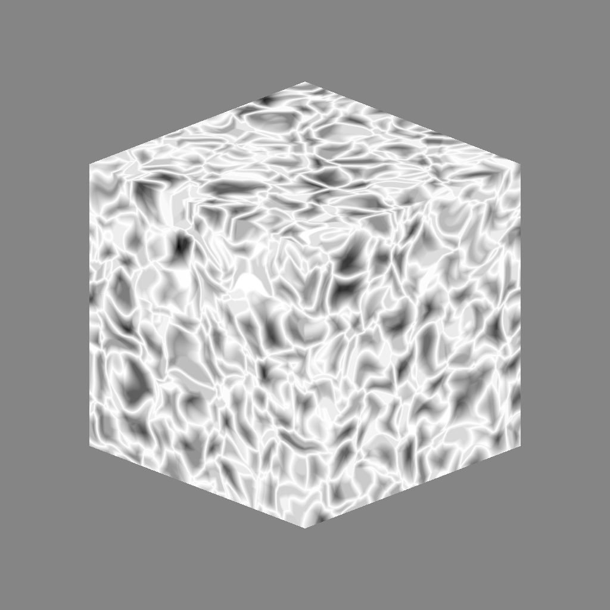

# Voronoi 3D

<table>
<tr style="border: 0;">
<td width="33.33%" style="border: 0;" valign="top">

{width="200px"}

<b>Ingresso:</b> Generatori di Texture > Rumori

</td>
<td width="100.00%" style="border: 0;" valign="top">

## Descrizione

Il nodo <b>3D Voronoi</b> genera un rumore Voronoi nello spazio 3D in base all&#39;input <b>Mappa posizione</b>.

Questo nodo può essere testato con [Cubo 3D GBuffers](../../../../../../compositing-graphs/nodes-reference-for-com/node-library/texture-generators/patterns/cube-3d-gbuffers/cube-3d-gbuffers.md) come input anziché come mappa con baking effettiva (come illustrato nell&#39;immagine di esempio seguente).

</td>
</tr>
</table>

>[!WARNING]
>
> Questo rumore deve essere utilizzato solo con <i>motore GPU</i> (ad esempio <b>Direct3D</b> o <b>OpenGL</b>). Vai a <b>Strumenti > Cambia motore...</b> oppure premi il tasto <b>F9</b> per selezionare il motore desiderato.

## Parametri

|  |  |
|:---|:---|
| <b>Inverti</b> <i>Booleano</i> | Inverte l’immagine di output. |
| <b>Scala</b> <i>Mobile</i> | Controlla la scala del disturbo 3D di Voronoi.  <i>Nota</i>: quando <b>Affiancamento</b> è attivato su <i>qualsiasi asse</i>, la regolazione della scala è <i>incrementata</i>. Questo è previsto. |
| <b>Dimensioni</b> <i>Float3</i> | Controlla la dimensione del disturbo 3D di Voronoi sugli assi <b>X</b>, <b>Y</b> e <b>Z</b>. I valori non uniformi producono un effetto <i>allungamento o schiacciante</i>.  <i>Nota</i>: quando l&#39;opzione <b>Affiancamento</b> è abilitata su <i>qualsiasi asse</i>, la regolazione della dimensione è <i>graduale</i>. Questo è previsto. |
| <b>Scostamento</b> <i>Float3</i> | Applica uno scostamento alla <i>posizione</i> del disturbo 3D di Voronoi sugli assi <b>X</b>, <b>Y</b> e <b>Z</b>. |
| <b>Disturbo</b> <i>Float3</i> | Intensità dello <i>scostamento casuale</i> applicato a ciascun punto del disturbo sugli assi <b>X</b>, <b>Y</b> e <b>Z</b>. |
| <b>Intensità Distorsione</b> <i>Mobile</i> | Controlla l’intensità di un <i>effetto di alterazione</i> applicato al disturbo 3D di Voronoi. |
| <b>Moltiplicatore scala Distorsione</b> <i>Mobile</i> | Controlla la scala del <i>pattern di deformazione</i> utilizzato nell&#39;effetto di alterazione controllato dall&#39;<b>intensità della Distorsione</b>. |
| <b>Curva arrotondata</b> <i>Mobile</i> | Arrotonda la <i>pendenza</i> attorno a ciascun punto del disturbo per renderlo <i>convesso</i>.  <i>Nota</i>: questo parametro non è disponibile quando il parametro <b>Stile</b> è impostato su <i>Bordo</i>. |
| <b>Scala distanza</b> <i>Mobile</i> | Regola la <i>distanza della sfumatura</i> attorno a ciascun punto del disturbo. |
| <b>Modalità distanza</b> <i>Numero intero</i> | Imposta il metodo su <i>calcolare la sfumatura della distanza</i> attorno a ciascun punto del disturbo:  - <i>euclideo</i> - <i>Manhattan</i> - <i>Chebyshev</i> - <i>Minkowski</i> |
| <b>Numero di Minkowski</b> <i>Mobile</i> | L&#39;ordine <i>p</i> della distanza di Minkowski. Se dividiamo la sfumatura della distanza in quadranti, questo numero influisce su questi quadranti come segue:  - p è <i>esattamente</i> 1: retto - p è <i>inferiore</i> a 1: concavo - p è <i>maggiore</i> di 1: convesso  Valori interessanti: - <i>1,0</i>: distanza di Manhattan - <i>2,0</i>: distanza euclidea - <i>Infinito</i>: distanza Chebyshev  <i>Nota</i>: questo parametro è disponibile solo quando il parametro <b>Modalità distanza</b> è impostato su <i>Minkowski</i>. |
| <b>Stile</b> <i>Numero intero</i> | Imposta il metodo <i>rendering dei dati</i> del disturbo 3D di Voronoi, considerando che il disturbo si basa su un insieme di punti nello spazio 3D:  - <i>F1</i>: la distanza dal <i>punto più vicino</i> nello spazio 3D - <i>F2</i>: la distanza dal <i>secondo punto più vicino</i> nello spazio 3D - <i>F2-F1</i> - <i>F1\*F2</i> - <i>F1/F2</i> - <i>Bordo</i>: il <i>bordo tra ogni cella</i> del disturbo nello spazio 3D - <i>Colore casuale</i>: assegnate un <i>colore piatto casuale</i> a ogni cella del disturbo nello spazio 3D |
| <b>Thickness Edge</b> <i>Mobile</i> | Regola il thickness dei bordi rilevati tra le celle del disturbo 3D di Voronoi. Gli spigoli vengono rilevati negli assi X, Y e Z, pertanto alcuni spessori possono aumentare più rapidamente di altri a seconda della <i>profondità</i> delle celle.  <i>Nota</i>: questo parametro è disponibile solo quando il parametro <b>Stile</b> è impostato su <i>Spigolo</i>. |
| <b>Abilita Affiancamento</b> <i>Booleano</i> | Regola il disturbo 3D di Voronoi in modo che il relativo pattern <i>si ripeta</i> sugli assi X, Y e Z. |

## Esempi

<table style="margin-top: 32px; margin-bottom: 32px">
    <tr style="border: 0">
        <td style="border: 0; background: transparent">
            
        </td>
        <td style="border: 0; background: transparent">
            
        </td>
        <td style="border: 0; background: transparent">
            
        </td>
    </tr>
    <tr style="border: 0; background: transparent">
        <td style="border: 0; background: transparent">
            
        </td>
        <td style="border: 0; background: transparent">
            
        </td>
        <td style="border: 0; background: transparent">
            
        </td>
    </tr>
</table>
