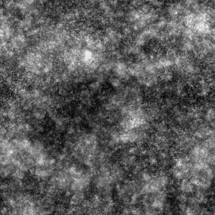

# BnW macchie 1

<table>
<tr style="border: 0;">
<td width="33.33%" style="border: 0;" valign="top">

{width="200px"}

<b>Ingresso:</b> Generatori di texture > Rumori

</td>
<td width="100.00%" style="border: 0;" valign="top">

## Descrizione

Una variazione dei <b>rumori di colore bianco e nero (BnW) approssimativi</b>.

Vedere anche: [macchie BnW 2](../../../../../../compositing-graphs/nodes-reference-for-com/node-library/texture-generators/noises/bnw-spots-2/bnw-spots-2.md), [macchie BnW 3](../../../../../../compositing-graphs/nodes-reference-for-com/node-library/texture-generators/noises/bnw-spots-3/bnw-spots-3.md)

</td>
</tr>
</table>

## Output

|  |  |
|:---|:---|
| <b>Output</b> <i>Scala di grigi</i> | Il disturbo generato come bitmap in scala di grigio. |

## Parametri

|  |  |
|:---|:---|
| <b>Scala</b> <i>Numero intero</i> | Suddivisione della griglia utilizzata per generare le porzioni di disturbo.    Un valore più elevato determina la creazione di più riquadri e un disturbo maggiore. |
| <b>Disturbo</b> <i>Mobile</i> | Sposta gli ingredienti del disturbo.    Può essere utilizzato per animare il disturbo. |
| <b>Velocità del disturbo</b> <i>Mobile</i> | Regola la distanza di spostamento applicata dal parametro <b>Disturbo</b>.    Questa opzione consente di controllare la velocità di spostamento durante l’animazione del disturbo. |
| <b>anisotropia disturbo</b> <i>Mobile</i> | Controlla l&#39;estensione delle direzioni dello spostamento applicato dal parametro <b>Disturbo</b>, in cui un valore più alto determina una direzione più stretta e definita.    La direzione è controllata dal parametro <b>Angolo di anisotropia disturbo</b>. |
| <b>angolo di anisotropia di disturbo</b> <i>Mobile</i> | Controlla la direzione dello spostamento applicato dal parametro <b>Disturbo</b> quando il parametro <b>anisotropia disturbo</b> è diverso da zero. |
| <b>Rugosità</b> <i>Mobile</i> | Il bilanciamento delle ottave di disturbo, dove un valore più alto renderà più visibili le ottave di frequenza più alta. |
| <b>Scostamento porzione</b> <i>Float2</i> | Controlla la posizione della porzione di piano infinito utilizzata per eseguire il rendering del disturbo. |
| <b>Espansione non quadrata</b> <i>Booleano</i> | Nelle immagini non quadrate, mantiene il riquadro quadrato generato ed espande la generazione del disturbo fino ai limiti dell&#39;immagine. |

## Esempi

<table>
<tr style="border: 0;">
<td style="border: 0;" valign="top">

{zoomable="yes"}

</td>
<td style="border: 0;" valign="top">

{zoomable="yes"}

</td>
</tr>
</table>

<table>
<tr style="border: 0;">
<td style="border: 0;" valign="top">

{zoomable="yes"}

</td>
<td style="border: 0;" valign="top">

{zoomable="yes"}

</td>
</tr>
</table>
