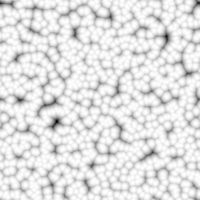
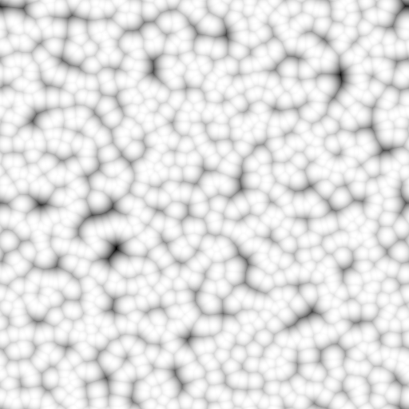

# CELLE 1

<table>
<tr style="border: 0;">
<td style="border: 0;" valign="top">

<table>
<tr style="border: 0;">
<td width="33.33%" style="border: 0;" valign="top">

{width="200px"}

<b>Ingresso:</b> Generatori di texture > Rumori

</td>
<td width="100.00%" style="border: 0;" valign="top">

## Descrizione

Variazione dei <b>Celle</b> rumori muri.

I pattern selezionati dall’utente vengono distribuiti e sovrapposti utilizzando il metodo di fusione Massimo.

Vedere anche: [Celle 2](../../../../../../compositing-graphs/nodes-reference-for-com/node-library/texture-generators/noises/cells-2/cells-2.md), [Celle 3](../../../../../../compositing-graphs/nodes-reference-for-com/node-library/texture-generators/noises/cells-3/cells-3.md), [Celle 4](../../../../../../compositing-graphs/nodes-reference-for-com/node-library/texture-generators/noises/cells-4/cells-4.md)

</td>
</tr>
</table>

<table>
<tr style="border: 0;">
<td style="border: 0;" valign="top">

### Output

</td>
<td style="border: 0;" valign="top">

### Parametri

</td>
<td style="border: 0;" valign="top">

### Esempi

</td>
</tr>
</table>

## Output

|  |  |
| --- | --- |
| <b>Output</b> *Scala di grigi* | Il disturbo generato come bitmap in scala di grigio. |

## Parametri

|  |  |
| --- | --- |
| <b>Scala</b> Intero | Suddivisione della griglia utilizzata per generare le porzioni di disturbo.    Un valore più elevato determina la creazione di più riquadri e un disturbo maggiore. |
| <b>Disturbo</b> Mobile | Sposta gli ingredienti del disturbo.    Può essere utilizzato per animare il disturbo. |
| <b>Velocità del disturbo</b> Mobile | Regola la distanza di spostamento applicata dal parametro <b>Disturbo</b>.    Questa opzione consente di controllare la velocità di spostamento durante l’animazione del disturbo. |
| <b>anisotropia disturbo</b> Mobile | Controlla l&#39;estensione delle direzioni dello spostamento applicato dal parametro <b>Disturbo</b>, in cui un valore più alto determina una direzione più stretta e definita.    La direzione è controllata dal parametro <b>Angolo di anisotropia disturbo</b>. |
| <b>Angolo di anisotropia disturbo</b> Mobile | Controlla la direzione dello spostamento applicato dal parametro <b>Disorder</b> quando il parametro &#39;anisotropia del disturbo&#39; è diverso da zero. |
| <b>Pattern</b> Integer | Forma di base dispersa nell’immagine generata. |
| <b>Dimensione motivo</b> Float2 | Moltiplicatore per la dimensione di un motivo sparso nella relativa cella., dove 1,0 è l&#39;estensione completa della cella. |
| <b>Scala pattern</b> a virgola mobile | Un moltiplicatore per la <b>dimensione del pattern</b>, dove 1,0 corrisponde alla dimensione reale. |
| <b>Luminanza casuale</b> Mobile | Intervallo di luminanza sottratto casualmente dalle celle, dove 1 rappresenta l’intervallo completo. |
| <b>Angolo</b> Mobile | Angolo utilizzato per impostare la direzione delle celle, in numero di giri e a partire da destra orizzontale. |
| <b>Angolo casuale</b> Mobile | L&#39;importo massimo della variazione casuale applicata al valore <b>Angolo</b>, in numero di giri. |
| <b>Scostamento porzione</b> Float2 | Controlla la posizione della porzione di piano infinito utilizzata per eseguire il rendering del disturbo. |
| <b>Espansione non quadrata</b> Booleano | Nelle immagini non quadrate, mantiene il riquadro quadrato generato ed espande la generazione del disturbo fino ai limiti dell&#39;immagine. |

## Esempi

<table>
<tr style="border: 0;">
<td style="border: 0;" valign="top">

{zoomable="yes"}

</td>
<td style="border: 0;" valign="top">

{zoomable="yes"}

</td>
</tr>
</table>

<table>
<tr style="border: 0;">
<td style="border: 0;" valign="top">

{zoomable="yes"}

</td>
<td style="border: 0;" valign="top">

{zoomable="yes"}

</td>
</tr>
</table>

</td>
<td style="border: 0;" valign="top">

</td>
<td style="border: 0;" valign="top">

</td>
</tr>
</table>
