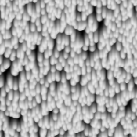

# Fluido

<table>
<tr style="border: 0;">
<td width="33.33%" style="border: 0;" valign="top">

{width="128px"}

<b>Ingresso:</b> Generatori di Texture > Rumori

</td>
<td width="100.00%" style="border: 0;" valign="top">

## Descrizione

Si tratta di un nodo interessante che genera un flusso o una caduta di fluidi. È uno dei rumori più complessi, con alcuni parametri.

Questo rumore riempie una nicchia specifica: può essere utile per generare pioggia, perdite o qualsiasi tipo di liquido sotto gli effetti della gravità.

</td>
</tr>
</table>

## Parametri

|  |  |
|:---|:---|
| <b>Scala</b> <i>1 - 8</i> | Imposta la scala globale per l’effetto. |
| <b>Disturbo</b> <i>0.0 - 1.0</i> | Fase-sposta il disturbo per introdurre piccole variazioni. |
| <b>Intensità alterazione</b> <i>0.0 - 1.0</i> |  |
| <b>Dimensione motivo</b> <i>0.0 - 1.0</i> |  |
| <b>Non square expansion</b> <i>Falso/Vero</i> | Consente la compensazione di squash e allungamento con rapporti non quadrati. |

## Esempi

<table style="margin-top: 32px; margin-bottom: 32px">
    <tr style="border: 0">
        <td style="border: 0; background: transparent">
            
        </td>
    </tr>
</table>
