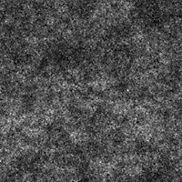

# SOMMA FRATTALE 2

<table>
<tr style="border: 0;">
<td width="33.33%" style="border: 0;" valign="top">

{width="200px"}

<b>Ingresso:</b> Generatori di texture > Rumori

</td>
<td width="100.00%" style="border: 0;" valign="top">

## Descrizione

Variazione dei rumori di <b>Somma frattale</b>.

Vedere anche: [Somma frattale base](../../../../../../compositing-graphs/nodes-reference-for-com/node-library/texture-generators/noises/fractal-sum-base/fractal-sum-base.md), [Somma frattale 1](../../../../../../compositing-graphs/nodes-reference-for-com/node-library/texture-generators/noises/fractal-sum-1/fractal-sum-1.md), [Somma frattale 3](../../../../../../compositing-graphs/nodes-reference-for-com/node-library/texture-generators/noises/fractal-sum-3/fractal-sum-3.md), [Somma frattale 4](../../../../../../compositing-graphs/nodes-reference-for-com/node-library/texture-generators/noises/fractal-sum-4/fractal-sum-4.md)

</td>
</tr>
</table>

## Output

|  |  |
|:---|:---|
| <b>Output</b> <i>Scala di grigi</i> | Il disturbo generato come bitmap in scala di grigio. |

## Parametri

|  |  |
|:---|:---|
| <b>Disturbo</b> <i>Mobile</i> | Sposta gli ingredienti del disturbo.    Può essere utilizzato per animare il disturbo. |
| <b>Velocità del disturbo</b> <i>Virgola mobile</i> | Regola la distanza di spostamento applicata dal parametro <b>Disturbo</b>.    Questa opzione consente di controllare la velocità di spostamento durante l’animazione del disturbo. |
| <b>Espansione non quadrata</b> <i>Booleano</i> | Nelle immagini non quadrate, mantiene il riquadro quadrato generato ed espande la generazione del disturbo fino ai limiti dell&#39;immagine. |

## Esempi

<table>
<tr style="border: 0;">
<td style="border: 0;" valign="top">

{zoomable="yes"}

</td>
<td style="border: 0;" valign="top">

{zoomable="yes"}

</td>
</tr>
</table>
