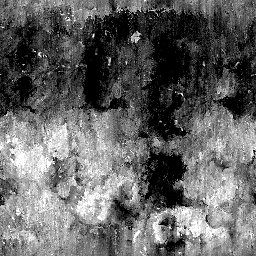
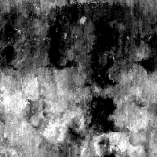

# Mappa grungi 015

<table>
<tr style="border: 0;">
<td width="33.33%" style="border: 0;" valign="top">

{width="128px"}

<b>Ingresso:</b> Generatori di Texture > Rumori

</td>
<td width="100.00%" style="border: 0;" valign="top">

## Descrizione

Questo genera una complessa mappa del disturbo combinata. Può essere molto utile come una procedura dettagliata, ma tenete a mente che questi sono molto ad alta intensità di prestazioni e quindi più lenti da generare.

</td>
</tr>
</table>

## Parametri

|  |  |
|:---|:---|
| <b>Saldo</b> <i>0.0 - 1.0</i> | Sposta il bilanciamento del risultato tra il bianco o il nero, ad esempio regolando la luminosità. |
| <b>Contrasto</b> <i>0.0 - 1.0</i> | Regola il contrasto del risultato. |
| <b>Inverti</b> <i>Falso/Vero</i> | Inverte il risultato. |
| <b>Motivo pennello</b> <i>0.0 - 1.0</i> | Aggiunge una maschera intorno ai bordi, per quando viene utilizzato come pennello alfa. |
| <b>Non square expansion</b> <i>Falso/Vero</i> | Consente la compensazione di schiacciamento e allungamento con rapporti non quadrati. |

## Esempi

<table style="margin-top: 32px; margin-bottom: 32px">
    <tr style="border: 0">
        <td style="border: 0; background: transparent">
            
        </td>
    </tr>
</table>
