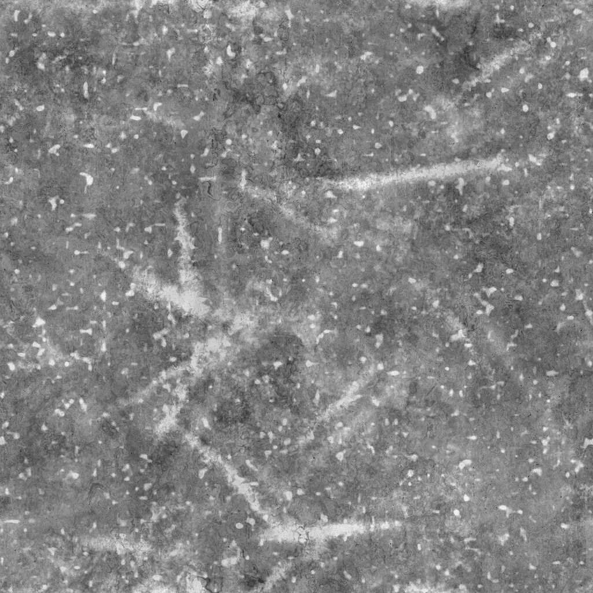

# Ruggine di grunge fine

<table>
<tr style="border: 0;">
<td width="41.60%" style="border: 0;" valign="top">

{width="200px"}

**Ingresso:** *Generatori Di Texture* */Rumori*

**Semplice**

</td>
<td width="58.30%" style="border: 0;" valign="top">

## Descrizione

Il nodo **Ruggine di Grunge fine** genera una mappa di grunge simile a una sovrapposizione di ruggine di grunge fine.

</td>
</tr>
</table>

## Parametri

* **Bilanciamento** *Fluttuazione* Regola il bilanciamento tra valori scuri e chiari.
* **Contrasto** *Mobile* Regola il contrasto dell&#39;immagine.
* **Inverti** *Booleano* Inverte l&#39;output dell&#39;immagine, utilizzando un&#39;operazione `1-x`.
* **Non square expansion** *Booleano* Consente la compensazione di schiacciamento e allungamento con rapporti non quadrati.
* Avanzate
  * **Contrasto base Grunge** *Fluttuazione* Regola il contrasto della texture della grunge utilizzata come base per la ruggine.
  * **Intensità alterazione base** *Fluttuazione* Regola l’intensità dell’effetto di alterazione applicato sulla mappa della grunge utilizzata come base per la ruggine.
  * **Intensità striature** *Muovi* Regola l’intensità delle striature più luminose e delle macchie sovrapposte sulla texture della grunge di base.
  * **Intensità disturbo** *Fluttuazione* Regola l&#39;intensità del disturbo applicato alla texture della grunge di base.
  * **Intensità nitidezza** *Fluttuazione* Regola l&#39;intensità dell&#39;effetto di nitidezza globale.

## Immagini di esempio

<table>
<tr style="border: 0;">
<td style="border: 0;" valign="top">

{width="256px"}

</td>
<td style="border: 0;" valign="top">

{width="256px"}

</td>
</tr>
</table>
