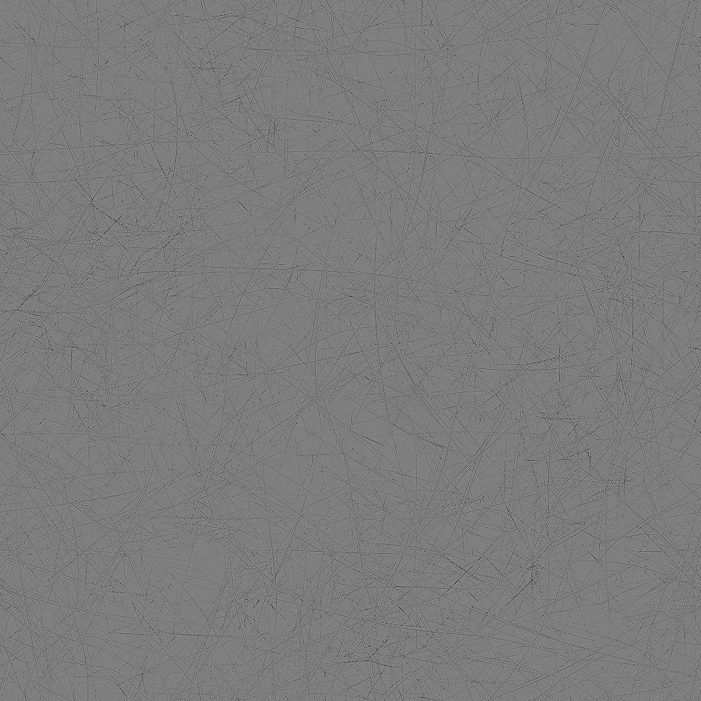

# Scratches di grunge fini

<table>
<tr style="border: 0;">
<td width="33.33%" style="border: 0;" valign="top">

{width="200px"}

<b>Ingresso:</b> Generatori di Texture > Rumori

</td>
<td width="100.00%" style="border: 0;" valign="top">

## Descrizione

Il nodo **Scratches fini** delle Grungi genera una mappa delle grungi simile a una superficie pulita finemente graffiata.

</td>
</tr>
</table>

## Parametri

|  |  |
|:---|:---|
| <b>Saldo</b> <i>Virgola mobile</i> | Regola il bilanciamento tra i valori di luminosità e oscurità. |
| <b>Contrasto</b> <i>Virgola mobile</i> | Regola il contrasto dell’immagine. |
| <b>Inverti</b> <i>Booleano</i> | Inverte l&#39;output dell&#39;immagine utilizzando un&#39;operazione `1-x`. |
| <b>Non square expansion</b> <i>Booleano</i> | Consente la compensazione di squash e allungamento con rapporti non quadrati. |
| <b>Avanzate</b> |  |
| <b>Importo Scratches</b> <i>Virgola mobile</i> | Regola la quantità di graffi fini sulla superficie. |
| <b>Intensità nitidezza</b> <i>Virgola mobile</i> | Regola l’intensità dell’effetto di nitidezza globale. |
| <b>Differenza valore memoria virtuale</b> <i>Mobile</i> | Regola il bilanciamento dei valori di luminanza assegnati ai singoli graffi. |

## Esempi

<table style="margin-top: 32px; margin-bottom: 32px">
    <tr style="border: 0">
        <td style="border: 0; background: transparent">
            
        </td>
        <td style="border: 0; background: transparent">
            
        </td>
    </tr>
</table>
