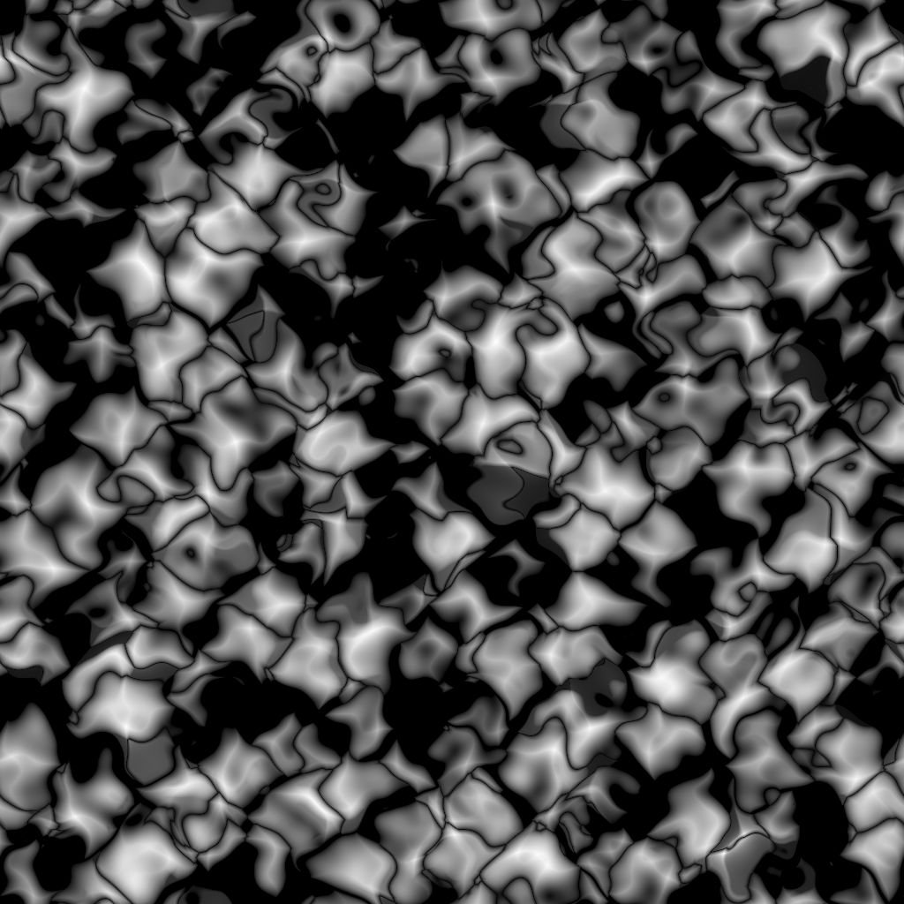
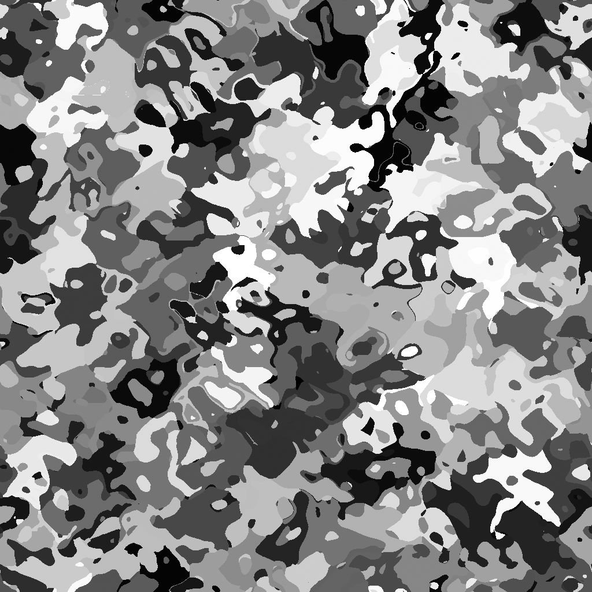

# Voronoi

<table>
<tr style="border: 0;">
<td width="33.33%" style="border: 0;" valign="top">

{width="200px"}

<b>Ingresso:</b> Generatori di Texture > Rumori

</td>
<td width="100.00%" style="border: 0;" valign="top">

## Descrizione

Il nodo **Voronoi** genera un disturbo 3D di Voronoi mappato a un&#39;immagine 2D utilizzando una *proiezione ortogonale Z-down*.

Questo nodo può essere testato con [Cubo GBuffer](../../../../../../compositing-graphs/nodes-reference-for-com/node-library/texture-generators/patterns/cube-3d-gbuffers/cube-3d-gbuffers.md) come input anziché come mappa con baking effettiva (come illustrato nell&#39;immagine di esempio seguente).

>[!WARNING]
>
> Questo rumore deve essere utilizzato solo con *il motore GPU* (ad esempio **Direct** o **OpenGL**). Vai a **Strumenti > Cambia motore...** oppure premi il tasto **F9** per selezionare il motore desiderato.

</td>
</tr>
</table>

## Parametri

|  |  |
|:---|:---|
| <b>Inverti</b> <i>Booleano</i> | Inverte l’immagine di output. |
| <b>Scala</b> <i>Mobile</i> | Controlla la scala del rumore di Voronoi.  *Nota*: quando **Affiancamento** è attivato su *qualsiasi asse*, la regolazione della scala è *graduale*. Questo è previsto. |
| <b>Dimensioni</b> <i>Float3</i> | Controlla la dimensione del disturbo di Voronoi sugli assi **X**, **Y** e **Z**. I valori non uniformi producono un effetto *allungamento o schiacciante*.  *Nota*: quando l&#39;opzione **Affiancamento** è abilitata su *qualsiasi asse*, la regolazione della dimensione è *graduale*. Questo è previsto. |
| <b>Scostamento</b> <i>Float3</i> | Applica uno scostamento alla *posizione* del rumore di Voronoi sugli assi **X**, **Y** e **Z**. |
| <b>Disturbo</b> <i>Float3</i> | Intensità dello *scostamento casuale* applicato a ciascun punto del disturbo sugli assi **X**, **Y** e **Z**. |
| <b>Intensità Distorsione</b> <i>Mobile</i> | Controlla l&#39;intensità di un *effetto di alterazione* applicato al disturbo di Voronoi. |
| <b>Moltiplicatore scala Distorsione</b> <i>Mobile</i> | Controlla la scala del *pattern di deformazione* utilizzato nell&#39;effetto di alterazione controllato dall&#39;**intensità della Distorsione**. |
| <b>Curva arrotondata</b> <i>Mobile</i> | Arrotonda la *pendenza* attorno a ciascun punto del disturbo per renderlo *convesso*.  *Nota*: questo parametro non è disponibile quando il parametro **Stile** è impostato su *Bordo*. |
| <b>Scala distanza</b> <i>Mobile</i> | Regola la *distanza della sfumatura* attorno a ciascun punto del disturbo. |
| <b>Modalità distanza</b> <i>Numero intero</i> | Imposta il metodo su *calcolare la sfumatura della distanza* attorno a ciascun punto del disturbo:  - *euclideo* - *Manhattan* - *Chebyshev* - *Minkowski* |
| <b>Numero di Minkowski</b> <i>Mobile</i> | L&#39;ordine *p* della distanza di Minkowski. Se dividiamo la sfumatura della distanza in quadranti, questo numero influisce su questi quadranti come segue:  - p è *esattamente* 1: retto - p è *inferiore* a 1: concavo - p è *maggiore* di 1: convesso  Valori interessanti:  - *1,0*: distanza di Manhattan - *2,0*: distanza euclidea - *Infinito*: distanza Chebyshev   *Nota*: questo parametro è disponibile solo quando il parametro **Modalità distanza** è impostato su *Minkowski*. |
| <b>Stile</b> <i>Numero intero</i> | Imposta il metodo *rendering dei dati* del disturbo di Voronoi, considerando che il disturbo si basa su un insieme di punti nello spazio:  - *F1*: la distanza dal *punto più vicino* nello spazio - *F2*: la distanza dal *secondo punto più vicino* nello spazio - *F2-F1* - *F1\* F2 * -* F1/F2 * -* Bordo *: il* bordo tra ogni cella *del disturbo nello spazio -* Colore casuale *: assegna un* colore piatto casuale* a ogni cella del disturbo nello spazio |
| <b>Thickness Edge</b> <i>Mobile</i> | Regola il thickness dei bordi rilevati tra le celle del disturbo di Voronoi. Gli spigoli vengono rilevati negli assi X, Y e Z, pertanto alcuni spessori possono aumentare più rapidamente di altri a seconda della *profondità* delle celle.  *Nota*: questo parametro è disponibile solo quando il parametro **Stile** è impostato su *Spigolo*. |
| <b>Modalità colore casuale</b> <i>Numero intero</i> | Imposta il metodo di *acquisizione* del valore di inizializzazione casuale per la selezione colore per cella:  - *Numero casuale globale*: utilizzare il valore di inizializzazione *ereditato* dal nodo - *Numero manuale*: utilizzare un valore di inizializzazione *discreto*  *Nota*: questo parametro è disponibile solo quando il parametro **Stile** è impostato su *Colore casuale*. |
| <b>Numero di colori casuale</b> <i>Numero intero</i> | Valore di inizializzazione casuale discreto da utilizzare per la selezione del colore per cella.  *Nota*: questo parametro è disponibile solo quando il parametro **Style** è impostato su *Colore casuale* e il parametro **Modalità di inizializzazione colore casuale** è impostato su ***Numero manuale***. |
| <b>Non square expansion</b> <i>Booleano</i> | Consente la compensazione di schiacciamento e allungamento con rapporti non quadrati. |

## Esempi

<table style="margin-top: 32px; margin-bottom: 32px">
    <tr style="border: 0">
        <td style="border: 0; background: transparent">
            
        </td>
        <td style="border: 0; background: transparent">
            
        </td>
        <td style="border: 0; background: transparent">
            
        </td>
        <td style="border: 0; background: transparent">
            
        </td>
        <td style="border: 0; background: transparent">
            
        </td>
        <td style="border: 0; background: transparent">
            
        </td>
    </tr>
</table>
