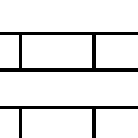

# Mattone 2

<table>
<tr style="border: 0;">
<td style="border: 0;" valign="top">

{width="128px"}

## Mattone 2

**Ingresso:** *Generatori Di Texture**/Pattern*

**Semplice**

</td>
<td style="border: 0;" valign="top">

## Descrizione

Pattern mattone semplice, vedere [Generatore mattoni](../../../../../../compositing-graphs/nodes-reference-for-com/node-library/texture-generators/patterns/brick-generator/brick-generator.md) o [Tile Generator](../../../../../../compositing-graphs/nodes-reference-for-com/node-library/texture-generators/patterns/tile-generator/tile-generator.md) per ulteriori opzioni.

## Parametri

* **Affiancatura**: *1 - 16*\
  Imposta il numero di volte in cui il risultato deve essere affiancato.
* **Smoothness bordo**: *0.0 - 1.0* Fusione tra bordi netti e bordi lisci.
* **Larghezza interstizio**: *0.0 - 1.0* Imposta l&#39;interstizio (dimensione spazio).
* **Non square expansion**: *Falso/Vero*\
  Consente la compensazione di schiacciamento e allungamento con rapporti non quadrati.

## Immagini di esempio

</td>
</tr>
</table>
