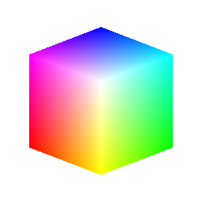

# Cubo 3D GBuffer

<table>
<tr style="border: 0;">
<td width="33.33%" style="border: 0;" valign="top">

{width="128px"}

<b>Ingresso:</b> Generatori Texture > Pattern

</td>
<td width="100.00%" style="border: 0;" valign="top">

## Descrizione

Versione avanzata di [Cubo 3D](../../../../../../compositing-graphs/nodes-reference-for-com/node-library/texture-generators/patterns/cube-3d/cube-3d.md) che genera anche solo mappe di posizione e normali invece di heightmap.

</td>
</tr>
</table>

## Parametri

|  |  |
|:---|:---|
| <b>Scostamento orientamento</b> | Consente la rotazione X e Y del cubo in 3D. Può essere effettuata anche manipolando il piccolo punto nell’anteprima 2D. |
| <b>Dimensioni</b> <i>0.0 - 1.0</i> | Consente il ridimensionamento non uniforme del cubo. |
| <b>Scala</b> <i>0.0 - 1.0</i> | Ridimensiona l&#39;intero cubo in modo uniforme. |
| <b>Non square expansion</b> <i>Falso/Vero</i> | Consente la compensazione di schiacciamento e allungamento con rapporti non quadrati. |
