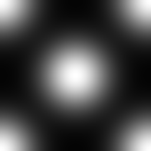

# Gaussiano 1

<table>
<tr style="border: 0;">
<td width="33.33%" style="border: 0;" valign="top">

{width="128px"}

<b>Ingresso:</b> Generatori Texture > Pattern

</td>
<td width="100.00%" style="border: 0;" valign="top">

## Descrizione

Semplice schema di blob gaussiano.

</td>
</tr>
</table>

## Parametri

|  |  |
|:---|:---|
| <b>Affiancatura</b> <i>1 - 16</i> | Imposta il numero di volte in cui il risultato deve essere affiancato. |
| <b>Non square expansion</b> <i>Falso/Vero</i> | Consente la compensazione di schiacciamento e allungamento con rapporti non quadrati. |

## Esempi

<table style="margin-top: 32px; margin-bottom: 32px">
    <tr style="border: 0">
        <td style="border: 0; background: transparent">
            
        </td>
    </tr>
</table>
