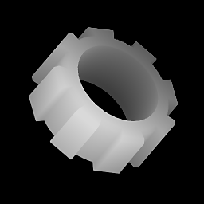

# Estrusione forma

<table>
<tr style="border: 0;">
<td style="border: 0;" valign="top">

{width="128px"}

## Estrusione forma

**Ingresso:** *Generatori Di Texture**/Pattern*

**Complesso**

</td>
<td style="border: 0;" valign="top">

## Descrizione

Nodo avanzato che consente il rendering degli input di &quot;forme&quot; binari 2D su mappe di altezza ruotate in 3D. Funziona in modo simile a un&#39;estrusione in un pacchetto 3D in cui una forma viene estrusa lungo il suo asse, creando un volume. In combinazione con la maschera Sfumatura profilo, è possibile creare anche corpi di tipo rivoluzione/tornio. Molto utile per creare forme artistiche complesse per le mappe altezza.

## Parametri

### Input

* **Extrude Shape Input**: *Grayscale Input* Se Extrude Shape è impostato su Custom, inserire qui la propria maschera di forma binaria (preferibilmente).
* **Sfumatura profilo**: *Input scala di grigi\
  Se Tipo profilo è impostato su Sfumatura verticale, può essere utilizzato per definire la scala della forma lungo l&#39;asse, per i corpi di rivoluzione.*
* **Maschera profilo**: *Input scala di grigi*\
  Slot maschera utilizzato per nascondere o mostrare la forma estrusa lungo il suo asse. Può essere utilizzato per interrompere la continuità della forma lungo il suo asse. Interpretato solo come binario: i valori put della scala di grigi vengono arrotondati a 0 o 1.

### Parametri

* **Estrusione Height**: *0.0 -* 1.0\
  Entità per l&#39;estrusione della forma dal centro verso l&#39;alto.
* **Estrusione Profondità**: *0.0 - 1.0* Quantità di estrusione della forma da parte dei livelli inferiori dal centro.
* **Forma estrusione**: *Cubo, Cilindro, Input personalizzato* Utilizzare forme incorporate o immettere la propria forma personalizzata esternamente.
* **Dimensioni forma estrusione**: *0.0 - 1.0* Utilizzato solo con il cubo e il cilindro incorporati, determina le dimensioni della forma di base e può essere ridimensionato in modo non uniforme.
* **Scala**: *0,0 - 1,0*\
  Impostate la scala globale per l’effetto. Con Forme incorporate si tratta di una scala di forma base uniforme che non ha effetto su Height o Profondità.\
  Con l’input personalizzato, l’intero risultato finale viene ridimensionato in modo uniforme.
* **Tipo di profilo**: *Sfumatura verticale dritta, maschera* Controllo principale per determinare il comportamento dell&#39;effetto e l&#39;uso di mappe di input aggiuntive opzionali.\
  Diritto è il comportamento standard dell&#39;estrusione; Sfumatura verticale consente di personalizzare i valori di scala lungo l&#39;intero asse; Maschera consente di nascondere le sezioni lungo l&#39;asse tramite maschera.
* **Height smussato**: *0.0 - 1.0* Impostare la distanza della smussatura lungo l&#39;asse di estrusione.
* **Intensità smusso**: *0.0 - 1.0* Impostate il valore di ritrazione della smussatura rispetto alla forma originale.
* **Curva smussata**: *-1.0 - 1.0* Imposta la curva convessa o concava dell&#39;effetto Smussato. Un valore pari a 0 significa rettilineo, nessuna curva.
* **Smusso speculare**: *False/True* Attivate/disattivate per applicare lo smusso sopra e sotto la forma.
* **Downscale Mulitplier**: *0 - 2* Controllo di downscale semplice integrato. Può essere utilizzato per aggiungere rapidamente l&#39;antialiasing; assicurarsi di aumentare anche la risoluzione dei nodi.
* **Posizione**:\
  Controllo principale per la rotazione dei risultati nello spazio 3D. Correlazione con Gizmo interavtice nella vista 2D.
* **Intervallo output**: *[0, 1], [-1, 1]*Impostare i valori minimo e massimo dell&#39;output. Se intervallo è impostato su [-1,1], i valori negativi vengono presentati come nero.

## Immagini di esempio

| 

 |
| --- |
|  |

</td>
</tr>
</table>
