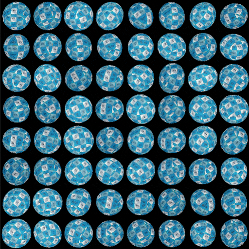
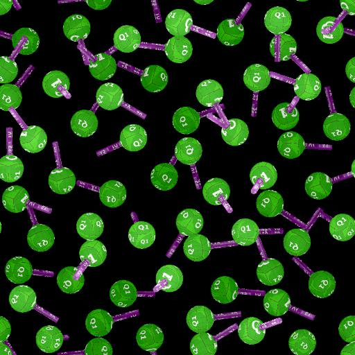

# Colore mapping splatter forma v2

<table>
<tr style="border: 0;">
<td width="33.33%" style="border: 0;" valign="top">

<b>Ingresso:</b> Generatore > Pattern

</td>
<td width="100.00%" style="border: 0;" valign="top">

## Descrizione

Esegue la mappatura delle immagini a colori sulle forme generate e distribuite utilizzando il nodo [splatter di forme v2](../shape-splatter-v2/shape-splatter-v2.md), utilizzando i dati aggiuntivi forniti dal nodo.  Le immagini vengono fornite come input di pattern separati o inserite in un atlante griglia e possono essere applicate alle forme utilizzando la mappatura UV, la proiezione triplanare o la mappatura personalizzata.  È possibile colorare le forme e regolarne i colori in modo uniforme o casuale in base alla forma.

Vedere anche [Scala di grigi splatter v2 mapper ](../shape-splatter-v2-mapper-grayscale/shape-splatter-v2-mapper-grayscale.md).

</td>
</tr>
</table>

>[!INFO]
>
> Questo nodo richiede dati di input generati dal nodo [splatter forma v2](../shape-splatter-v2/shape-splatter-v2.md).
> 
> Altri nodi nella famiglia di splatter Shape v2:
> * [Splatter forma v2 da mascherare](../shape-splatter-v2-to-mask/shape-splatter-v2-to-mask.md)
>
> I nodi di [colore Atlante griglia](../grid-atlas-color/grid-atlas-color.md) consentono di comprimere le immagini in un atlante di dimensioni personalizzate, fino a 16 pattern in 4*4 celle.

>[!TIP]
> 
> Per iniziare con i nodi Shape splatter v2, è disponibile il materiale [**&#39;Rusty bolts&#39;** sample](../../../../../../function-graphs/nodes-reference-for-fun/function-node-library/function-nodes-sdf-functions/working-with-sdf-functions.md#material-sample).
> 
> Per ulteriori informazioni sui concetti e i flussi di lavoro relativi alla Funzione SDF, consulta la pagina dedicata: [Utilizzo della Funzione SDF](../../../../../../function-graphs/nodes-reference-for-fun/function-node-library/function-nodes-sdf-functions/working-with-sdf-functions.md)

## Input

|                                 |                                                                                                                                                                                                                                                                                                                                                                                                                                                                                                                                                                                                                                                                                                                                                                                                                                                                                        |
|:--------------------------------|:---------------------------------------------------------------------------------------------------------------------------------------------------------------------------------------------------------------------------------------------------------------------------------------------------------------------------------------------------------------------------------------------------------------------------------------------------------------------------------------------------------------------------------------------------------------------------------------------------------------------------------------------------------------------------------------------------------------------------------------------------------------------------------------------------------------------------------------------------------------------------------------|
| <b>Input Atlante griglia</b> *Colore* | Immagine a colori di pattern compressi in un layout a griglia.  La dimensione della griglia deve corrispondere a quella utilizzata dal nodo [splatter forma v2](../shape-splatter-v2/shape-splatter-v2.md) .  Utilizzare il nodo [colore Atlante griglia](../grid-atlas-color/grid-atlas-color.md) per comprimere motivi separati in un atlante griglia. |
| <b>Input pattern 1</b> *Colore* | Immagine a colori per il motivo #1 mappato alle forme.  <i>Suggerimento:</i> Utilizzare una risoluzione vicina alle dimensioni massime consentite per il motivo quando è sparso. |
| <b>Input pattern 2</b> *Colore* | Immagine a colori per il motivo #2 mappato alle forme.  <i>Suggerimento:</i> Utilizzare una risoluzione vicina alle dimensioni massime consentite per il motivo quando è sparso. |
| <b>Input pattern 3</b> *Colore* | Immagine a colori per il motivo #3 mappato alle forme.  <i>Suggerimento:</i> Utilizzare una risoluzione vicina alle dimensioni massime consentite per il motivo quando è sparso. |
| <b>Input pattern 4</b> *Colore* | Immagine a colori per il motivo #4 mappato alle forme.  <i>Suggerimento:</i> Utilizzare una risoluzione vicina alle dimensioni massime consentite per il motivo quando è sparso. |
| <b>Input pattern 5</b> *Colore* | Immagine a colori per il motivo #5 mappato alle forme.  <i>Suggerimento:</i> Utilizzare una risoluzione vicina alle dimensioni massime consentite per il motivo quando è sparso. |
| <b>Input pattern 6</b> *Colore* | Immagine a colori per il motivo #6 mappato alle forme.  <i>Suggerimento:</i> Utilizzare una risoluzione vicina alle dimensioni massime consentite per il motivo quando è sparso. |
| <b>Input pattern 7</b> *Colore* | Immagine a colori per il motivo #7 mappato alle forme.  <i>Suggerimento:</i> Utilizzare una risoluzione vicina alle dimensioni massime consentite per il motivo quando è sparso. |
| <b>Input pattern 8</b> *Colore* | Immagine a colori per il motivo #8 mappato alle forme.  <i>Suggerimento:</i> Utilizzare una risoluzione vicina alle dimensioni massime consentite per il motivo quando è sparso. |
| <b>Input in background</b> *Colore* | Immagine a colori utilizzata come sfondo per le forme mappate. |
| <b>Input colore</b> *Colore* | Immagine a colori utilizzata per colorare le forme mappate in base alla relativa posizione dei punti cardini.  Utilizzare il parametro <b>Opacità input colore</b> per regolare l&#39;intensità del contributo di questi colori al colore delle forme. |
| <b>Normale</b> *Colore* | Normali calcolati per le forme sparse, mascherati in base alla fusione con il height di sfondo.   Se il <b>tipo di forma</b> è &#39;Atlante griglia&#39;, vengono utilizzate direttamente le normali fornite all&#39;input <b>Atlante griglia normale</b>. |
| <b>Splatter UVW</b> *Colore* | <b>R</b> - Componente U degli UV delle forme. <b>G</b> - Componente V degli UV delle forme. <b>B</b> - height delle forme. (W) <b>A</b> - Dati compressi:  - <i>Parte intera:</i> Identificatore univoco delle forme. (ID)  - <i>Parte frazionale:</i> dipende dal <b>Tipo di forma</b>: ID materiale se SDF/primitivo, ID motivo* se input/atlante griglia motivo.  <b>*:</b> L&#39;ID motivo è l&#39;indice della forma nell&#39;elenco/atlas. |
| <b>Dati splatter 1</b> *Colore* | <b>R</b> - Componente X della posizione sulla superficie della forma, nello spazio dell&#39;oggetto. <b>G</b> - Componente Y della posizione sulla superficie della forma, nello spazio dell&#39;oggetto. <b>B</b> - Componente Z della posizione sulla superficie della forma, nello spazio dell&#39;oggetto. <b>A</b> - Dati compressi:  - <i>Parte intera:</i> Componente U delle coordinate UV per i dati delle forme negli output dei dati 2/3.  - <i>Parte frazionale:</i> V componente delle coordinate UV per i dati delle forme negli output dei dati 2/3.  - <i>Firma:</i> Maschera binaria per la fusione delle forme con il height di sfondo. |
| <b>Dati splatter 2</b> *Colore* | <b>R</b> - Componente X della rotazione 3D delle forme. <b>G</b> - Componente Y della rotazione 3D delle forme. <b>B</b> - Componente Z della rotazione 3D delle forme. <b>A</b> - Rotazione delle forme attorno alla normale.  Tutte le rotazioni sono definite in numero di giri. |
| <b>Dati splatter 3</b> *Colore* | <b>R</b> - Componente X della posizione delle forme. <b>G</b> - Componente Y della posizione delle forme. <b>B</b> - Scostamento delle forme lungo la normale. <b>A</b> - Dati compressi:  - <i>Parte intera:</i> ID della forma.  - <i>Parte frazionaria:</i>Indice del pattern delle forme nel relativo atlas di origine. (Se si utilizza un tipo di pattern atlante griglia) |
| <b>Dati splatter 4</b> *Colore* | <i>Pixel 1</i> <b>R</b> - Dimensioni X delle immagini di output Data 2/3. <b>G</b> - Dimensioni Y delle immagini di output Data 2/3. <b>B</b> - Dimensioni X dell&#39;immagine di output Data 4. <b>A</b> - Dimensioni Y dell&#39;immagine di output Data 4.  <i>Pixel 2</i> <b>R</b> - Tipo di forma. (E.g. Cubo, cilindro, ...) <b>G</b> - Dati compressi:  - <i>Valore assoluto:</i> Numero di input del pattern.  - <i>Firma:</i> Formato normale della mappa normale di output. (Positivo: DirectX / Negativo: OpenGL) <b>B</b> - Dimensione X dell&#39;atlante griglia. (ovvero la quantità di colonne) <b>A</b> - Dimensione Y dell&#39;atlante griglia. (ovvero l&#39;importo delle righe) |

## Output

|               |                     |
|:--------------|:--------------------|
| <b>Output</b> | Le forme colorate. |

## Parametri

|                                            |                                                                                                                                                                                                                                                                                                                                                                                                                                                                                                                                                                                                                                                                                                                                                                                                                                                                                                                                                                                                                                                                |
|:-------------------------------------------|:---------------------------------------------------------------------------------------------------------------------------------------------------------------------------------------------------------------------------------------------------------------------------------------------------------------------------------------------------------------------------------------------------------------------------------------------------------------------------------------------------------------------------------------------------------------------------------------------------------------------------------------------------------------------------------------------------------------------------------------------------------------------------------------------------------------------------------------------------------------------------------------------------------------------------------------------------------------------------------------------------------------------------------------------------------------|
| <b>Modalità proiezione</b> *Numero intero* | Metodo di proiezione delle immagini di input sulle forme:  - <b>Dagli UV di splatter:</b> Utilizzare gli UV forniti dal nodo &#39;Shape splatter v2&#39;. - <b>Triplanare:</b> Utilizzare la proiezione triplanare per mappare le immagini sugli assi XYZ locali delle forme. - <b>Funzione personalizzata:</b> Creare un grafico di funzioni per definire la mappatura delle immagini sulle forme. |
| <b>Funzione personalizzata</b> *Float4* | Specifica il colore RGBA per pixel delle forme come Float4.  Sono disponibili le seguenti variabili: - <code>shape.position.os</code> (Float3) Posizione della superficie della forma nello spazio dell&#39;oggetto. - <code>shape.position.ws</code> (Float3) Posizione della superficie della forma nello spazio mondo*. - <code>shape.normal.os</code> (Float3) Normali della superficie della forma nello spazio dell&#39;oggetto.  - <code>forma.normale.ws</code> (Float3) Normali della superficie della forma nello spazio mondo*. - <code>shape.id</code> (Mobile) Identificatore univoco della forma. - <code>material.id</code> (Mobile) ID materiale della superficie della forma, definito dal nodo &#39;Splatter forma v2&#39;.  *: Lo spazio globale della forma è centrato sul relativo perno e non tiene conto del height della forma. Ciò significa che l&#39;unica differenza con lo spazio dell&#39;oggetto è l&#39;orientamento.  Se è necessario campionare gli input del nodo &#39;Shape splatter v2 mapper color&#39;, è possibile utilizzare gli slot di input del nodo <b>Sample color</b>: - 0: Atlante griglia - 1-8: Pattern input 1-8 |
| <b>Mappa normale</b> *Booleano* | Specifica se le immagini fornite all&#39;<b>input Atlante griglia</b> o all&#39;<b>input pattern #</b> sono mappe normali.  Questo è necessario per abilitare l&#39;elaborazione necessaria per gestire correttamente i vettori normali e applicarli alle forme. |
| <b>Formato normale di input</b> *Numero intero* | Formato delle mappe normali fornite all&#39;input <b>Atlante griglia</b> o all&#39;input <b>Pattern #</b>.  Inverte efficacemente il canale verde.  - <b>DirectX:</b> L&#39;asse Y punta verso l&#39;alto. - <b>OpenGL:</b> L&#39;asse Y punta verso il basso. |
| <b>Contrasto di fusione</b> *Virgola mobile* | Nitidezza delle transizioni tra proiezioni planari, dove 1 significa nessuna sfumatura di dissolvenza. |
| <b>Proiezione immagine</b> *Numero intero* | Quantità di <b>immagini di input con pattern #</b> distribuite nelle proiezioni planari che contribuiscono alla mappatura triplanare.  Per coprire tutti i lati di una forma, viene eseguita una proiezione della planari anteriore (+) e posteriore (-) su ciascun asse, per un totale di 6 proiezioni.  - <b>1 immagine:</b> L&#39;input pattern 1 viene utilizzato per tutte le proiezioni planari. - <b>3 immagini:</b> Per la proiezione +/- di ciascun asse viene utilizzato un input pattern separato. - <b>6 immagini:</b> Ogni proiezione utilizza un input pattern separato. - <b>1 immagine per ID materiale:</b> Utilizza un input pattern separato per ID materiale dove ciascuna immagine viene utilizzata per tutte le proiezioni planari. |
| <b>Centro di proiezione</b> *Float3* | Sposta la proiezione triplanare per asse nello spazio dell’oggetto.  L&#39;offset viene applicato all&#39;<i>intero spazio di proiezione</i>, pertanto un offset su un asse influisce sul posizionamento delle texture proiettate sugli <i>altri due</i> assi. |
| <b>Scala di proiezione</b> *Mobile* | Regola la scala delle texture proiettate su <i>tutti gli assi</i> in base al fattore specificato. |
| <b>Modalità di selezione dell&#39;input</b> *Numero intero* | Metodo di selezione delle immagini di input da associare alle forme.  Il <b>tipo di forma</b> selezionato nel nodo di origine &#39;Splatter forme v2&#39; cambia il modo di assegnare le immagini alle forme:  - <b>Atlante griglia</b> significa che le immagini vengono recuperate nell&#39;&#39;input Atlante griglia&#39; tramite indici della griglia corrispondenti (entrambi gli atlanti devono utilizzare la stessa dimensione della griglia) - <b>Input motivo</b> significa che le immagini vengono recuperate negli input &#39;N. input motivo&#39; tramite indici corrispondenti. - <b>Altri tipi di forma:</b> le immagini vengono assegnate mediante indici corrispondenti al materiale della forma ID.  I metodi disponibili per la selezione degli indici sono: - <b>Dai dati splatter:</b> Far corrispondere gli indici delle immagini &#39;N. input motivo&#39; o &#39;Input Atlante griglia&#39; agli indici delle forme assegnate dal nodo &#39;N. splatter forma v2&#39;. - <b>Manuale:</b> Utilizzare l&#39;indice specificato dal parametro &#39;Indice immagine&#39;. - <b>Casuale:</b> Utilizzare un indice casuale nell&#39;intervallo specificato dal parametro &#39;Intervallo casuale&#39;. |
| <b>Numero di input del pattern</b> *Numero intero* | Quantità di <b>immagini di input con pattern n. </b> da mappare sulle forme. |
| <b>Indice immagine</b> *Numero intero* | L&#39;indice del pattern di input dal <b>input n. </b> o <b>input Atlante griglia</b> che deve essere mappato sulle forme. |
| <b>Intervallo casuale</b> *Intero2* | Intervallo di indici dall&#39;<b>input motivo n. </b> o <b>input Atlante griglia</b> in cui deve essere selezionato in modo casuale il motivo da mappare sulle forme. |
| <b>Regolazione HSL</b> *Float3* | Uno scostamento applicato in modo uniforme alla tonalità, saturazione e luminanza (HSL) di tutte le forme. |
| <b>HSL casuale</b> *Float3* | Uno scostamento casuale positivo o negativo applicato alla tonalità, alla saturazione e alla luminanza (HSL) delle forme, fino ai valori specificati. |
| <b>Opacità input colore</b> *Mobile* | Intensità del contributo dell&#39;<b>Input colore</b> ai colori delle forme, in base al <b>Metodo fusione input colore</b> selezionato. |
| <b>Metodo fusione input colore</b> *Numero intero* | Operazione di fusione dei colori utilizzata per combinare le immagini di primo piano e di sfondo.  Queste operazioni sono identiche alle corrispondenti operazioni nel nodo <b>Fusione</b>.  Modalità disponibili: - <b>Copia</b> - <b>Aggiungi (schiarisci lineare)</b> - <b>Sottrai</b> - <b>Moltiplica</b> - <b>Sovrapposizione</b> |
| <b>Angolo normale casuale</b> *Mobile* | Un vettore di direzione viene generato dall&#39;origine del vettore normale a un punto casuale sulla base di un cono attorno al vettore normale, quindi il vettore normale viene fuso con quel vettore di direzione casuale.  Questo parametro regola l&#39;<i>angolo del cono</i>, dove 1 è un emisfero e 0 indica che il vettore di direzione è uguale al vettore normale. |
| <b>Modalità Porzione</b> *Numero intero* | Assi lungo i quali deve essere ripetuta la texture:  - <b>Nessuna porzione</b>  - <b>Porzione orizzontale</b>  - <b>Porzione verticale</b>  - <b>Porzione orizzontale e verticale</b>: porzione orizzontale e verticale combinata. |
| <b>Affiancamento UV</b> *Mobile* | Regola l&#39;affiancamento globale delle immagini mappate sulle forme  Con valori più alti si ottengono più ripetizioni. |
| <b>Scala UV</b> *Float2* | Regola la suddivisione in porzioni delle immagini mappate sulle forme in base al fattore specificato, con controlli separati per il ridimensionamento U e V. Valori più alti generano più ripetizioni. |
| <b>Offset UV</b> *Float2* | Applica uno scostamento alla mappatura delle immagini sulle forme, consentendo di regolare con precisione il posizionamento delle immagini sulle forme.  L&#39;offset viene aggiunto all&#39;<b>offset casuale</b>, se presente. |
| <b>Scostamento casuale</b> *Mobile* | Applica una quantità casuale di scostamento positivo o negativo <i>per forma</i> alla mappatura delle immagini nelle forme, fino al valore specificato.  L&#39;offset viene aggiunto all&#39;<b>Offset UV</b>, se presente. |

## Esempi

<table style="margin-top: 32px; margin-bottom: 32px; border: none">
    <tr style="border: 0; background: transparent">
        <td style="width: 33%; border: 0; background: transparent">
             <i>Mappatura triplanare</i>
        </td>
        <td style="width: 33%; border: 0; background: transparent">
             <i>Mappatura normale</i>
        </td>
        <td style="width: 33%; border: 0; background: transparent">
             <i>Mappatura per ID materiale dalle forme SDF</i>
        </td>
    </tr>
    <tr style="border: 0; background: transparent">
        <td style="width: 33%; border: 0; background: transparent">
             <i>Regolazione Affiancamento con mappatura triplanare</i>
        </td>
        <td style="width: 33%; border: 0; background: transparent">
             <i>Mappatura per ID materiale dalla forma Cilindro</i>
        </td>
        <td style="width: 33%; border: 0; background: transparent">
             <i>Nodo nel contesto di un grafico</i>" /&gt;
        </td>
    </tr>
</table>

