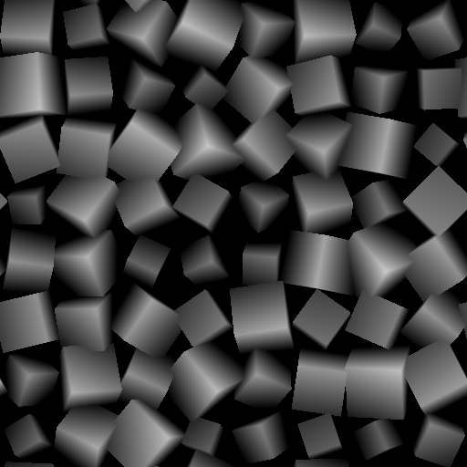

# Splatter forma v2

<table>
<tr style="border: 0;">
<td width="33.33%" style="border: 0;" valign="top">

<b>Ingresso:</b> Generatore > Pattern

</td>
<td width="100.00%" style="border: 0;" valign="top">

## Descrizione

Dispersione forme su una superficie del height di sfondo con funzionalità avanzate per la dispersione in uno <b>spazio 3D</b> virtuale, con controlli per posizione, rotazione, ridimensionamento e casualità.  Il nodo offre forme 3D di base di base e supporta quelle personalizzate fornite come <b>immagine pattern</b>, <b>atlas</b> o come <b>campo distanza firmato (SDF)</b> per forme 3D personalizzate complesse.  Sono disponibili diversi <b>metodi di distribuzione delle forme</b>, inclusa la creazione di una funzione personalizzata per il controllo completo.  Le forme possono essere trascinate verso aree specifiche utilizzando una <b>mappa di densità</b> personalizzata.  <i>Nota:</i> Questo nodo non deve essere utilizzato con le versioni CPU del motore di Substance, ad esempio SSE2 (Windows, Linux) e NEON (macOS).

</td>
</tr>
</table>

>[!INFO]
>
> I dati generati da questo nodo possono essere utilizzati con gli altri nodi della famiglia di splatter Shape v2:
> * [Colore dello splatter di forma v2 mapper](../shape-splatter-v2-mapper-color/shape-splatter-v2-mapper-color.md)
> * [Scala di grigi splatter forma v2 mapper](../shape-splatter-v2-mapper-grayscale/shape-splatter-v2-mapper-grayscale.md)
> * [Splatter forma v2 da mascherare](../shape-splatter-v2-to-mask/shape-splatter-v2-to-mask.md)
> 
> I nodi di [colore Atlante griglia](../grid-atlas-color/grid-atlas-color.md) consentono di comprimere le immagini in un atlante di dimensioni personalizzate, fino a 16 pattern in 4*4 celle.

>[!TIP]
>
> Per iniziare con i nodi Shape splatter v2, è disponibile il materiale [**&#39;Rusty bolts&#39;** sample](../../../../../../function-graphs/nodes-reference-for-fun/function-node-library/function-nodes-sdf-functions/working-with-sdf-functions.md#material-sample).
> 
> Per ulteriori informazioni sui concetti e i flussi di lavoro relativi alla Funzione SDF, consulta la pagina dedicata: [Utilizzo della Funzione SDF](../../../../../../function-graphs/nodes-reference-for-fun/function-node-library/function-nodes-sdf-functions/working-with-sdf-functions.md)

## Input

|                                      |                                                                                                                                                                                                                                                                                                                                                                  |
|:-------------------------------------|:-----------------------------------------------------------------------------------------------------------------------------------------------------------------------------------------------------------------------------------------------------------------------------------------------------------------------------------------------------------------|
| <b>height in background</b> *Scala di grigi* | Mappa dell&#39;altezza di base in cui le forme sono sparse. I height di ciascuno vengono combinati utilizzando una &quot;Fusione max&quot;, in cui viene utilizzato il valore più alto.  Il contributo del height di sfondo al height di output è controllato dal parametro <b>Opacità input sfondo</b>. |
| <b>Mappa di densità</b> *Scala di grigi* | Una mappa in scala di grigio che guida lo spostamento delle forme in base alla loro luminanza, in cui le forme si raggruppano nelle aree più luminose.  L&#39;intensità dello spostamento delle forme è controllata dal parametro <b>Moltiplicatore Mappa di densità</b>. |
| <b>Mappa offset Height</b> *Scala di grigi* | Una mappa in scala di grigio in cui i valori vengono aggiunti alle forme in modo uniforme in base alla posizione pivot delle forme.  Il contributo della mappa è controllato dal parametro <b>moltiplicatore mappa offset Height</b>. |
| <b>Mappa scala Height</b> *Scala di grigi* | Una mappa in scala di grigio con i valori utilizzati come fattore per il height delle forme.  Il contributo della mappa è controllato dal parametro <b>moltiplicatore mappa scala Height</b>. |
| <b>Mappa scala forme</b> *Scala di grigi* | Una mappa in scala di grigio con i valori utilizzati come fattore per la scala delle forme.  Il contributo della mappa è controllato dal parametro <b>Moltiplicatore mappa scala</b>. |
| <b>Rotazione forma</b> *Scala di grigi* | Mappa in scala di grigio in cui vengono aggiunti valori alla rotazione 3D delle forme, regolata in base ai fattori per asse forniti dal parametro <b>Moltiplicatore mappa di rotazione 3D</b>. |
| <b>Mappa vettoriale</b> *Colore* | Una mappa che descrive i vettori di direzione che possono essere utilizzati per guidare la rotazione e/o la posizione delle forme, utilizzando i seguenti parametri:  - <b>spostamento della mappa vettoriale</b> regola l&#39;effetto della mappa per spostare le forme. - <b>L&#39;input della rotazione delle Pendenze</b> può essere impostato su &#39;Mappa vettoriale&#39; per utilizzare questa mappa per ruotare le forme utilizzando i parametri correlati. |
| <b>Mappa maschera</b> *Scala di grigi* | L&#39;immagine utilizzata per mascherare le forme in base alla <b>soglia della mappa maschera</b>.  Ad esempio, le forme che si trovano nelle aree della mappa in cui la luminanza è inferiore a tale soglia verranno mascherate. |
| <b>Input pattern 1</b> *Scala di grigi* | La mappa di altezza per il pattern #1 che viene diffuso quando <b>Tipo di pattern</b> è impostato su &#39;Input pattern&#39;.  <i>Suggerimento:</i> Utilizzare una risoluzione vicina alla dimensione massima che il pattern potrebbe avere quando viene diffuso. |
| <b>Input pattern 2</b> *Scala di grigi* | La mappa di height per il pattern #2 che viene diffuso quando <b>Tipo di pattern</b> è impostato su &#39;Input pattern&#39;.  <i>Suggerimento:</i> Utilizzare una risoluzione vicina alla dimensione massima che il pattern potrebbe avere quando viene diffuso. |
| <b>Input pattern 3</b> *Scala di grigi* | La mappa di height per il pattern #3 che viene diffuso quando <b>Tipo di pattern</b> è impostato su &#39;Input pattern&#39;.  <i>Suggerimento:</i> Utilizzare una risoluzione vicina alla dimensione massima che il pattern potrebbe avere quando viene diffuso. |
| <b>Input pattern 4</b> *Scala di grigi* | La mappa di height per il pattern #4 che viene diffuso quando <b>Tipo di pattern</b> è impostato su &#39;Input pattern&#39;.  <i>Suggerimento:</i> Utilizzare una risoluzione vicina alla dimensione massima che il pattern potrebbe avere quando viene diffuso. |
| <b>Input pattern 5</b> *Scala di grigi* | La mappa di height per il pattern #5 che viene diffuso quando <b>Tipo di pattern</b> è impostato su &#39;Input pattern&#39;.  <i>Suggerimento:</i> Utilizzare una risoluzione vicina alla dimensione massima che il pattern potrebbe avere quando viene diffuso. |
| <b>Input pattern 6</b> *Scala di grigi* | La mappa di height per il pattern #6 che viene diffuso quando <b>Tipo di pattern</b> è impostato su &#39;Input pattern&#39;.  <i>Suggerimento:</i> Utilizzare una risoluzione vicina alla dimensione massima che il pattern potrebbe avere quando viene diffuso. |
| <b>Input pattern 7</b> *Scala di grigi* | La mappa di height per il pattern #7 che viene diffuso quando <b>Tipo di pattern</b> è impostato su &#39;Input pattern&#39;.  <i>Suggerimento:</i> Utilizzare una risoluzione vicina alla dimensione massima che il pattern potrebbe avere quando viene diffuso. |
| <b>Input pattern 8</b> *Scala di grigi* | La mappa di height per il pattern #8 che viene diffuso quando <b>Tipo di pattern</b> è impostato su &#39;Input pattern&#39;.  <i>Suggerimento:</i> Utilizzare una risoluzione vicina alla dimensione massima che il pattern potrebbe avere quando viene diffuso. |
| <b>height Atlante griglia</b> *Scala di grigi* | Immagine che descrive il height di pattern racchiusi in un atlante.  Utilizzare il parametro <b>Dimensione Atlante griglia</b> per specificare la dimensione della griglia dell&#39;atlas. |
| <b>Atlante griglia normale</b> *Colore* | L&#39;immagine che descrive le normali caratteristiche dei modelli racchiusi in un atlante.  Utilizzare il parametro <b>Dimensione Atlante griglia</b> per specificare la dimensione della griglia dell&#39;atlas. |

## Output

|                        |                                                                                                                                                                                                                                                                                                                                                                                                                                                                                                                                                                                                                                                                                                                                                                                                                                                                                        |
|:-----------------------|:---------------------------------------------------------------------------------------------------------------------------------------------------------------------------------------------------------------------------------------------------------------------------------------------------------------------------------------------------------------------------------------------------------------------------------------------------------------------------------------------------------------------------------------------------------------------------------------------------------------------------------------------------------------------------------------------------------------------------------------------------------------------------------------------------------------------------------------------------------------------------------------|
| <b>Height</b> | Mappa del height calcolato per le forme distribuite, incluso il height di sfondo se utilizzato e visibile. |
| <b>Colore SDF</b> | I colori della forma prodotta dalla <b>Funzione SDF</b>.  Utilizzare il nodo <a href="../../../../../../function-graphs/nodes-reference-for-fun/function-node-library/function-nodes-sdf-functions/sdf-functions-material/set-color/set-color.md">Imposta colore</a> nel grafico delle Funzioni SDF per definire un colore per ciascun componente della forma. |
| <b>Metallicità SDF</b> | I colori della forma prodotta dalla <b>Funzione SDF</b>.  Utilizzare il nodo <a href="../../../../../../function-graphs/nodes-reference-for-fun/function-node-library/function-nodes-sdf-functions/sdf-functions-material/set-metalness/set-metalness.md">Imposta metallizzazione</a> nel grafico delle Funzioni SDF per definire un valore di metallizzazione per componente della forma. |
| <b>Rugosità SDF</b> | I colori della forma prodotta dalla <b>Funzione SDF</b>.  Utilizzare il nodo <a href="../../../../../../function-graphs/nodes-reference-for-fun/function-node-library/function-nodes-sdf-functions/sdf-functions-material/set-roughness/set-roughness.md">Imposta rugosità</a> nel grafico delle Funzioni SDF per definire un valore di rugosità per componente della forma. |
| <b>Normale</b> | Normali calcolati per le forme sparse, mascherati in base alla fusione con il height di sfondo.   Se il <b>tipo di forma</b> è &#39;Atlante griglia&#39;, vengono utilizzate direttamente le normali fornite all&#39;input <b>Atlante griglia normale</b>. |
| <b>Splatter UVW</b> | <b>R</b> - Componente U degli UV delle forme. <b>G</b> - Componente V degli UV delle forme. <b>B</b> - height delle forme. (W) <b>A</b> - Dati compressi:  - <i>Parte intera:</i> Identificatore univoco delle forme. (ID)  - <i>Parte frazionale:</i> dipende dal <b>Tipo di forma</b>: ID materiale se SDF/primitivo, ID motivo* se input/atlante griglia motivo.  <b>*:</b> L&#39;ID motivo è l&#39;indice della forma nell&#39;elenco/atlas. |
| <b>Dati splatter 1</b> | <b>R</b> - Componente X della posizione sulla superficie della forma, nello spazio dell&#39;oggetto. <b>G</b> - Componente Y della posizione sulla superficie della forma, nello spazio dell&#39;oggetto. <b>B</b> - Componente Z della posizione sulla superficie della forma, nello spazio dell&#39;oggetto. <b>A</b> - Dati compressi:  - <i>Parte intera:</i> Componente U delle coordinate UV per i dati delle forme negli output dei dati 2/3.  - <i>Parte frazionale:</i> V componente delle coordinate UV per i dati delle forme negli output dei dati 2/3.  - <i>Firma:</i> Maschera binaria per la fusione delle forme con il height di sfondo. |
| <b>Dati splatter 2</b> | <b>R</b> - Componente X della rotazione 3D delle forme. <b>G</b> - Componente Y della rotazione 3D delle forme. <b>B</b> - Componente Z della rotazione 3D delle forme. <b>A</b> - Rotazione delle forme attorno alla normale.  Tutte le rotazioni sono definite in numero di giri. |
| <b>Dati splatter 3</b> | <b>R</b> - Componente X della posizione delle forme. <b>G</b> - Componente Y della posizione delle forme. <b>B</b> - Scostamento delle forme lungo la normale. <b>A</b> - Dati compressi:  - <i>Parte intera:</i> identificatore univoco della forma.  - <i>Parte frazionaria:</i>Indice del pattern delle forme nel relativo atlas di origine. (Se si utilizza un tipo di pattern atlante griglia) |
| <b>Dati splatter 4</b> | <i>Pixel 1</i> <b>R</b> - Dimensioni X delle immagini di output Data 2/3. <b>G</b> - Dimensioni Y delle immagini di output Data 2/3. <b>B</b> - Dimensioni X dell&#39;immagine di output Data 4. <b>A</b> - Dimensioni Y dell&#39;immagine di output Data 4.  <i>Pixel 2</i> <b>R</b> - Tipo di forma. (E.g. Cubo, cilindro, ...) <b>G</b> - Dati compressi:  - <i>Valore assoluto:</i> Numero di input del pattern.  - <i>Firma:</i> Formato normale della mappa normale di output. (Positivo: DirectX / Negativo: OpenGL) <b>B</b> - Dimensione X dell&#39;atlante griglia. (ovvero la quantità di colonne) <b>A</b> - Dimensione Y dell&#39;atlante griglia. (ovvero l&#39;importo delle righe) |

## Parametri

|                                                   |                                                                                                                                                                                                                                                                                                                                                                                                                                                                                                                                                                                                                                                                                                                                                                                                                                                                                                                                                               |
|:--------------------------------------------------|:--------------------------------------------------------------------------------------------------------------------------------------------------------------------------------------------------------------------------------------------------------------------------------------------------------------------------------------------------------------------------------------------------------------------------------------------------------------------------------------------------------------------------------------------------------------------------------------------------------------------------------------------------------------------------------------------------------------------------------------------------------------------------------------------------------------------------------------------------------------------------------------------------------------------------------------------------------------|
| <b>Modalità di distribuzione posizione</b> *Numero intero* | Metodo di distribuzione delle forme nello spazio:  - <b>Griglia 2D:</b> Una griglia uniforme semplice. - <b>Disco di Poisson:</b> Una simulazione che mira a spostare casualmente le celle di una griglia per evitare sovrapposizioni durante l&#39;utilizzo dello spazio disponibile. - <b>Uniforme:</b> Una distribuzione uniforme di un numero specificato di forme. Richiede calcoli più intensivi. - <b>Funzione personalizzata:</b> Creare un grafico di funzioni per definire la distribuzione delle forme. Le variabili disponibili sono elencate nella descrizione del nodo. |
| <b>Funzione posizione</b> *Float2* | Grafico a funzioni utilizzato per definire la distribuzione delle forme.  Il grafico genera un valore Virgola mobile 2 per la posizione normalizzata XY delle forme nell&#39;immagine.  Variabili disponibili:  - <code>shape.id</code> (Mobile) Identificatore univoco della forma.  - <code>forma.quantità</code> (Mobile) Quantità di forme specificata dal parametro <b>Fattore</b>. |
| <b>X importo</b> *Numero intero* | Quantità di colonne nella griglia di distribuzione.  Ossia la quantità di forme generate sull&#39;asse X. |
| <b>Importo Y</b> *Numero intero* | Quantità di righe nella griglia di distribuzione.  Ossia la quantità di forme generate sull&#39;asse Y. |
| <b>Importo</b> *Numero intero* | Quantità di forme generate. |
| <b>Formato normale di output</b> *Numero intero* | Formato della mappa normale di output.  Inverte efficacemente il canale verde.  - <b>DirectX:</b> L&#39;asse Y punta verso l&#39;alto. - <b>OpenGL:</b> L&#39;asse Y punta verso il basso. |
| <b>Espansione non quadrata</b> *Booleano* | Nelle immagini non quadrate, mantiene le proporzioni delle forme ed espande la loro generazione fino ai limiti dell&#39;immagine. |
| <b>Tipo di forma</b> *Numero intero* | Sono disponibili diversi tipi di forme da spargere, ognuna con caratteristiche specifiche.  La <b>Funzione SDF</b> è un grafico a funzioni che genera un campo distanza con segno (SDF, signed distance field) che descrive la superficie di una forma 3D. Ciò consente la dispersione 3D di forme procedurali complesse che possono variare dinamicamente.Le   <b>forme primitive</b>, calcolate utilizzando semplici funzioni di intersezione raggio/superficie, sono pronte per l&#39;uso: cubo, sfera, cilindro, piano, disco  <b>I pattern di input</b> sono immagini fornite dal grafico. Questi sono mappati su piani e possono essere <i>estrusi</i> in forme 3D:  - Input immagine: i pattern connessi ai <b>segnaposti di input pattern n. </b>.  - Atlante griglia: i motivi compressi in un&#39;immagine atlas connessa agli input <b>Atlante griglia</b>. |
| <b>Dimensioni Atlante griglia</b> *Intero2* | Quantità di righe e colonne dell&#39;atlas fornite agli input dell&#39;immagine <b>Atlante griglia</b>.  <i>Nota:</i> le celle vuote nell&#39;atlas generano spazi vuoti nella distribuzione delle forme. |
| <b>Ricalcola atlante griglia normale</b> *Booleano* | Se <i>è True</i>, la mappa normale fornita all&#39;input dell&#39;immagine <b>Atlante griglia normale</b> viene ignorata e le normali per i pattern forniti al <b>height Atlante griglia</b> vengono calcolate da zero.  Se <i>è False</i>, la mappa normale fornita alla <b>norma Atlante griglia</b> viene utilizzata così com&#39;è.  <i>Nota:</i> l&#39;intensità delle normali viene regolata in base al <b>height di estrusione della forma</b>. |
| <b>Atlante griglia formato normale</b> *Numero intero* | Formato della mappa normale fornita all&#39;input dell&#39;immagine <b>Atlante griglia normale</b>.  Inverte efficacemente il canale verde.  - <b>DirectX:</b> L&#39;asse Y punta verso l&#39;alto. - <b>OpenGL:</b> L&#39;asse Y punta verso il basso. |
| <b>Numero di input del pattern</b> *Numero intero* | Quantità di pattern forniti come immagini di input.  Aggiunge al nodo un numero uguale di <b>segnaposti di input di tipo </b>. |
| <b>Abilita estrusione forma</b> *Booleano* | Attiva/disattiva l&#39;estrusione dei pattern di input interpretandoli come mappe di altezza, con conseguente creazione di forme 3D procedurali complesse. |
| <b>simmetria di estrusione della forma</b> *Booleano* | Consente l&#39;estrusione simmetrica in avanti/indietro dei pattern di input.  L&#39;asse della simmetria è il <i>punto intermedio</i> dell&#39;estrusione, il che significa che la sua posizione potrebbe cambiare in base alla posizione dei punti cardini delle forme. |
| <b>height di estrusione della forma</b> *Mobile* | Distanza massima di estrusione nello spazio immagine, dove 1 rappresenta il lato più lungo dell&#39;immagine.  Questa distanza viene ridimensionata rispetto al valore della <b>Scala forma</b>. |
| <b>Campioni di estrusione della forma</b> *Numero intero* | Quantità di campioni eseguiti per disegnare l&#39;estrusione dei pattern di input.  Una quantità maggiore determina estrusioni più uniformi e definite a costo di alcune prestazioni. |
| <b>Funzione motivo</b> *Mobile* | Grafico della funzione Substance utilizzato per calcolare il pattern mappato a un piano 3D SDF.  Questi pattern possono essere estrusi anche utilizzando <b>Attiva estrusione forma</b>. |
| <b>Funzione SDF pattern</b> *Mobile* | Grafico a funzione Substance che crea il campo distanza con segno (SDF, signed distance field) che descrive la superficie di un oggetto 3D nello spazio.  Sfogliate la raccolta incorporata di [Funzione SDF](../../../../../../function-graphs/nodes-reference-for-fun/function-node-library/function-node-library.md#sdf-functions) nella libreria per creare un oggetto complesso combinando più elementi SDF <i>di base</i> utilizzando gli <i>operatori</i> e le <i>trasformazioni</i> disponibili.  Una forma SDF è completamente procedurale e può essere regolata dinamicamente, consentendo di rendere <i>univoca</i> ogni forma diffusa.  Utilizzare il nodo [Visualizzatore 3D](../../../filters/effects/3d-viewer/3d-viewer.md) per visualizzare il risultato di una Funzione SDF.  <i>Nota:</i> Per applicare la casualità nelle Funzioni SDF, utilizzare i nodi [Hash](../../../../../../function-graphs/nodes-reference-for-fun/function-node-library/function-node-library.md#random) anziché &#39;Casuale&#39;. |
| <b>Dimensioni fotogramma di delimitazione SDF</b> *Float3* | Definisce la dimensione massima del rettangolo di selezione (Bbox) della forma SDF, che a sua volta viene utilizzata per calcolare il relativo rettangolo di selezione 2D.  Le forme vengono disegnate solo entro i limiti del rispettivo rettangolo di selezione 2D e il resto viene tagliato. |
| <b>Abilita effetto ritaglio</b> *Booleano* | Attiva/disattiva il taglio dei pattern, ignorando tutti i valori al di sotto della <b>soglia di ritaglio</b>. In questo modo viene utilizzata solo la silhouette desiderata dei pattern. |
| <b>Soglia di ritaglio</b> *Mobile* | Valore della scala di grigi al di sotto del quale vengono tagliati i valori nei pattern. Ad esempio, il valore utilizzato come bordo della silhouette per i pattern. |
| <b>Flusso di lavoro normalizzato</b> *Booleano* | Attiva la regolazione automatica del height delle forme, in modo che mantengano le proporzioni originali</i> durante l&#39;ingrandimento o la riduzione.<i>  Se disattivato, il height delle forme viene espresso nell&#39;intervallo di height completo dell&#39;immagine, indipendentemente dalle proporzioni originali.  È comunque possibile regolare manualmente il height delle forme utilizzando i parametri <b>Scala Height</b>. |
| <b>La scala delle forme influisce sulla scala dei height</b> *Booleano* | Se <i>è True</i>, la scala del height di una forma viene modificata in modo da mantenere le proporzioni.  Se <i>è impostato su False</i>, la scala del height è indipendente dalla scala della forma, con conseguente deformazione. |
| <b>Scala Height</b> *Mobile* | Un moltiplicatore per il height della forma, dove 1 è l&#39;intero height della forma espresso nell&#39;intervallo di height completo dell&#39;immagine dell&#39;intervallo di height normalizzato della forma. Consulta <b>Flusso di lavoro normalizzato</b> |
| <b>Scala Height casuale</b> *Mobile* | Riduce casualmente il height di ogni forma fino al rapporto specificato, dove 1 indica che il height di una forma può essere ridotto completamente a 0. |
| <b>Moltiplicatore mappa scala Height</b> *Mobile* | Intensità della <b>mappa scala Height</b> fornita, dove 1 indica che il valore della mappa completa viene moltiplicato per il height della forma. |
| <b>Opacità input in background</b> *Mobile* | Intensità dell&#39;input <b>height di sfondo</b> specificato nella mappa del height finale.  I height delle forme e dello sfondo vengono combinati utilizzando una &quot;Fusione max&quot;, in cui viene utilizzato il valore più alto. |
| <b>Scostamento Height dallo sfondo</b> *Mobile* | La proporzione del height di sfondo che deve essere aggiunta al height delle forme, dove 1 indica che è stato aggiunto l&#39;intero height di sfondo.  È possibile utilizzare questa opzione per far riposare le forme sul height di sfondo. |
| <b>Conformità allo sfondo</b> *Mobile* | Intensità della deformazione applicata al height delle forme corrispondente al height di sfondo per pixel, dove 1 indica una corrispondenza esatta.  <i>Nota:</i> Questo parametro non ha effetto quando <b>scostamento Height dallo sfondo</b> = 0. |
| <b>pendenza dello sfondo uniforme</b> *Mobile* | Intensità dell&#39;arrotondamento applicato al height di sfondo utilizzato per lo scostamento di <b>Height dallo sfondo</b> e le regolazioni <b>Conformità allo sfondo</b>.  Questo ammorbidisce le frequenze di deformazione e scostamento del height, che può essere più duro del desiderato. |
| <b>Offset Height</b> *Mobile* | Valore aggiunto al height delle forme, che determina uno scostamento diritto.  Il valore è espresso nell&#39;intervallo di height completo dell&#39;immagine. |
| <b>Scostamento Height casuale</b> *Mobile* | Applica uno scostamento casuale al height delle forme, fino al valore specificato.  Il valore è espresso nell&#39;intervallo di height completo dell&#39;immagine. |
| <b>Offset Height da ID</b> *Mobile* | Offset applicato al height delle forme in base al relativo indice nella distribuzione, dove l&#39;offset aumenta in modo lineare da una forma all&#39;altra fino al valore specificato.  È possibile impostare manualmente il valore oltre <code>[0, 1]</code> intervallo. |
| <b>Moltiplicatore mappa offset Height</b> *Mobile* | Regola l&#39;intensità dell&#39;offset applicato dalla <b>mappa di offset dei Height</b> utilizzando il fattore specificato, dove 1 significa che i valori di intensità della mappa vengono applicati così come sono.  L&#39;intero height della forma viene scostato aggiungendo il valore nella mappa di scostamento nella relativa posizione pivot XY.  È possibile impostare manualmente il valore del moltiplicatore oltre <code>[0, 1]</code> intervallo. |
| <b>Modalità dimensioni</b> *Numero intero* | Il metodo di definizione delle dimensioni delle forme distribuite:  - <b>Automatico:</b> Dimensioni è espresso come fattore delle dimensioni della cella della forma. - <b>Assoluto (spazio texture):</b> Dimensioni è espresso come fattore del lato più lungo dell&#39;immagine. |
| <b>Mantieni proporzioni</b> *Booleano* | Regola le dimensioni delle forme per mantenere le proporzioni originali in griglie non quadrate e dimensioni dell&#39;immagine. |
| <b>Scala forme</b> *Mobile* | La dimensione della forma come fattore definito dalla <b>modalità dimensioni</b>.  <i>Nota:</i> quando si utilizza la distribuzione del <b>disco di Poisson</b>, la regolazione della dimensione delle forme determina lo spostamento delle forme per sfruttare lo spazio disponibile. Usate il parametro <b>Shape scale post Poisson</b> per ridimensionare le forme in posizione. |
| <b>Scala di forme casuale</b> *Mobile* | Riduce le forme di un fattore casuale fino al valore specificato, dove 1 può causare il ridimensionamento di alcune forme fino alla dimensione zero. |
| <b>Moltiplicatore mappa scala</b> *Mobile* | Intensità della moltiplicazione dei valori nella <b>mappa scala forme</b> rispetto alle dimensioni delle forme. |
| <b>Scala di forme post-Poisson</b> *Mobile* | Un fattore di scala applicato dopo la simulazione del disco di Poisson. |
| <b>Dimensioni forma</b> *Float3* | Fattori di scala separati per asse per regolare le dimensioni delle forme. |
| <b>Dimensioni forma casuali</b> *Float3* | Riduce le forme di un fattore casuale <i>per asse</i> fino al valore specificato, dove 1 può causare il ridimensionamento di alcune forme fino alla dimensione zero. |
| <b>Raggio cilindro</b> *Mobile* | Raggio degli SDF cilindrici sparsi. Il raggio è espresso come un fattore definito dalla <b>modalità Dimensione</b>. |
| <b>Dimensioni forma</b> *Float2* | Fattori di scala separati per asse per regolare le dimensioni delle forme. |
| <b>Dimensioni forma casuali</b> *Float2* | Riduce le forme di un fattore casuale <i>per asse</i> fino al valore specificato, dove 1 può causare il ridimensionamento di alcune forme fino alla dimensione zero. |
| <b>Posizione casuale</b> *Mobile* | Applica uno scostamento casuale sugli assi XY fino al valore specificato, dove 1 rappresenta la lunghezza del lato più lungo dell&#39;immagine. |
| <b>Posizione del moltiplicatore casuale</b> *Float2* | Fattori separati per asse per lo scostamento casuale applicato alle forme sugli assi XY. |
| <b>Sequenza di distribuzione posizione</b> *Numero intero* | Algoritmo utilizzato per distribuire le forme in modo uniforme nello spazio.   - <b>R2</b>: in base al rapporto aureo. È veloce e offre distribuzioni più uniformi e apparentemente casuali indipendentemente dalla quantità di forme. - <b>Halton</b>: basato su numeri primi. Fornisce ottimi risultati per le distribuzioni sparse, ma diventa più lento e può risultare in linee visibili con l&#39;aumentare della quantità di forme.  Questi algoritmi sono noti come <i>quasirandom</i> e <i>low-discrepancy</i>, in quanto seguono una sequenza deterministica (quasirandom) volta a coprire uno spazio in modo uniforme (bassa discrepanza). |
| <b>Moltiplicatore Mappa di densità</b> *Mobile* | Fattore per lo scostamento applicato alle forme in modo che vengano raggruppate nelle aree più chiare della <b>Mappa di densità</b>. |
| <b>Scostamento normale</b> *Mobile* | Sposta le forme lungo il loro normale, ovvero lungo l&#39;asse Z locale. |
| <b>Scostamento normale casuale</b> *Mobile* | Aggiunge una quantità casuale di spostamento alle forme lungo la normale.  La quantità casuale può essere positiva o negativa fino al valore specificato o negativa. |
| <b>spostamento mappa vettoriale</b> *Mobile* | Fattore per lo spostamento applicato alle forme aggiungendo i valori RGB nella <b>mappa vettoriale</b> rispettivamente alle coordinate XYZ della forma.  Lo spostamento è espresso come fattore del lato più lungo dell&#39;immagine. Ad esempio un valore RGB di (0,5, 0,5, 0) sposta le forme della metà delle loro dimensioni lungo gli assi X e Y.  Un valore di parametro di 1,0 indica che viene aggiunto il valore completo. |
| <b>Moltiplicatore spostamento vettoriale</b> *Float3* | Regola lo <b>spostamento della mappa vettoriale</b> in base a un fattore separato per asse, dove 0,0 significa che non viene applicato alcuno spostamento a quell&#39;asse. |
| <b>Offset globale</b> *Float2* | Uno scostamento applicato alla posizione di ogni forma <i>dopo</i> vengono applicati scostamenti di height, scostamenti casuali e altri spostamenti.  Questo significa che lo spostamento delle forme utilizzando questo parametro non ne modificherà la posizione, l&#39;orientamento e la scala. |
| <b>Offset posizione riga</b> *Mobile* | Scostamento applicato alle linee delle forme sulla griglia in base alla <b>modalità Scostamento posizione linea.</b> |
| <b>Modalità offset posizione riga</b> *Numero intero* | Metodo di applicazione dello scostamento <b>della posizione della linea</b> alle forme.  I metodi <b>All</b> applicano l&#39;offset come fattore del lato più lungo dell&#39;immagine (ad esempio nello spazio della texture). - <b>All - Horizontal:</b> aggiunge gradualmente il valore di offset in orizzontale riga per riga, in base a un fattore dell&#39;indice di riga. - <b>All - Vertical:</b> aggiunge gradualmente il valore di offset in verticale colonna per colonna, in base a un fattore dell&#39;indice di colonna.  I metodi <b>Quincunx</b> applicano l&#39;offset come fattore della dimensione delle celle delle forme. - <b>Quincunx - Orizzontale:</b> Aggiunge il valore di offset in modo uniforme ogni due righe. - <b>Quincunx - Verticale:</b> Aggiunge il valore di offset in modo uniforme ogni due colonne. |
| <b>Posizione dei punti cardini (locale)</b> *Float3* | Regola la posizione del perno nello spazio locale della forma, che influisce sull&#39;origine delle trasformazioni. (Ad esempio, scostamento della posizione, rotazione e ridimensionamento)  Ad esempio, regola la posizione dei punti cardini Z in modo che le forme ruotino attorno alla base. |
| <b>Rotazione 3D</b> *Float3* | Applica una rotazione per asse in modo uniforme a tutte le forme, in numero di giri. |
| <b>Rotazione 3D casuale</b> *Mobile* | Fattore per la quantità casuale di rotazione applicata alle forme fino al valore specificato, in senso orario o antiorario, in numero di giri. |
| <b>Moltiplicatore casuale rotazione 3D</b> *Float3* | Regola la quantità di rotazione casuale applicata da <b>rotazione casuale 3D</b> in base a un fattore separato per asse. |
| <b>Moltiplicatore mappa di rotazione 3D</b> *Float3* | Intensità in base alla quale i valori nella mappa <b>Rotazione forma</b> vengono aggiunti alla rotazione per asse di ogni forma, dove 1 indica l&#39;intera quantità di rotazione aggiunta. |
| <b>Rotazione intorno alla norma</b> *Mobile* | Quantità di rotazione applicata in modo uniforme a tutte le forme attorno al loro normale, ovvero l&#39;asse Z locale, in numero di giri. |
| <b>Rotazione attorno alla norma casuale</b> *Mobile* | Applica una rotazione casuale a ogni forma attorno alla propria normale, ovvero all&#39;asse Z locale, in senso orario o antiorario, fino a un giro completo. |
| <b>Rotazione Pendenza</b> *Mobile* | Ruota le forme in modo che corrispondano alla pendenza dello sfondo nella posizione. Ad esempio, applica una rotazione uguale a quella del vettore Z-up globale alla normale del height di sfondo.  Questo parametro è un fattore per questa rotazione, dove 1 indica che viene applicata la rotazione completa.  Questa rotazione viene aggiunta ad altre rotazioni che possono essere applicate alle forme. |
| <b>Input rotazione Pendenza</b> *Numero intero* | Origine della pendenza utilizzata per guidare la <b>rotazione della Pendenza</b>.  - <b>Sfondo:</b> Viene utilizzata la texture del height di sfondo, la normale calcolata fuori da tale mappa di altezza è la direzione di destinazione per la rotazione. - <b>Mappa vettoriale:</b> I vettori specificati dalla texture della mappa vettoriale vengono utilizzati come la direzione di destinazione della rotazione.</b> |
| <b>Moltiplicatore mappa vettoriale</b> *Mobile* | Ruota le forme attorno all&#39;asse specificato dall&#39;<b>asse di rotazione della mappa vettoriale</b> in modo che corrisponda alla direzione dei vettori descritta dalla texture <b>Mappa vettoriale</b>. Ad esempio, applica ai vettori della texture una rotazione uguale a quella del vettore X-right globale.  Questo parametro è un fattore per questa rotazione, dove 1 indica che viene applicata la rotazione completa.  Questa rotazione viene aggiunta ad altre rotazioni che possono essere applicate alle forme. |
| <b>Asse di rotazione mappa vettoriale</b> *Numero intero* | Asse attorno al quale deve essere eseguita la rotazione specificata dalla <b>mappa vettoriale</b>.  - <b>Normale:</b> Ruota le forme attorno alla loro normale, analogamente all&#39;utilizzo del parametro &#39;Rotazione attorno alla normale&#39;. - <b>Asse Z:</b> Ruota le forme attorno all&#39;asse Z globale, analogamente all&#39;utilizzo del componente Z del parametro &#39;Rotazione 3D&#39;. |
| <b>Maschera casuale</b> *Mobile* | Nasconde il rapporto specificato della quantità totale di forme in sequenza casuale, dove 1 significa che tutte le forme sono nascoste.  Questo parametro è combinato con la mappa maschera. (se utilizzato) |
| <b>Soglia mappa maschera</b> *Mobile* | Valore in scala di grigio nella <b>mappa maschera</b> sotto il quale le forme sono nascoste.  La mappa è combinata con il parametro <b>Maschera casuale</b>. |
| <b>Scala UV</b> *Float2* | Un moltiplicatore per asse per gli UV delle forme, in cui l&#39;affiancatura aumenta con i valori. |
| <b>Scala UV estremità</b> *Float2* | Moltiplicatore per asse per gli UV delle estremità del cilindro, in cui la porzione aumenta con i valori. |
| <b>Modalità UV maiuscola</b> *Numero intero* | Metodo di calcolo degli UV per le estremità del cilindro.  - <b>Polare:</b> Utilizzare le coordinate polari in cui U aumenta intorno all&#39;asse Z del cilindro e V aumenta man mano che si allontana da esso. - <b>Planare:</b> Utilizzare una proiezione planare in cui gli UV sono mappati utilizzando il rettangolo di selezione delle estremità (ovvero un rettangolo adattato alle dimensioni delle estremità) |
| <b>Mostra casella 2D della forma</b> *Booleano* | Sovrappone una visualizzazione del rettangolo di selezione della forma nell&#39;immagine. Area in cui vengono disegnate le forme. |
| <b>Mostra casella 3D della forma</b> *Booleano* | Sovrappone una visualizzazione del volume di selezione della forma nello spazio 3D. Si tratta dell&#39;area in cui vengono disegnati i piani estrusi e le forme SDF.  Per le forme SDF, queste aree corrispondono alle <b>dimensioni fotogramma limite SDF</b>.  Questa visualizzazione consente di valutare l&#39;estensione e l&#39;orientamento della forma. |
| <b>Mostra perno forma</b> *Booleano* | Sovrappone una visualizzazione delle forme pivot, come combinazione dei vettori dell&#39;asse XYZ locale.  Questa visualizzazione consente di valutare l&#39;orientamento della forma e l&#39;origine delle sue trasformazioni. (Scostamento, rotazione, ridimensionamento) |

## Esempi

<table style="margin-top: 32px; margin-bottom: 32px">
    <tr style="border: 0">
        <td style="border: 0; background: transparent">
             <i>Distribuzione di Poisson</i>
        </td>
        <td style="border: 0; background: transparent">
             <i>Distribuzione uniforme</i>
        </td>
        <td style="border: 0; background: transparent">
             <i>Mappa di densità</i>
        </td>
    </tr>
    <tr style="border: 0; background: transparent">
        <td style="border: 0; background: transparent">
             <i>Rotazione 3D casuale</i>
        </td>
        <td style="border: 0; background: transparent">
             <i>Rotazione Pendenza</i>
        </td>
        <td style="border: 0; background: transparent">
             <i>Estrusione forma</i>
        </td>
    </tr>
    <tr style="border: 0; background: transparent">
        <td style="border: 0; background: transparent">
             <i>Forme SDF 3D</i>
        </td>
        <td style="border: 0; background: transparent">
        </td>
        <td style="border: 0; background: transparent">
        </td>
    </tr>
</table>

