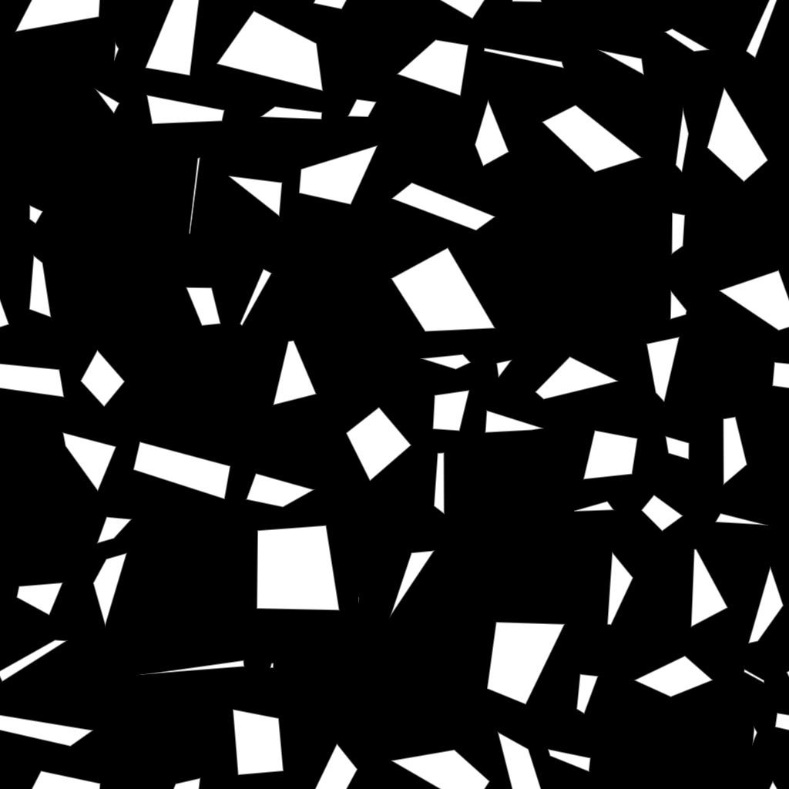

# Affianca casuale 2

<table>
<tr style="border: 0;">
<td width="33.33%" style="border: 0;" valign="top">

{width="200px"}

<b>Ingresso:</b> Generatori Texture > Pattern

</td>
<td width="100.00%" style="border: 0;" valign="top">

## Descrizione

Il nodo **Tile Random 2** genera porzioni adiacenti di dimensioni casuali e rapporti height-larghezza.

La griglia può essere modificata *inclinando* casualmente i lati delle forme per suddividere gli angoli.

Le forme possono essere regolate con opzioni per *ridimensionamento*, *smussatura*, *arrotondamento degli angoli* e *rotazione disordinata*.

Queste regolazioni possono essere controllate da *mappe di input*.

Un output dedicato consente di immettere i **UV** della forma in **Flood Fill a (...)** nodi per l&#39;applicazione di variazioni aggiuntive.

</td>
</tr>
</table>

## Input

|  |  |
|:---|:---|
| <b>Mappa dimensioni casuale</b> <i>Scala di grigi</i> | Immagine di input in scala di grigio che controlla la scala casuale delle forme.  Il suo impatto è controllato dal parametro <b>Moltiplicatore mappa di input dimensione casuale</b>. |
| <b>Mappa inclinata casuale</b> <i>Scala di grigi</i> | Immagine di input in scala di grigio che controlla l’inclinazione casuale delle forme.  Il suo impatto è controllato dal parametro <b>Moltiplicatore mappa di input inclinata casuale</b>. |
| <b>Mappa Raggio Angoli Arrotondati</b> <i>Scala di grigi</i> | Immagine di input in scala di grigio che controlla il raggio degli angoli arrotondati delle forme.  Il suo impatto è controllato dal <b>Mult mappa input raggio angoli arrotondati.</b> parametro. |
| <b>Mappa di distanza smussata</b> <i>Scala di grigi</i> | Immagine di input in scala di grigio che controlla la smussatura delle forme.  Il suo impatto è controllato dal <b>mult mappa di input distanza smussata</b> parametro. |
| <b>Mappa maschera</b> <i>Scala di grigi</i> | Immagine di input in scala di grigio che controlla la maschera delle forme.  Il suo impatto è controllato dai parametri <b>Inizio input mappa maschera</b> e <b>Fine input mappa maschera</b>. |

## Parametri

|  |  |
|:---|:---|
| <b>Importo X</b> <i>Numero intero</i> | Numero di celle sull&#39;asse <b>X</b>. |
| <b>Importo Y</b> <i>Numero intero</i> | Numero di celle sull&#39;asse <b>Y</b>. |
| <b>Dimensioni</b> |  |
| <b>Moltiplicatore dimensione casuale</b> <i>Mobile</i> | Applica una regolazione <i>globale</i> all&#39;intensità del ridimensionamento casuale. |
| <b>Moltiplicatore mappa di input dimensione casuale</b> <i>Mobile</i> | Regola l’intensità del ridimensionamento casuale utilizzando i valori <i>campionati</i> dall’input <b>Mappa dimensioni casuale</b>. |
| <b>Dimensione Casuale X</b> <i>Mobile</i> | Regola l&#39;intensità del ridimensionamento casuale sull&#39;asse <b>X</b> <i>only</i>. |
| <b>Dimensione casuale Y</b> <i>Mobile</i> | Regola l&#39;intensità del ridimensionamento casuale sull&#39;asse <b>Y</b> <i>only</i>. |
| <b>Distribuzione casuale delle dimensioni</b> <i>Numero intero</i> | Controlla il metodo di distribuzione dei valori di ridimensionamento casuale:  - <i>Uniforme</i>: la scala casuale viene applicata <i>allo stesso modo</i> su tutte le celle - <i>Disturbo blu</i>: la scala casuale viene <i>regolata</i> utilizzando un pattern di disturbo blu |
| <b>Aspetto forma - Trasforma</b> |  |
| <b>Thickness interstizio</b> <i>Mobile</i> | Regola il thickness dello spazio tra le forme. È <i>uguale per tutte</i> le forme. |
| <b>Moltiplicatore di posizione casuale</b> <i>Mobile</i> | Applica uno scostamento di posizione casuale alla forma fino a <i>soddisfare il bordo della cella</i>. |
| <b>Raggio angoli arrotondati</b> <i>Mobile</i> | Regola il <i>raggio</i> degli angoli arrotondati delle forme. Un valore di <b>0</b> indica che non viene applicato alcun arrotondamento.  <i>Nota</i>: questo effetto non può essere applicato quando il parametro <b>Attiva controllo smusso per asse</b> è impostato su <i>True</i>. |
| <b>Mult mappa input raggio angoli arrotondati</b> <i>Mobile</i> | Regola l&#39;intensità con cui la mappa di input <b>Raggio angoli arrotondati</b> influisce sul raggio degli angoli arrotondati.  La mappa funge da moltiplicatore <i>per pixel</i> per il parametro <b>Raggio angoli arrotondati</b>.  <i>Nota</i>: questo effetto non può essere applicato quando il parametro <b>Abilita controllo smusso per asse</b> è impostato su <i>Vero</i>. |
| <b>Moltiplicatore di scala</b> <i>Mobile</i> | Regola le dimensioni di ogni forma in proporzione all&#39;<i>area della relativa cella</i>. |
| <b>Scala casuale</b> <i>Mobile</i> | Regola l&#39;intensità in base alla quale viene applicata una scala casuale a <i>ogni</i> forma. |
| <b>Rotazione</b> <i>Mobile</i> | Ruota le forme nelle celle spostando ogni <i>angolo</i> nel relativo <i>adiacente</i> lungo il bordo della cella.  Con questo metodo, <i>distorsione</i> e <i>ridimensionamento</i> vengono applicati alla forma in corrispondenza della rotazione. |
| <b>Rotazione casuale</b> <i>Mobile</i> | Regola l’intensità con cui viene applicata una quantità casuale di rotazione a ogni forma.  Il metodo di rotazione è descritto nel parametro <b>Rotazione</b>. |
| <b>Posizione angoli casuale</b> <i>Mobile</i> | Distorce le forme applicando una quantità casuale di <i>offset</i> a ciascuno dei relativi <i>angoli</i> lungo il bordo della cella. |
| <b>Inclinato</b> |  |
| <b>Moltiplicatore inclinazione casuale</b> <i>Mobile</i> | Applica una regolazione <i>globale</i> all&#39;intensità dell&#39;inclinazione casuale. |
| <b>Moltiplicatore mappa di input inclinata casuale</b> <i>Mobile</i> | Regola l’intensità dell’inclinazione casuale utilizzando i valori <i>campionati</i> dall’input <b>Mappa inclinazione casuale</b>. |
| <b>Inclinazione Casuale X</b> <i>Mobile</i> | Regola l&#39;intensità dell&#39;inclinazione casuale sull&#39;asse <b>X</b> <i>only</i>. |
| <b>Inclinazione casuale Y</b> <i>Mobile</i> | Regola l&#39;intensità dell&#39;inclinazione casuale sull&#39;asse <b>Y</b> <i>only</i>. |
| <b>Distribuzione Inclinata Casuale</b> <i>Numero intero</i> | Controlla il metodo di distribuzione dei valori di inclinazione casuale:  - <i>Uniforme</i>: l&#39;inclinazione casuale viene applicata <i>allo stesso modo</i> su tutte le celle - <i>Disturbo blu</i>: l&#39;inclinazione casuale è <i>regolata</i> utilizzando un pattern di disturbo blu |
| <b>Smussato</b> |  |
| <b>Modalità Distanza Smussata</b> <i>Numero intero</i> | Imposta il metodo di <i>acquisizione della distanza</i> entro cui le forme devono essere smussate:  - <i>Rispetto alle dimensioni della griglia</i>: le forme vengono smussate in base alla <i>proporzione delle dimensioni della griglia</i>  specificata- <i>Rispetto alle dimensioni della forma</i>: le forme vengono smussate in base alla <i>proporzione delle dimensioni</i> - <i>Rispetto alle dimensioni dell&#39;immagine</i>: le forme vengono smussate in base alla <i>proporzione dell&#39;immagine</i> specificata |
| <b>Moltiplicatore distanza smussata</b> <i>Mobile</i> | Applica una regolazione <i>globale</i> alla distanza di smussatura. |
| <b>Mult mappa input distanza smussata</b> <i>Mobile</i> | Regola la distanza di smussatura utilizzando la mappa di input <b>Mappa di distanza smussata</b> come moltiplicatore <i>per pixel</i>. |
| <b>Curva arrotondata in rilievo</b> <i>Mobile</i> | Regola l&#39;intensità dell&#39;arrotondamento applicato all&#39;angolo di smussatura per renderla più <i>convessa</i>. |
| <b>Abilita controllo smusso per asse</b> <i>Booleano</i> | Se <i>è True</i>, è possibile applicare la smussatura e regolarla <i>separatamente</i> sugli assi <b>X</b> e <b>Y</b>.  <i>Nota</i>: questa operazione <i>annulla</i> l&#39;effetto <b>Angoli arrotondati</b>. |
| <b>Distanza Smussata X</b> <i>Mobile</i> | Regola la distanza di smussatura sull&#39;asse <b>X</b> <i>only</i>. Questa distanza dipende dal valore del parametro <b>Modalità distanza smussata</b>.  <i>Nota</i>: questo parametro è disponibile solo quando il parametro <b>Abilita controllo smussato per asse</b> è impostato su <i>True</i>. |
| <b>Distanza smussata Y</b> <i>Mobile</i> | Regola la distanza di smussatura sull&#39;asse <b>Y</b> <i>only</i>. Questa distanza dipende dal valore del parametro <b>Modalità distanza smussata</b>.  <i>Nota</i>: questo parametro è disponibile solo quando il parametro <b>Abilita controllo smussato per asse</b> è impostato su <i>True</i>. |
| <b>Maschera</b> |  |
| <b>Inversione casuale maschera</b> <i>Booleano</i> | Inverte la maschera casuale delle forme. |
| <b>Inizio casuale maschera</b> <i>Mobile</i> | Per un dato <b>Numero casuale</b>, la mascheratura pseudo-casuale viene applicata seguendo un <i>ordine specifico</i> da una forma iniziale a una forma finale. Questo parametro consente di <i>scostare l&#39;indice</i> della forma <i>start</i>.  <i>Nota</i>: determina un limite di un <i>intervallo di valori</i> per la mascheratura. Il valore può quindi essere <i>maggiore</i> del valore <b>Fine casuale maschera</b>. |
| <b>Fine casuale maschera</b> <i>Mobile</i> | Per un dato <b>Numero casuale</b>, la mascheratura pseudo-casuale viene applicata seguendo un <i>ordine specifico</i> da una forma iniziale a una forma finale. Questo parametro consente di <i>scostare l&#39;indice</i> della forma <i>end</i>.  <i>Nota</i>: determina un limite di un <i>intervallo di valori</i> per la mascheratura. Il valore potrebbe quindi essere <i>maggiore</i> del valore <b>Inizio casuale maschera</b>. |
| <b>Maschera per inversione area cella</b> <i>Booleano</i> | Inverte la mascheratura delle forme in base all&#39;area delle celle. |
| <b>Inizio maschera per area cella</b> <i>Mobile</i> | Regola la soglia dell&#39;area della cella <i>minima</i> per il mascheramento delle forme.  <i>Nota</i>: determina un limite di un <i>intervallo di valori</i> per il mascheramento. Il valore può quindi essere <i>maggiore</i> del valore <b>Maschera per fine area cella</b>. |
| <b>Maschera per fine area cella</b> <i>Mobile</i> | Regola la soglia dell&#39;area della cella <i>massima</i> per il mascheramento delle forme.  <i>Nota</i>: determina un limite di un <i>intervallo di valori</i> per il mascheramento. Il valore potrebbe pertanto essere <i>inferiore</i> al valore <b>Inizio maschera per area cella</b>. |
| <b>Inversione input mappa maschera</b> <i>Booleano</i> | Inverte la maschera delle forme in base alla mappa di input <b>Mappa maschera</b>. |
| <b>Inizio input mappa maschera</b> <i>Mobile</i> | Regola la soglia del <i>valore minimo della scala di grigi</i> nella mappa di input <b>Mappa maschera</b> per la mascheratura delle forme.  <i>Nota</i>: determina un limite di un <i>intervallo di valori</i> per la mascheratura. Il valore può quindi essere <i>maggiore</i> del valore <b>Fine input mappa maschera</b>. |
| <b>Fine input mappa maschera</b> <i>Mobile</i> | Regola la soglia del <i>valore massimo in scala di grigio</i> nella mappa di input <b>Mappa maschera</b> per la mascheratura delle forme.  <i>Nota</i>: determina un limite di un <i>intervallo di valori</i> per la mascheratura. Il valore potrebbe quindi essere <i>inferiore</i> al valore <b>Inizio input mappa maschera</b>. |

## Esempi

<table style="margin-top: 32px; margin-bottom: 32px">
    <tr style="border: 0">
        <td style="border: 0; background: transparent">
            
        </td>
        <td style="border: 0; background: transparent">
            
        </td>
        <td style="border: 0; background: transparent">
            
        </td>
        <td style="border: 0; background: transparent">
            
        </td>
        <td style="border: 0; background: transparent">
            
        </td>
        <td style="border: 0; background: transparent">
            
        </td>
        <td style="border: 0; background: transparent">
            
        </td>
    </tr>
</table>
