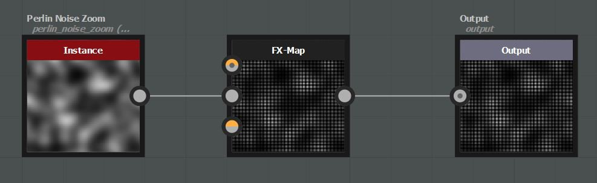

# Utilizzo dei nodi di Sampler

Il nodo del campionatore può essere utilizzato per campionare i valori dei pixel in un input di immagine collegato al nodo della mappa fx. I valori campionati possono quindi essere utilizzati per guidare qualsiasi parametro utilizzando le funzioni.

## Esempio semplice

In questo esempio è stata creata una catena di nodi quadranti per generare una griglia di serie. Viene creata una funzione nel parametro Opacità/Luminanza dell’ultimo quadrante.

{width="300px"}{width="300px"}

Il nodo Sample accetta un input float2 come coordinate di campionamento (x, y). In questo esempio abbiamo utilizzato la variabile $pos: per ogni pattern, il valore dei pixel viene campionato nella posizione del pattern nel primo input dell’immagine collegato al nodo FxMap.

Il nodo Grigio campione restituisce un valore float1 compreso nell&#39;intervallo 0, 1.

Il nodo Sample Color restituisce un valore float4 (rgba) compreso nell&#39;intervallo 0, 1.

## Esempio avanzato

Qui confrontiamo il valore campionato con una costante (0,3). Se il valore campionato è maggiore di 0,3 la funzione restituisce 1, altrimenti restituisce 0.

{width="300px"}{width="300px"}

## Scarica esempio

[{width="64px"}](https://shared-assets.adobe.com/link/d5f9adf3-0bb5-49a1-4eb9-a0506d4f3f32)
