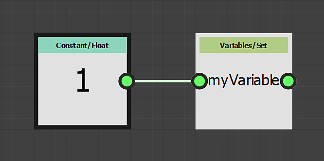
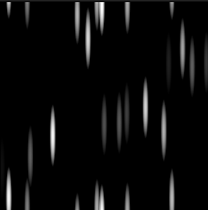

# Utilizzo dei nodi Set/Sequence

Questa pagina descrive i nodi **Set** e **Sequence** e fornisce un esempio di caso d&#39;uso nel contesto di **FX-Maps**.

<table>
<tr style="border: 0;">
<td style="border: 0;" valign="top">

## Panoramica

Durante l&#39;utilizzo delle funzioni in <b>FX-Maps</b>, talvolta si desidera generare un valore dal *[grafico delle funzioni Substance](../../../../function-graphs/the-function-graph/the-function-graph.md)* di un parametro, in modo da poterlo *utilizzare in un altro parametro.* Per impostazione predefinita, tuttavia, un grafico a funzioni Substance genera solo *un* valore: quello che determina il parametro correlato.

</td>
<td style="border: 0;" valign="top">

</td>
</tr>
</table>

In questo caso, è possibile utilizzare la combinazione dei nodi <b>Set</b> e <b>Sequence</b>, che consente di controllare le variabili in una o più funzioni.

Questo processo prevede due fasi:

1. Il nodo <b>Set</b> consente di creare una nuova variabile in modo da poterla chiamare altrove e assegnare un valore.
1. Il nodo <b>Sequenza</b> viene utilizzato per eseguire la logica nel passaggio 1 nella sua interezza, *prima di eseguire un altro ramo* del grafico, ad esempio la logica effettivamente coinvolta nell&#39;output del valore previsto per il grafico corrente

<table>
<tr style="border: 0;">
<td width="100.00%" style="border: 0;" valign="top">

## Nodo Set

Il nodo <b>Set</b> consente di impostare una nuova variabile e di assegnarle il tipo e il valore connessi all&#39;*input* del nodo.

Il *nome* della variabile viene immesso dall&#39;utente nelle proprietà del nodo.

Per impostazione predefinita, la variabile impostata da questo nodo è accessibile *solo* nell&#39;ambito del *padre* di questo grafico della funzione Substance, ad esempio il nodo che ospita il parametro definito dalla funzione.

</td>
<td width="25.00%" style="border: 0;" valign="top">

</td>
</tr>
</table>

<table>
<tr style="border: 0;">
<td style="border: 0;" valign="top">

In questo esempio il nome della variabile è stato impostato su **`myVariable`** e il relativo valore è **1**.

</td>
<td style="border: 0;" valign="top">

</td>
</tr>
</table>

<table>
<tr style="border: 0;">
<td width="100.00%" style="border: 0;" valign="top">

## Nodo Sequenza

Il nodo <b>Sequenza</b> consente di controllare il *flusso di esecuzione* dei grafici delle funzioni Substance, verificando che il *primo ramo sia stato completamente eseguito prima del secondo ramo*.

L&#39;output del *secondo ramo* viene quindi passato all&#39;output del nodo.

</td>
<td width="25.00%" style="border: 0;" valign="top">

</td>
</tr>
</table>

<table>
<tr style="border: 0;">
<td style="border: 0;" valign="top">

In questo esempio, il nodo <b>Sequenza</b> è impostato come output del grafico. L&#39;output della funzione è quindi il valore <b>0.5</b> generato dal nodo <b>Float</b>.

Tuttavia, prima che ciò accada, la variabile `<b>myVariable</b>` viene impostata con un valore float di <b>1.0</b>. Questa variabile può quindi essere utilizzata *altrove* nel contesto del nodo.

</td>
<td style="border: 0;" valign="top">

</td>
</tr>
</table>

I nodi **Sequenza** possono essere *concatenati* per controllare il flusso di esecuzione del grafico.

Ad esempio, puoi *impostare* prima una variabile, *aggiornare* il suo valore in un secondo momento, quindi *leggere* il suo valore finale, assicurandoti che queste azioni si verifichino *in un ordine specifico*.

## Visibilità variabile

Tieni presente che una variabile dichiarata è *non* accessibile da qualsiasi luogo.\
Una variabile dichiarata a livello principale può essere accessibile a livelli secondari, ma *non è vera*.

Pertanto, le variabili impostate nel nodo sono *non* accessibili a livello di grafico, mentre le variabili impostate a livello di grafico *possono* essere accessibili nelle funzioni dei parametri del relativo nodo.

Ad esempio, questa regola è alla base dell&#39;esposizione di *un parametro*, poiché l&#39;esposizione richiede effettivamente questi passaggi:

1. Creazione di un parametro di input grafico
1. Accesso nel grafico della funzione Substance del parametro
1. Impostazione del valore come output della funzione

Facciamo un piccolo esempio: immaginate che il valore <b>Rotazione</b> di un nodo <b>Quadrante</b> debba essere influenzato dal valore <b>Colore/Luminosità</b>: più luminosa è la luminosità, più rotazione.

<table>
<tr style="border: 0;">
<td style="border: 0;" valign="top">

Ciò che faremo è eseguire tutti i calcoli nella funzione del parametro <b>Colore/Luminosità</b>. Questo parametro verrà calcolato *first* in modo che qualsiasi variabile in esso contenuta sia disponibile per gli altri parametri del nodo.

</td>
<td style="border: 0;" valign="top">

</td>
</tr>
</table>

<table>
<tr style="border: 0;">
<td style="border: 0;" valign="top">

La nostra funzione sarà semplice: la luminosità sarà un valore casuale compreso tra **0** e **1**, questo valore verrà memorizzato nella variabile `myRotation`, quindi il valore verrà impostato come output della funzione.

Ciò significa che il valore del parametro **Colore/Luminosità** sarà casuale *e* archiviato nella variabile `myRotation`.

Si noti che la proprietà **Position** è già definita da un valore casuale e che viene utilizzato un nodo **Iterate** per ottenere più pattern posizionati casualmente.

</td>
<td style="border: 0;" valign="top">

</td>
</tr>
</table>

<table>
<tr style="border: 0;">
<td style="border: 0;" valign="top">

Ora che la variabile `myRotation` esiste e ha un valore, accediamo al grafico della funzione Substance della proprietà <b>Rotazione pattern</b>.

</td>
<td style="border: 0;" valign="top">

</td>
</tr>
</table>

<table>
<tr style="border: 0;">
<td width="100.00%" style="border: 0;" valign="top">

Nella funzione, il valore del parametro `myRotation` viene letto utilizzando un nodo **Get Float**. La variabile contiene un valore float e viene impostata come output della funzione.

</td>
<td width="25.00%" style="border: 0;" valign="top">

</td>
</tr>
</table>

La luminosità ora controlla anche la rotazione.

