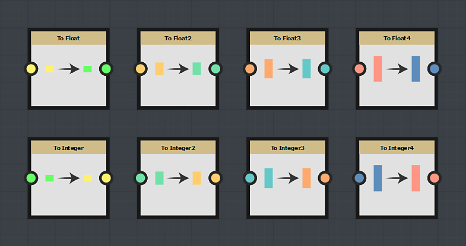

# Cast nodi

I nodi di cast vengono utilizzati per convertire un nodo da un tipo a un altro tipo:

## Come utilizzare un nodo cast?

È sufficiente selezionare il nodo del cast che corrisponde alla lunghezza del nodo da convertire.
