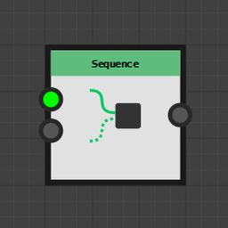

# Nodi di controllo

Questa pagina descrive i nodi di [grafici di funzione](../../../../function-graphs/the-function-graph/the-function-graph.md) che controllano il *flusso di esecuzione*.

<table>
<tr style="border: 0;">
<td width="33.33%" style="border: 0;" valign="top">

</td>
<td width="100.00%" style="border: 0;" valign="top">

## If...Else

Analogamente ai linguaggi di programmazione, l&#39;If... In caso contrario, il nodo introduce la possibilità di filtrare il risultato in base a condizioni predefinite.

</td>
</tr>
</table>

Questo nodo verrà utilizzato insieme ai [nodi logici](../../../../function-graphs/nodes-reference-for-fun/atomic-function-nodes/logical-nodes/logical-nodes.md) e ai [nodi di confronto](../../../../function-graphs/nodes-reference-for-fun/atomic-function-nodes/comparison-nodes/comparison-nodes.md) che consentono di creare la condizione da controllare.

+++Connettori di ingresso
<b>Condizione</b> *Booleano*\
Condizione che controlla l&#39;output del nodo.

<b>Se</b> *Tipo variabile* Il valore generato dal nodo se <b>Condizione</b> è *Vero*.

<b>Altro</b> *Tipo variabile* Il valore generato dal nodo se <b>Condizione</b> è *Falso*.

+++

<table>
<tr style="border: 0;">
<td width="33.33%" style="border: 0;" valign="top">

</td>
<td width="100.00%" style="border: 0;" valign="top">

## Sequenza

Assicura che una parte del grafico venga calcolata prima di un’altra.

</td>
</tr>
</table>

Questo è fondamentale per controllare lo stato delle variabili quando vengono create, lette e aggiornate.

Ulteriori informazioni sul nodo Sequenza sono disponibili nella pagina [Utilizzo dei nodi Set/Sequenza](../../../../function-graphs/fxmaps/using-functions-in-fxmaps/using-the-set-sequence/using-the-set-sequence-nodes.md) di questa documentazione.

+++Connettori di ingresso
<b>In</b> *Tipo di variabile*\
Porzione del grafico da calcolare per prima

<b>Ultimo</b> *Tipo di variabile*\
Parte del grafico da calcolare per ultima

+++

<table>
<tr style="border: 0;">
<td width="33.33%" style="border: 0;" valign="top">

</td>
<td width="100.00%" style="border: 0;" valign="top">

## Loop while

Esegue una volta il ramo <b>Init</b>, quindi esegue un&#39;iterazione sul <b>Cond di uscita</b> e <b>Corpo ciclo</b> diramazioni fino al <b>Cond. uscita</b> branch restituisce *True*.

Una volta completato il ciclo, il nodo genera il risultato dell&#39;ultima iterazione del <b>corpo del ciclo</b>.

</td>
</tr>
</table>

I loop hanno un numero massimo implicito di iterazioni che può essere disattivato impostandolo su -1.

Le variabili mantengono il loro valore in tutte le iterazioni e sono accessibili nella condizione di uscita (Cond. uscita).\
Ciò significa che potete aggiungere a un valore indice ogni iterazione e controllarne il valore nella condizione di uscita per controllare il numero di loop necessari.

>[!IMPORTANT]
>
> Nodi connessi al nodo <b>uscita</b> e <b>Le diramazioni del corpo del ciclo</b> non possono essere collegate ad altre diramazioni del grafico.

+++Connettori di ingresso
<b>Inizio.</b> *Tipo di variabile*\
La porzione del grafico che viene calcolata prima della prima iterazione, ovvero l&#39;inizio del ciclo.

<b>Esci da Cond.</b> *Booleano*\
Condizione che deve essere vera affinché il ciclo si arresti. Viene ricalcolato su ogni iterazione.\
*Nota:* il numero massimo di iterazioni è ancora limitato al parametro <b>Numero massimo di iterazioni</b>.

<b>Corpo ciclo</b> *Tipo di variabile*\
Grafico che beneficia del ciclo. Viene ricalcolato su ogni iterazione.

+++

+++Parametri
<b>Max. iterazioni</b> *Numero intero*\
Numero massimo di iterazioni eseguite dal nodo.\
Il nodo interrompe l&#39;iterazione quando viene soddisfatto per primo uno dei seguenti criteri: questo numero massimo viene raggiunto o la condizione di uscita diventa vera.\
Questo valore massimo può essere disabilitato impostando il valore su *-1*. A questo punto, solo la condizione di uscita può interrompere le iterazioni.

Impostazione di &#39;Max. iterazioni&#39; a -1 migliora le prestazioni in loop di piccole dimensioni in quanto è disponibile un contatore in meno per tenere traccia e aggiornare.

Tuttavia, tieni presente che il nodo è configurato in quanto è possibile produrre un <b>ciclo infinito</b> che potrebbe causare la mancata risposta di Designer.

+++

Seguite questa esercitazione sul nodo Ciclo continuo:
