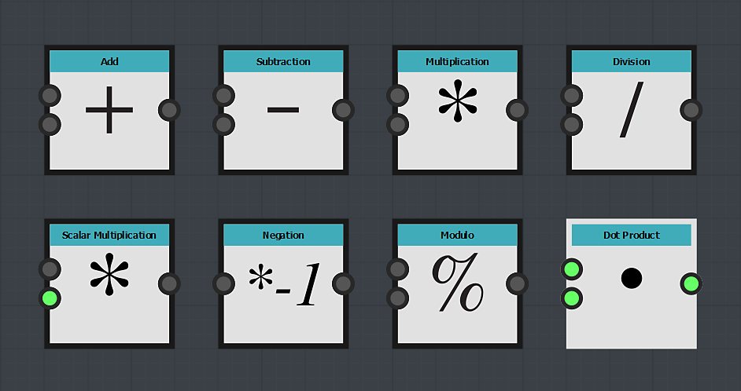

# Nodi operatore

I nodi operatore consentono di eseguire le operazioni matematiche classiche sui nodi di input:

>[!NOTE]
>
> Per la divisione e il modulo, il divisore è l&#39;input minore.
> 
> Per la sottrazione, anche la sottocartella è l&#39;input minore.
